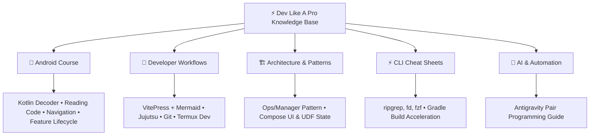
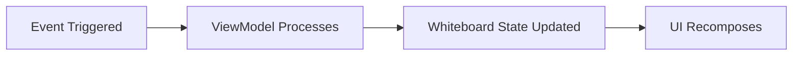

# ⚡ Dev Like A Pro

[](https://vitepress.dev/)
[](https://vuejs.org/)
[](https://mermaid.js.org/)
[](https://pnpm.io/)
[](https://github.com/easoyeb/dev-likeAPro)

A developer wiki, hands-on Android engineering academy, architecture handbook, and CLI cheat sheet collection. Built with **VitePress**, **Vue 3**, and interactive **Mermaid diagrams**.

---

## 🚀 Quick Start: Running the Server Locally

### 1. Prerequisites
Ensure you have **Node.js** (v18+) and **pnpm** installed:
```bash
# Check Node version
node -v

# Install pnpm if not already present
corepack enable
corepack prepare pnpm@latest --activate
```

### 2. Clone the Repository
```bash
git clone git@github.com:easoyeb/dev-likeAPro.git
cd dev-likeAPro
```

### 3. Install Dependencies
```bash
pnpm install
```

### 4. Start the Local Development Server
To launch the live-reloading dev server on your local machine:
```bash
pnpm run docs:dev
```
The documentation portal will start at:
👉 **`http://localhost:5173/`**

#### 📱 Running on Android / Termux / Local Network
If you are developing inside **Termux**, a chroot environment, or want to view docs on your smartphone or another device on the same Wi-Fi network, bind to all interfaces:
```bash
pnpm run docs:dev --host 0.0.0.0
```
Then visit:
- From device: `http://localhost:5173`
- From local network: `http://<your-local-ip>:5173`

---

## 📦 Build & Production Commands

| Command | Description |
| :--- | :--- |
| `pnpm run docs:dev` | Starts local dev server with instant Hot Module Replacement (HMR) |
| `pnpm run docs:dev --host 0.0.0.0` | Starts dev server exposed to all local network devices |
| `pnpm run docs:build` | Compiles markdown into optimized static HTML/CSS assets in `docs/.vitepress/dist` |
| `pnpm run docs:preview` | Locally previews the generated production build |

---

## 📚 What's Inside the Knowledge Base



### 📱 1. Android Development Course
From beginner Kotlin syntax to reverse-engineering production codebases (like **mpvRex**):
- **[Lesson 1: The Kotlin Decoder](docs/android-course/kotlin-decoder.md)** — Symbol matrix (`?`, `::`, `@`, `by`, `_`), Custom vs Library packages (`xyz.mpv.rex.*` vs `androidx.*`), lambdas, and receivers.
- **[Lesson 2: Reading Code Like Human Language](docs/android-course/how-to-read-code.md)** — The 4 physical metaphors (whiteboard, loudspeaker, foreman, room service), the 3-pass detective method, and translating real code mechanisms.
- **[Lesson 3: Universal Code Navigation](docs/android-course/codebase-navigation.md)** — The 3 Universal Anchors (Strings, Icons, Routes) to find any feature in 60s.
- **[Lesson 4: The Feature Lifecycle](docs/android-course/feature-lifecycle.md)** — 6-step feature addition blueprint and the surgical deletion checklist.
- **[Module 1: Compose Fundamentals & State](docs/android-course/module1-basics.md)** — Jetpack Compose, Recomposition, `remember`, `mutableStateOf`, `collectAsState`, and Modifier order traps.
- **[Module 2: State & Storage](docs/android-course/module2-state-management.md)** — StateFlow, DataStore, Room Database, and Koin Dependency Injection.
- **[Module 3: Custom UI & Canvas](docs/android-course/module3-custom-ui-canvas.md)** — Custom Seekbars, wavy lines, progress drawing, and dynamic color logic.
- **[Module 4: Reverse-Engineering Features](docs/android-course/module4-how-to-read-codebases.md)** — Step-by-step case study on adding a White Seekbar toggle to a production video player.

### 🏗️ 2. Architecture & Patterns
- **[Ops / Manager Architectural Pattern](docs/architecture/ops-manager-pattern.md)** — Preventing god-objects by separating UI, ViewModels, and specialized background managers.
- **[Jetpack Compose UI & State Architecture](docs/architecture/compose-state.md)** — Unidirectional Data Flow (UDF), the 4 state lifetime tiers, State Hoisting, and recomposition optimization.

### 🚀 3. Developer Workflows
- **[VitePress & Mermaid Architecture Masterclass](docs/workflow/vitepress-mermaid.md)** — Deep dive into VitePress config, multi-sidebar routing, and Mermaid diagram syntax rules.
- **[Jujutsu (`jj`) Mastery](docs/workflow/jujutsu-mastery.md)** — Next-generation Git-compatible version control with first-class anonymous branches and automatic rebasing.
- **[Git & Rebase Mastery](docs/workflow/git-mastery.md)** — Clean commit hygiene, interactive rebasing, and resolving conflicts cleanly.
- **[Code Search Masterclass](docs/workflow/code-search.md)** — Instant code discovery using `ripgrep`, `fd`, and `fzf`.
- **[Termux & Android Dev Setup](docs/workflow/termux-android-dev.md)** — Developing, building, and running Android code on mobile devices.

### ⚡ 4. CLI Cheat Sheets
- **[ripgrep, find & FZF Cheat Sheet](docs/cheatsheets/cli-tools.md)** — Fastest one-liners for searching codebases.
- **[Gradle & Build Speed Optimization](docs/cheatsheets/gradle-tips.md)** — Fast compilation (`compileDebugKotlin`), daemon caching, and Termux init scripts.

### 🤖 5. AI & Automation
- **[Antigravity & Agentic Pair Programming](docs/ai/agent-guide.md)** — Best practices for working alongside agentic coding assistants without losing architectural control.

---

## 📁 Repository Structure

```text
dev-likeAPro/
├── docs/
│   ├── .vitepress/
│   │   ├── config.mts           # Multi-sidebar, navigation, local search config
│   │   └── theme/
│   │       └── index.mts        # Custom theme with reactive Mermaid renderer
│   ├── ai/                      # AI & Agentic pair programming
│   ├── android-course/          # 4 Lessons + 4 In-depth Android Modules
│   ├── architecture/            # Architecture blueprints (UDF, Ops/Manager)
│   ├── cheatsheets/             # CLI & Gradle cheat sheets
│   ├── workflow/                # Git, Jujutsu, VitePress, and Termux guides
│   └── index.md                 # Documentation portal landing page
├── package.json                 # Dependencies & docs:* scripts
├── pnpm-lock.yaml               # Pnpm dependency lockfile
└── README.md                    # Project overview & local server setup
```

---

## 🎨 Diagram Engine: Mermaid Integration

This site uses `vitepress-mermaid-renderer` to dynamically render diagrams directly in the browser. 

To add a diagram in any markdown file:
````markdown

````

> [!TIP]
> **Mermaid Rule**: Always double-quote labels containing parentheses or special characters (e.g. `["Label (Details)"]`) to prevent syntax errors.

---

## 🤝 Git Hygiene & Rules

- **Branch**: Default active branch is `master`.
- **Sequential Execution**: Avoid chaining multiple git/build commands with `&&` (e.g. run `git add`, `git commit`, and `git push` as separate, verified operations).
- **Clean Commits**: Keep documentation commits atomic, descriptive, and linked to relevant lessons.

---

*Maintained with ⚡ for high-performance software engineering.*
