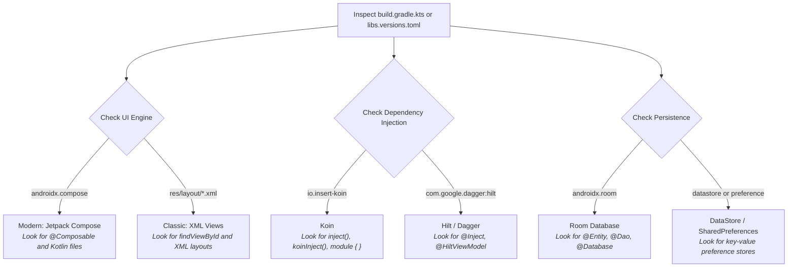

# 🧭 Universal Code Navigation: How to Find Any Feature in ANY Android Project

Whether you are exploring **mpvRex**, **NewPipe**, **Tachiyomi**, or a corporate app at a tech company, large codebases can feel like a labyrinth of hundreds of files.

Professional Android developers do not read an entire codebase from top to bottom. Instead, they use **Universal Android Invariants**—architectural rules that exist in **100% of Android apps**—to locate the exact file responsible for any feature in under 60 seconds.

---

## 1. Step Zero: Identify the App's Tech Stack in 30 Seconds

Before searching for features, look at `build.gradle.kts` (or `gradle/libs.versions.toml`). This tells you which tools the project uses so you know what keywords to look for:



---

## 2. Universal Invariant: The Front Door of Every Android App

Every single Android application has one mandatory file defined by the Android Operating System:

```
app/src/main/AndroidManifest.xml
```

When you open any unfamiliar Android repo, open `AndroidManifest.xml` first to answer two fundamental questions:

### A. What code runs when the app boots?
Look inside the `<application>` tag:
```xml
<application
    android:name=".App"   <-- THIS IS THE GLOBAL SINGLETON
    ... >
```
Whatever class is named here (e.g., `App.kt`, `MainApplication.kt`) is the **first code executed when the app process starts**. This is where databases, network proxies, crash handlers, and DI containers are initialized.

### B. What is the very first screen the user sees?
Look for the `<activity>` containing the `LAUNCHER` category:
```xml
<activity android:name=".MainActivity" ...>
    <intent-filter>
        <action android:name="android.intent.action.MAIN" />
        <category android:name="android.intent.category.LAUNCHER" />
    </intent-filter>
</activity>
```
This is your UI root. Starting from `MainActivity.kt`, you can follow the screen tree anywhere in the app.

---

## 3. The 3 Universal Anchor Techniques (Finding Any Feature)

When you see a feature on your phone screen that you want to examine in code, use one of these three universal anchors:

```mermaid
flowchart LR
    A1["Anchor 1: Text Anchor<br><i>(Visible UI words)</i>"] --> Strings["Search in strings.xml"]
    A2["Anchor 2: Icon Anchor<br><i>(Drawables & icons)</i>"] --> Assets["Search in res/drawable/ or Icons.*"]
    A3["Anchor 3: Preference Key<br><i>(Toggles & settings)</i>"] --> PrefStore["Search in Preferences"]
    
    Strings --> SearchCode["`rg` in Kotlin source"]
    Assets --> SearchCode
    PrefStore --> SearchCode
    SearchCode --> TargetFile["🎯 Target Composable / ViewModel"]
```

---

### Anchor 1: The UI Text Anchor (The Senior Dev's Fastest Trick)

Almost all text displayed in an Android app is localized in:
```
app/src/main/res/values/strings.xml
```

#### The 3-Step Procedure:
1. **Look at the screen**: Suppose the screen shows a button or setting saying: `"Show circular double tap seek"`.
2. **Search `strings.xml` for those words**:
   ```bash
   rg -i "Show circular double tap seek" app/src/main/res/values/strings.xml
   ```
   **Result**:
   ```xml
   <string name="pref_player_show_circular_double_tap_seek_title">Show circular double tap seek</string>
   ```
3. **Search the Kotlin codebase for that resource ID**:
   ```bash
   rg "pref_player_show_circular_double_tap_seek_title" app/src/main/kotlin/
   ```
   **Instant Result**:
   - `PlayerPreferencesScreen.kt` (Where the toggle UI lives).
   - `MoreSheet.kt` (Where the quick-toggle in the player lives).

You found the exact file in **under 5 seconds** without guessing!

---

### Anchor 2: The Icon / Asset Anchor

What if the feature has no text, only an icon (like a Play button, Subtitle icon, or Download arrow)?

1. In Android, icons come from two places:
   - **Vector Drawables**: in `app/src/main/res/drawable/` (e.g., `ic_play.xml`, `ic_subtitles.xml`).
   - **Compose Material Icons**: `Icons.Default.PlayArrow`, `Icons.Rounded.Subtitles`.
2. Search for the icon name across the project:
   ```bash
   rg "R.drawable.ic_subtitle" app/src/main/
   # or
   rg "Icons.Rounded.Subtitles" app/src/main/
   ```
   This immediately takes you to the Composable or XML View that renders that button.

---

### Anchor 3: The Route / Navigation Anchor

In modern apps using Jetpack Compose or Fragment Navigation, every screen has a **Route name** or **Destination**:

```kotlin
// Example in Navigation3 / Jetpack Navigation:
composable("settings_player") {
    PlayerPreferencesScreen(...)
}
```

If you know the screen name or URL path, searching for the route name leads straight to the screen composable.

---

## 4. The Universal Data Flow: Tracing What Happens on Click

Once you find the UI file, how do you trace what the feature *actually does*?

Every well-architected Android app follows the **Unidirectional Data Flow (UDF)**:

```
[ User Taps Button in UI ]
            │
            ▼
[ UI calls ViewModel / Manager ]   (e.g., viewModel.onSeekForward(10))
            │
            ▼
[ ViewModel updates Business Logic ] (Calculates new timestamp)
            │
            ▼
[ Delegates to Repository or Engine ] (Writes to Database, or calls libmpv / MediaPlayer)
            │
            ▼
[ StateFlow updates State ]        (e.g., `currentTime = 45s`)
            │
            ▼
[ UI Recomposes & Renders new State ]
```

### Reading the Trail:
1. In the UI file, find the `onClick` or `onValueChange` lambda.
2. See what function it calls (e.g., `playerViewModel.seek(...)` or `preferences.doubleTapSeek::set`).
3. Open that ViewModel or Preference class to see the business logic.
4. Follow the call down to the Database DAO, Network API, or Player Engine.

---

## 5. Summary Cheat Sheet: The 4 Universal Questions

When approaching **any** Android codebase:

| Question | Where to Look |
| :--- | :--- |
| **How does the app initialize?** | `AndroidManifest.xml` $\rightarrow$ look for `<application android:name="...">` |
| **What is the root screen?** | `AndroidManifest.xml` $\rightarrow$ look for the Activity with `LAUNCHER` intent-filter |
| **Where is a specific UI button/text?** | Search exact text in `strings.xml` $\rightarrow$ search string ID in Kotlin code |
| **Where does data get saved?** | Search for Room `@Dao` interfaces or Preference classes (`DataStore` / `SharedPreferences`) |

---

*Next: Proceed to [Module 1: Android & Jetpack Compose Fundamentals](./module1-basics).*
