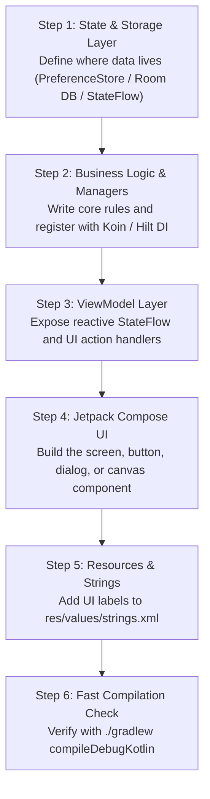
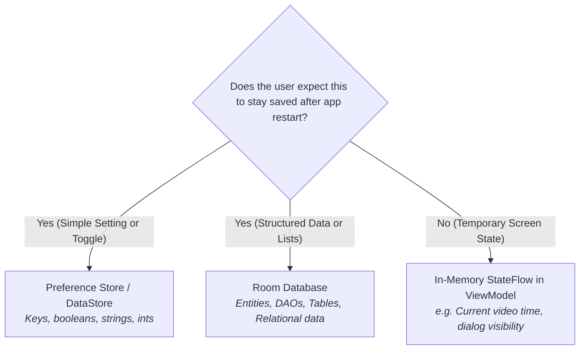
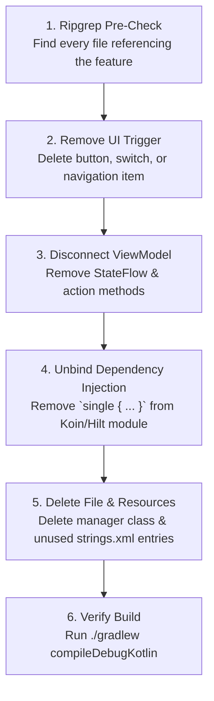

# 🛠️ Lesson 3: The Feature Lifecycle — Adding & Deleting Features Like a Senior Engineer

Adding a feature to a small tutorial app is easy. But in a real-world, production Android app (like **mpvRex**, **NewPipe**, or a commercial product), features touch multiple layers: **Storage**, **Business Logic**, **Dependency Injection**, **ViewModels**, **Compose UI**, and **String Resources**.

Similarly, **deleting a feature** is an essential engineering skill. Inexperienced developers delete code randomly, leading to broken builds, memory leaks, or orphaned database rows. Senior developers perform clean, surgical removal.

This lesson gives you the exact, step-by-step blueprint for both.

---

## PART 1: How to Add a Feature (The 6-Step Universal Blueprint)

Whenever you want to add any new feature—whether it is a **Sleep Timer**, a **Playback Speed Slider**, a **Download Toggle**, or a **Custom Theme Color**—follow this bottom-up pipeline:



---

### Step 1: Decide Where the Data Lives (State & Storage)

Before writing any UI, ask yourself: **"Does this feature need to be remembered after the user closes the app?"**



#### Example A: A Persistent Toggle (e.g. "Auto Background Play")
Add the key to your preferences class:
```kotlin
// In PlayerPreferences.kt
val autoBackgroundPlay = preferenceStore.getBoolean("auto_background_play", false)
```

#### Example B: Temporary UI State (e.g. "Is Sleep Timer Dialog Open")
Add a `MutableStateFlow` in your ViewModel:
```kotlin
// In PlayerViewModel.kt
private val _isSleepTimerOpen = MutableStateFlow(false)
val isSleepTimerOpen: StateFlow<Boolean> = _isSleepTimerOpen.asStateFlow()
```

---

### Step 2: Implement the Business Logic & Dependency Injection

Do not cram heavy logic into your UI or ViewModel! Dedicated Managers or Repositories keep your codebase clean and testable.

1. **Create the Manager / Service:**
```kotlin
class SleepTimerManager(private val context: Context) {
    private var timerJob: Job? = null

    fun startTimer(minutes: Int, onFinish: () -> Unit) {
        timerJob?.cancel()
        timerJob = CoroutineScope(Dispatchers.Default).launch {
            delay(minutes * 60 * 1000L)
            withContext(Dispatchers.Main) {
                onFinish()
            }
        }
    }

    fun cancelTimer() {
        timerJob?.cancel()
        timerJob = null
    }
}
```

2. **Register it in Dependency Injection (Koin or Hilt):**
If using Koin:
```kotlin
// In AppModule.kt or DomainModule.kt
single { SleepTimerManager(androidContext()) }
```
Now any class or Composable in the app can access `SleepTimerManager` without manual object passing!

---

### Step 3: Wire the ViewModel (The Coordinator)

The `ViewModel` connects your business logic to the UI:
- It exposes **State** (`StateFlow`).
- It exposes **Actions** (functions called when user taps buttons).

```kotlin
class PlayerViewModel(
    private val sleepTimerManager: SleepTimerManager,
    val playerPreferences: PlayerPreferences
) : ViewModel() {

    private val _sleepTimeRemaining = MutableStateFlow<Int?>(null)
    val sleepTimeRemaining = _sleepTimeRemaining.asStateFlow()

    fun onStartSleepTimer(minutes: Int) {
        sleepTimerManager.startTimer(minutes) {
            // Callback when timer ends: pause video
            pausePlayback()
        }
    }

    fun onCancelSleepTimer() {
        sleepTimerManager.cancelTimer()
        _sleepTimeRemaining.value = null
    }
}
```

---

### Step 4: Build the UI with Jetpack Compose

Now that the data and logic exist, build the visual interface. Follow the **State Hoisting** rule:
- Pass data *down* into the Composable.
- Pass events *up* via lambdas (`() -> Unit`).

```kotlin
@Composable
fun SleepTimerDialog(
    isOpen: Boolean,
    onDismiss: () -> Unit,
    onSelectMinutes: (Int) -> Unit
) {
    if (!isOpen) return

    AlertDialog(
        onDismissRequest = onDismiss,
        title = { Text(stringResource(R.string.sleep_timer_title)) },
        text = {
            Column {
                listOf(15, 30, 60).forEach { minutes ->
                    TextButton(
                        onClick = {
                            onSelectMinutes(minutes)
                            onDismiss()
                        },
                        modifier = Modifier.fillMaxWidth()
                    ) {
                        Text("$minutes minutes")
                    }
                }
            }
        },
        confirmButton = {
            TextButton(onClick = onDismiss) {
                Text(stringResource(android.R.string.cancel))
            }
        }
    )
}
```

---

### Step 5: Add Resources & Strings (`strings.xml`)

Never hardcode text like `"Sleep Timer"` inside Compose! Always add it to `strings.xml`:

```xml
<!-- In app/src/main/res/values/strings.xml -->
<string name="sleep_timer_title">Sleep Timer</string>
<string name="sleep_timer_summary">Automatically stop playback after a set time</string>
```

**Why?**
1. Localization: Translators can translate your app into Spanish, French, Japanese without touching Kotlin code.
2. Accessibility: Screen readers (TalkBack) depend on string resources.

---

### Step 6: Verify Fast Compilation on Device

Never wait until you finish 5 files to compile. In mobile/chroot environments, compile early to catch typos instantly:

```bash
./gradlew compileDebugKotlin
```
If this exits with `BUILD SUCCESSFUL`, your feature is mathematically sound!

---

## PART 2: How to Delete a Feature (The Surgical Deletion Checklist)

Deleting a feature seems simple: just delete the file, right? **Wrong.**
If you delete a file while other parts of the app still reference it, your build breaks with dozens of errors:
- *"Unresolved reference: SleepTimerManager"*
- *"Cannot find symbol R.string.sleep_timer_title"*
- *"Module could not resolve dependency"*

Follow this **Reverse Surgical Checklist**:



---

### Step 1: Ripgrep Pre-Check (Find All Tentacles)

Before touching any code, run `rg` to find every single place the feature is mentioned:

```bash
# Example: If deleting SleepTimer
rg "SleepTimer" app/src/
rg "sleep_timer" app/src/
```

Make a mental list (or scratchpad) of the files found:
- `res/values/strings.xml`
- `ui/player/PlayerControls.kt`
- `ui/player/PlayerViewModel.kt`
- `di/AppModule.kt`
- `managers/SleepTimerManager.kt`

---

### Step 2: Remove the UI Trigger First

Start at the outside (UI) and work inward.
- If it is a button in `PlayerControls.kt`: Delete the button Composable or icon.
- If it is a setting in `PlayerPreferencesScreen.kt`: Delete the `SwitchPreference` block.

---

### Step 3: Clean the ViewModel

Open the ViewModel and delete:
1. The `StateFlow` variable (e.g. `val sleepTimeRemaining`).
2. The action functions (e.g. `onStartSleepTimer()`).
3. The constructor parameter (e.g. `private val sleepTimerManager: SleepTimerManager`).

---

### Step 4: Unbind from Dependency Injection

Open your DI module (`di/AppModule.kt` or `DatabaseModule.kt`):
- Delete `single { SleepTimerManager(...) }`.
- If you forget this step, Koin may crash at runtime when trying to initialize a class that no longer exists!

---

### Step 5: Safely Delete the File & Strings

Now you can safely delete the file:
```bash
rm app/src/main/kotlin/xyz/mpv/rex/ui/player/managers/SleepTimerManager.kt
```
And remove its strings from `res/values/strings.xml`:
```xml
<!-- Delete these: -->
<string name="sleep_timer_title">Sleep Timer</string>
<string name="sleep_timer_summary">...</string>
```

---

### Step 6: What If the Feature Touched the Database? (Special Warning)

> [!CAUTION]
> **Never just delete a Room Database column or Table without a Migration!**
> If user phones already have your app installed and you delete a database column without telling Room, **the app will crash on startup** with:
> `IllegalStateException: Room cannot verify the data integrity.`
> 
> **How to handle database changes:**
> 1. Increment your database version (`@Database(version = 17, ...)`).
> 2. Add an `AutoMigration` or `Migration(16, 17)`.
> 3. Or if in early development, enable `fallbackToDestructiveMigration()`.

---

### Step 7: The Final Verification

Run the fast Kotlin compilation:
```bash
./gradlew compileDebugKotlin
```
If it succeeds, your deletion is 100% clean—no ghost code, no broken imports, no unused resources.

---

## 🎯 Summary Comparison

| Task | What You Do First | What You Do Last |
| :--- | :--- | :--- |
| **Adding a Feature** | Start at Data/State $\rightarrow$ Business Logic | Build UI $\rightarrow$ Add strings $\rightarrow$ Compile |
| **Deleting a Feature** | Run `rg` to find references $\rightarrow$ Remove UI | Delete Manager file $\rightarrow$ Delete strings $\rightarrow$ Compile |

---

*Next: Proceed to [Module 1: Android & Jetpack Compose Fundamentals](./module1-basics).*
