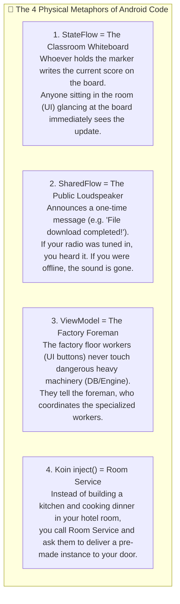
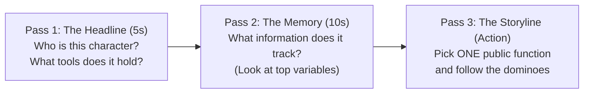

# 📖 Lesson 2: How to Read Code Like Human Language

When you first learn programming—especially with AI assistants generating hundreds of lines—code looks like an alien soup of symbols: `by inject()`, `CoroutineScope(SupervisorJob() + Dispatchers.Default)`, `MutableStateFlow`, `debounce(1_000)`, `collect { ... }`.

Senior software engineers do not see symbols. **They read code as fluently as a novel.** To them, code is a story featuring **characters (classes)** who have **tools (dependencies)**, remember **information (state)**, and react to **events (user clicks)**.

This masterclass teaches you the exact mental translation engine that turns confusing code into clear, everyday English sentences.

---

## 1. The Code Grammar Rosetta Stone

Every programming language is fundamentally structured like human grammar:

| Human Grammar | Kotlin Equivalent | What It Represents | Real Android Example |
| :--- | :--- | :--- | :--- |
| **Noun** (Person / Place / Thing) | **Class / Data Type** | An entity that exists in the app. | `VideoItem`, `User`, `SeekbarState` |
| **Tool** (Equipment the thing uses) | **Constructor Parameter** | What a class needs to do its job. | `private val context: Context` |
| **Adjective** (State / Quality) | **Property / Variable** | How the thing currently looks or feels. | `val isPlaying = true`, `val volume = 80` |
| **Verb** (Action) | **Function / Method** | Something the thing can *do*. | `fun play()`, `fun seekTo(30)`, `fun refresh()` |
| **Conjunction** (And then...) | **Chained Operators** | Sequence of operations. | `.debounce(...)`, `.filter { ... }`, `.map { ... }` |
| **Conditional** (If / Unless) | **`if`, `when`, `?:`** | Decision branch in the storyline. | `val color = if (whiteBar) White else Primary` |

---

## 2. The 4 Physical Metaphors (Understanding Mechanisms)

Computer code feels abstract and invisible. To understand its *mechanism* (cause and effect), map code components to physical real-world objects:



---

## 3. The 3-Pass Reading Technique (How to Read a 500-Line File)

Beginners make the mistake of reading code from line 1 to line 500. This causes mental exhaustion within 2 minutes.

Senior developers use the **3-Pass Detective Strategy**:



### Pass 1: The Headline & Tools (5 Seconds)
Look only at the top class declaration:
```kotlin
class SubtitleManager(
    private val context: Context,
    private val preferences: PlayerPreferences
)
```
* **Translation**: *"This character is named `SubtitleManager`. To do its job, it holds two tools: Android system access (`context`) and user settings (`preferences`)."*
* **Do NOT read the rest of the file yet!**

---

### Pass 2: The Memory / State (10 Seconds)
Glance at the top private variables:
```kotlin
private val _currentTrack = MutableStateFlow<SubtitleTrack?>(null)
val currentTrack = _currentTrack.asStateFlow()
private val availableTracks = mutableListOf<SubtitleTrack>()
```
* **Translation**: *"This manager remembers two things: which subtitle is currently active on the whiteboard (`currentTrack`), and a list of all subtitles it found in the video folder (`availableTracks`)."*

---

### Pass 3: Follow One Storyline (The Action)
Now choose **one specific user action** and read its function like a chronological story:
```kotlin
fun selectTrack(track: SubtitleTrack) {
    if (track == _currentTrack.value) return
    _currentTrack.value = track
    nativePlayer.setSubtitleTrack(track.id)
}
```
* **Translation**:
  1. *"When the user picks a subtitle track..."*
  2. *"If it's already the active one, do nothing and stop (`return`)."*
  3. *"Otherwise, write the new track onto our whiteboard (`_currentTrack.value = track`)."*
  4. *"Then shout down to the C++ player engine to switch subtitle decoders (`nativePlayer.setSubtitleTrack`)."*

---

## 4. Live Case Studies: Translating Real `mpvRex` Code

Let's test this framework on real, complex lines from the production `mpvRex` codebase:

---

### Case Study 1: Background File Observers (`App.kt`)

```kotlin
applicationScope.launch {
  mediaStoreInvalidations
    .debounce(1_000)
    .collect {
      runCatching { hybridMediaIndex.refreshMediaStore() }
    }
}
```

#### Sentence-by-Sentence English Translation:
1. **`applicationScope.launch {`**  
   $\rightarrow$ *"In the background, start a long-running watcher task that lives as long as the app is open."*
2. **`mediaStoreInvalidations`**  
   $\rightarrow$ *"Listen to notifications sent whenever the Android phone detects a video was added, deleted, or renamed."*
3. **`.debounce(1_000)`**  
   $\rightarrow$ *"If 50 files are added in rapid succession (like during a download), wait until there has been 1 whole second of complete silence."*
4. **`.collect {`**  
   $\rightarrow$ *"Whenever that moment of silence occurs, take action:"*
5. **`runCatching { hybridMediaIndex.refreshMediaStore() }`**  
   $\rightarrow$ *"Safely refresh our video library list, and if anything unexpected happens, catch the error so the app doesn't crash."*

---

### Case Study 2: Jetpack Compose Reactive UI (`PlayerControls.kt`)

```kotlin
val whiteSeekBar by playerPreferences.whiteSeekBar.collectAsState()
val primaryColor = if (whiteSeekBar) Color.White else MaterialTheme.colorScheme.primary

Canvas(modifier = Modifier.fillMaxWidth().height(48.dp)) {
    drawLine(
        color = primaryColor,
        start = Offset(0f, centerY),
        end = Offset(progressPx, centerY),
        strokeWidth = 4.dp.toPx()
    )
}
```

#### Sentence-by-Sentence English Translation:
1. **`val whiteSeekBar by playerPreferences.whiteSeekBar.collectAsState()`**  
   $\rightarrow$ *"Keep your eyes locked on the `whiteSeekBar` preference. The second the user toggles it in Settings, automatically re-run this drawing function."*
2. **`val primaryColor = if (whiteSeekBar) Color.White else ...`**  
   $\rightarrow$ *"Decide on the paint color: if the toggle is ON, use pure White; otherwise, use the theme's accent color (like purple or blue)."*
3. **`Canvas(modifier = Modifier.fillMaxWidth().height(48.dp))`**  
   $\rightarrow$ *"Give me a blank digital canvas that stretches across the whole screen width and stands 48 density pixels tall."*
4. **`drawLine(color = primaryColor, start = ..., end = ...)`**  
   $\rightarrow$ *"Dip the brush into our chosen color, start at the far left edge (`0f`), and draw a horizontal line right up to where the video has played (`progressPx`)."*

---

### Case Study 3: Dependency Injection Wiring (`AppModule.kt`)

```kotlin
single { PlayerPreferences(get()) }
viewModel { PlayerViewModel(get(), get(), get()) }
```

#### Sentence-by-Sentence English Translation:
1. **`single { PlayerPreferences(get()) }`**  
   $\rightarrow$ *"Hey Koin, create exactly ONE instance of `PlayerPreferences` for the entire app. It needs a storage helper to work, so go find one from your registry (`get()`)."*
2. **`viewModel { PlayerViewModel(get(), get(), get()) }`**  
   $\rightarrow$ *"Whenever a screen asks for `PlayerViewModel`, assemble it fresh and automatically inject the 3 managers it requires without making me pass them manually."*

---

## 5. Mental Translation Cheat Sheet

Keep these 6 rules in your head when looking at unfamiliar code:

| What the Code Says | What Your Brain Should Say |
| :--- | :--- |
| `val x by inject()` | *"Hey Koin, hand me the instance of `x`."* |
| `val state by flow.collectAsState()` | *"Watch `flow` continuously. Redraw the UI whenever it changes."* |
| `button.clickable { viewModel.onAction() }` | *"When tapped, tell the coordinator what happened."* |
| `scope.launch { ... }` | *"Do this heavy work in the background without freezing the screen."* |
| `withContext(Dispatchers.Main) { ... }` | *"Jump back to the main UI thread so we can show something on screen."* |
| `runCatching { ... }` | *"Try this risky action; if it throws an error, don't crash the app."* |

---
 
*Next: Proceed to [Lesson 3: Universal Code Navigation](./codebase-navigation).*
