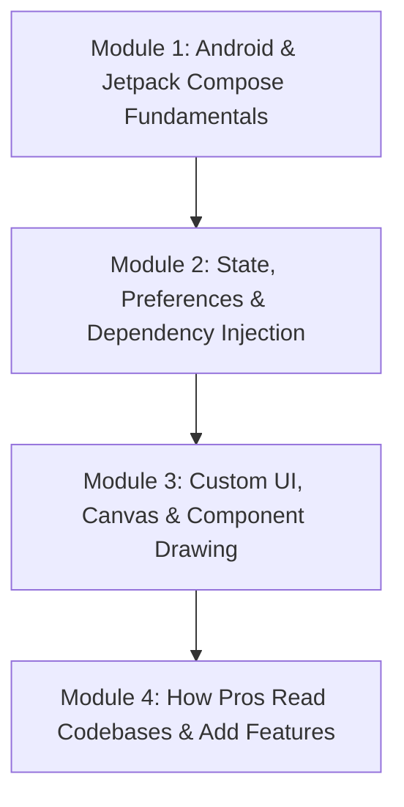

# 📱 Android Development Course: From Beginner to Pro

Welcome to the hands-on Android Development course! This course is designed to take you from foundational concepts to reverse-engineering real production codebases (like **mpvRex**).

---

## 🗺️ Course Curriculum Roadmap

---

## 🎓 Modules Overview

| Module | Topic | What You Will Learn |
| :--- | :--- | :--- |
| **[Lesson 1: The Kotlin Decoder](./kotlin-decoder)** | **Syntax & Mental Model** | Custom vs Library classes, symbol matrix (`?`, `::`, `@`, `by`), Lambdas & Receivers |
| **[Module 1](./module1-basics)** | **Fundamentals** | Activities, Composables, Layouts, Modifier system, and Component Structure |
| **[Module 2](./module2-state-management)** | **State & Storage** | StateFlow, `remember`, PreferenceStores, Koin Dependency Injection |
| **[Module 3](./module3-custom-ui-canvas)** | **Custom UI & Canvas** | Drawing custom Seekbars, progress tracks, and dynamic color logic |
| **[Module 4](./module4-how-to-read-codebases)** | **Reading Codebases** | How to trace code flow, find existing patterns, and add features like a senior dev |

---
*Start with [Lesson 1: The Kotlin Decoder](./kotlin-decoder).*
