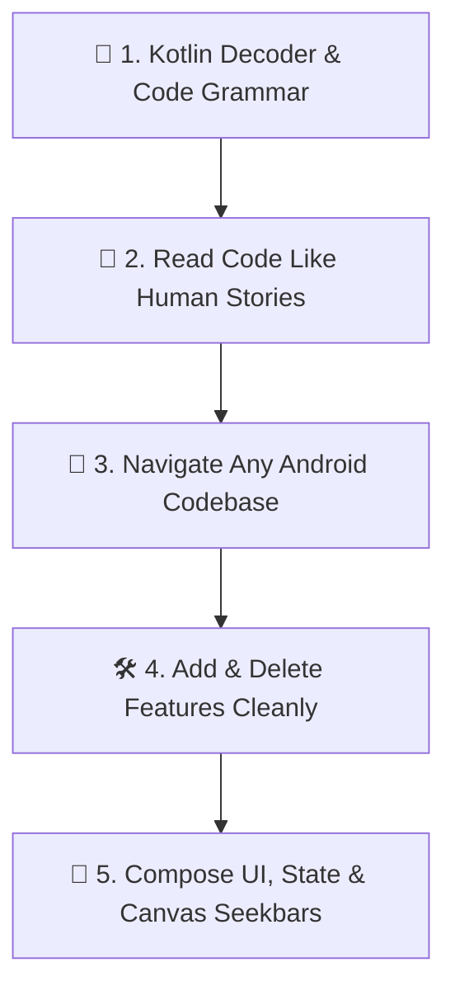

# 📱 Android Development Course: From Beginner to Pro

Welcome to the hands-on Android Development course! This course is designed to take you from foundational concepts to reverse-engineering real production codebases (like **mpvRex**).

---

## 🗺️ Course Curriculum Roadmap

### 🚀 Foundational Lessons
1. **[Lesson 1: The Kotlin Decoder](./kotlin-decoder)** — Demystify Kotlin symbols (`?`, `::`, `@`, `by`) & Custom vs Library classes.
2. **[Lesson 2: Reading Code Like Human Language](./how-to-read-code)** — The 4 physical metaphors, 3-pass reading strategy, and code grammar translation.
3. **[Lesson 3: Universal Code Navigation](./codebase-navigation)** — The 3 Universal Anchors to locate any feature in any Android app in 60s.
4. **[Lesson 4: The Feature Lifecycle](./feature-lifecycle)** — The 6-step feature addition pipeline and surgical deletion checklist.

### 🛠️ Deep Dive Modules
5. **[Module 1: Compose Fundamentals & State](./module1-basics)** — Activities, Composables, Recomposition, and State Hoisting.
6. **[Module 2: State & Storage](./module2-state-management)** — StateFlow, Preferences, Room Database, and Koin Dependency Injection.
7. **[Module 3: Custom UI & Canvas](./module3-custom-ui-canvas)** — Drawing custom Seekbars, progress tracks, and Canvas graphics.
8. **[Module 4: Reverse-Engineering Features](./module4-how-to-read-codebases)** — Reverse-engineering real production apps (mpvRex case study).

---

## 🎓 Modules Overview

| Lesson / Module | Topic | What You Will Learn |
| :--- | :--- | :--- |
| **[Lesson 1: The Kotlin Decoder](./kotlin-decoder)** | **Syntax & Mental Model** | Custom vs Library classes, symbol matrix (`?`, `::`, `@`, `by`), Lambdas & Receivers |
| **[Lesson 2: Reading Code Like English](./how-to-read-code)** | **Mental Translation** | Whiteboard/Foreman metaphors, 3-pass detective method, line-by-line real code translation |
| **[Lesson 3: Universal Code Navigation](./codebase-navigation)** | **Finding Any Feature** | 3 Universal Anchors (Strings, Icons, Routes), Manifest entry points, and Stack inspection |
| **[Lesson 4: The Feature Lifecycle](./feature-lifecycle)** | **Adding & Deleting** | The 6-step feature addition blueprint and the surgical deletion checklist |
| **[Module 1](./module1-basics)** | **Compose & State** | Activities, Composables, Layouts, Modifier chain rules, Recomposition mental model |
| **[Module 2](./module2-state-management)** | **State & Storage** | StateFlow, `remember`, PreferenceStores, Koin Dependency Injection |
| **[Module 3](./module3-custom-ui-canvas)** | **Custom UI & Canvas** | Drawing custom Seekbars, progress tracks, and dynamic color logic |
| **[Module 4](./module4-how-to-read-codebases)** | **Reading Codebases** | How to trace code flow, find existing patterns, and add features like a senior dev |

---
*Start with [Lesson 1: The Kotlin Decoder](./kotlin-decoder).*
