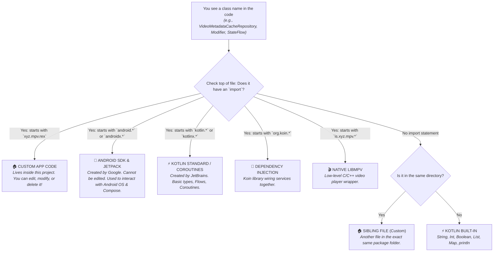

# 🧩 Lesson 1: The Kotlin Decoder

When you build an app with AI or inspect a large open-source project like **mpvRex**, you are immediately hit with hundreds of lines of unfamiliar Kotlin code.

This lesson eliminates the two biggest sources of confusion:
1. **How to differentiate Custom classes from Library / Android SDK classes.**
2. **The Kotlin Multi-Purpose Symbol Matrix** (`?`, `::`, `@`, `by`, `{ }`, `_`).
3. **Lambdas, Trailing Lambdas, and Receivers.**

---

## 1. Custom Class vs. Library Class: The "Who Wrote This?" Rule

In Kotlin, every class, function, or interface belongs to a **Package**. 

To immediately know who wrote a piece of code, look at the **`import`** statements at the top of the file:



### Real Example from `App.kt`:

```kotlin
// 🤖 Android SDK (Google)
import android.app.Application
import android.content.Context

// 🏠 Custom classes (Your project mpvRex)
import xyz.mpv.rex.database.repository.VideoMetadataCacheRepository
import xyz.mpv.rex.di.DatabaseModule

// ⚡ Kotlin Coroutines (JetBrains)
import kotlinx.coroutines.CoroutineScope
import kotlinx.coroutines.launch

// 💉 Koin Library (Dependency Injection)
import org.koin.android.ext.android.inject
import org.koin.core.context.startKoin

// 🎬 Native media library wrapper
import `is`.xyz.mpv.FastThumbnails
```

> [!TIP]
> Whenever you wonder *"Can I change how this method works?"*, check the import! If it starts with your app's package name (`xyz.mpv.rex`), you can open that file and change anything. If it starts with `android.*` or `androidx.*`, it is an immutable framework API provided by Google.

---

## 2. The Kotlin Multi-Purpose Symbol Matrix

Kotlin reuses certain characters (`?`, `::`, `@`, `_`) for multiple purposes depending on where they appear. Here is how to decode them:

| Symbol | Syntax Pattern | Name | What it does | Real `mpvRex` Example |
| :--- | :--- | :--- | :--- | :--- |
| **`?`** | `Type?` | **Nullable Type** | Says: "This variable can hold a real value OR `null`." | `context: Context?` |
| **`?.`** | `obj?.property` | **Safe Call** | Calls property only if `obj` is not null. Returns `null` if it is null (prevents crashes). | `intent?.data?.path` |
| **`?:`** | `a ?: b` | **Elvis Operator** | If `a` is not null, use `a`. If `a` is null, fall back to `b`. | `val title = video.title ?: "Untitled"` |
| **`as?`** | `x as? Type` | **Safe Cast** | Tries to cast `x` to `Type`. If incompatible, returns `null` instead of throwing `ClassCastException`. | `intent.getSerializableExtra(...) as? File` |
| **`!!`** | `obj!!` | **Not-Null Assertion** | Forces Kotlin to treat `obj` as non-null. **Crashes if null!** Senior devs avoid this. | `uri!!.path` |
| **`::`** | `Class::class.java` | **Reflection Reference** | Gets the runtime Java Class blueprint. | `CrashActivity::class.java` |
| **`::`** | `obj::function` | **Function Reference** | Passes a function as a parameter without executing it right now. | `onValueChange = preferences.whiteSeekBar::set` |
| **`@`** | `@Composable` | **Annotation** | Metadata telling the compiler to treat this code specially. | `@Composable fun MiniPlayer() { ... }` |
| **`@`** | `this@MainActivity` | **Qualified This** | Points to the outer class when nested several levels deep inside lambdas. | `androidContext(this@App)` |
| **`@`** | `return@launch` | **Labeled Jump** | Exits only this specific coroutine/lambda block, not the outer function. | `return@launch` |
| **`by`** | `val x by delegate` | **Property Delegation** | Hands off reading/writing `x` to a helper object. | `val whiteSeekBar by prefs.whiteSeekBar.collectAsState()` |
| **`_`** | `{ _, value -> }` | **Discarded Parameter** | Tells Kotlin: "This lambda receives a parameter, but I don't care about it, don't name it." | `items.forEachIndexed { _, file -> ... }` |
| **`_`** | `1_000_000` | **Numeric Separator** | Cosmetic underscore to help humans read large numbers. Compiler treats it as `1000000`. | `debounce(1_000)` |

---

## 3. Demystifying Lambdas & `{ }`

In languages like C, Java, or Python, `{ }` denotes code blocks (if-statements, loops, function bodies).
In Kotlin, `{ }` also creates an **Anonymous Function (Lambda)** that can be stored in a variable or passed as an argument.

### A. Trailing Lambda Syntax (Why Compose Code Looks Like This)

Consider a simple Compose button:

```kotlin
// Method signature:
fun Button(
    onClick: () -> Unit,
    content: @Composable () -> Unit
)
```

In traditional syntax, you would write:
```kotlin
Button(
    onClick = { playVideo() },
    content = { Text("Play") }
)
```

Because `content` is the **last parameter**, Kotlin lets you pull it **outside the parentheses**:
```kotlin
Button(onClick = { playVideo() }) {
    Text("Play")
}
```
This is called **Trailing Lambda Syntax**. Whenever you see `SomeComposable(...) { ... }`, the code inside `{ ... }` is simply the UI children being passed to the parent component!

---

### B. The Implicit `it` Parameter

When a lambda takes **exactly one parameter**, Kotlin doesn't force you to name it. It automatically names it **`it`**:

```kotlin
// Long version:
items.map { item -> item.title }

// Short idiomatic Kotlin:
items.map { it.title }
```

---

### C. Lambdas with Receiver (DSL Magic)

Notice how drawing code in [`Seekbar.kt`](file:///root/Projects/mpvRex/app/src/main/kotlin/xyz/mpv/rex/ui/player/controls/components/Seekbar.kt) works:

```kotlin
Canvas(modifier = Modifier.fillMaxWidth().height(48.dp)) {
    // Where did drawLine come from? There is no "canvas.drawLine"!
    drawLine(
        color = primaryColor,
        start = Offset(0f, centerY),
        end = Offset(progressPx, centerY),
        strokeWidth = 5.dp.toPx()
    )
}
```

**How does this work?**
`Canvas` takes a lambda with a receiver: `DrawScope.() -> Unit`.
Inside `{ }`, Kotlin silently makes `this = DrawScope`.
So calling `drawLine(...)` is literally calling `this.drawLine(...)` on the internal drawing engine!

---

## 4. Quick Self-Test Exercise

Look at this actual line from [`App.kt`](file:///root/Projects/mpvRex/app/src/main/kotlin/xyz/mpv/rex/App.kt#L37):

```kotlin
private val metadataCache: VideoMetadataCacheRepository by inject()
```

1. **What is `VideoMetadataCacheRepository`?**
   - Custom class located in `xyz.mpv.rex.database.repository`.
2. **What does `by` do?**
   - Property delegation. Instead of creating `new VideoMetadataCacheRepository()`, it delegates creation.
3. **What is `inject()`?**
   - A function from the Koin library (`org.koin.android.ext.android.inject`). It asks Koin to automatically supply the repository instance when needed.

---

*Next: Proceed to [Module 1: Android & Jetpack Compose Fundamentals](./module1-basics).*
