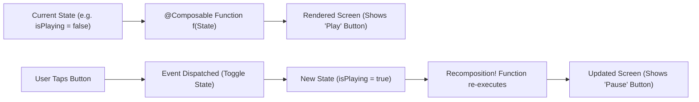
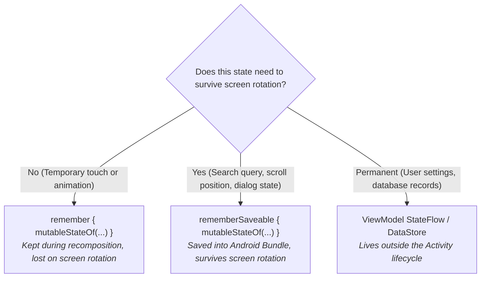
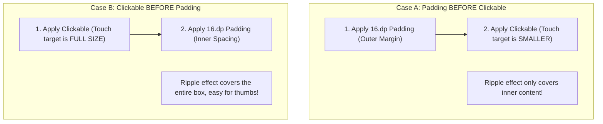
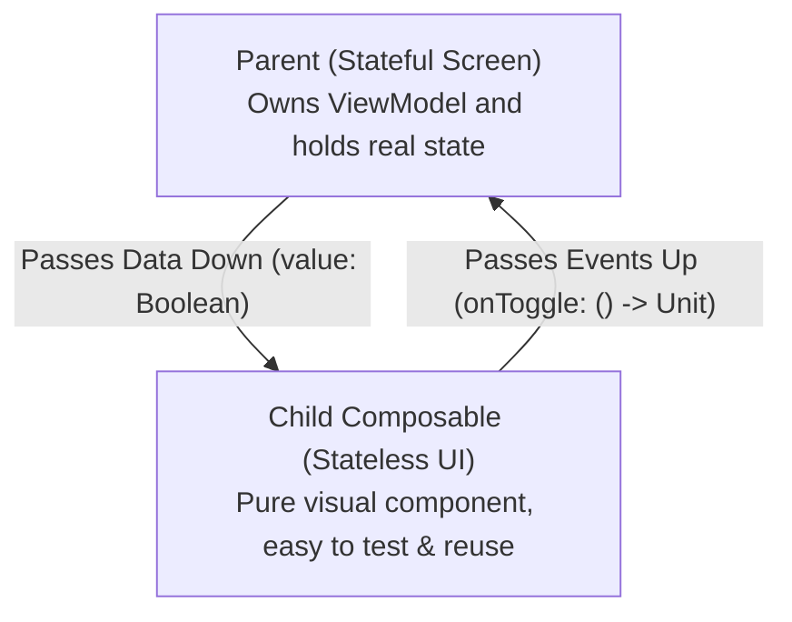

# 📦 Module 1: Jetpack Compose & State Deep Dive

In modern Android development, **Jetpack Compose** is the official UI toolkit recommended by Google. If you inspect 300+ files in apps like **mpvRex**, you will find that almost all user interfaces are built with Compose.

To write, debug, and understand Compose code, you must understand the **mental model** of declarative UI and how the Compose runtime actually works.

---

## 1. The Declarative Mindset: `UI = f(State)`

In the old, traditional Android world (XML Views):
- You created an XML file with `<Button id="playButton" />`.
- In Kotlin, you searched for it: `val button = findViewById(R.id.playButton)`.
- When the video paused, you manually commanded it: `button.setText("Play")`.
- If you forgot to update one label or icon in code, your UI fell out of sync with your state!

### The Compose Way:
In Jetpack Compose, **you never mutate UI elements directly**. Instead, your UI is a mathematical function of your **State**:

$$\text{UI} = f(\text{State})$$



Whenever the state changes, Compose automatically **recomposes** (re-executes) the affected functions and updates the display.

---

## 2. The Recomposition Mystery: Why Functions Run Multiple Times

A `@Composable` function is **not** called just once when the screen opens. It can run:
- Every time a state variable changes.
- Multiple times per second during animations or scrolling.
- In any order, or concurrently on background threads!

```kotlin
@Composable
fun VideoPlayerControls(isPlaying: Boolean) {
    // ⚠️ WARNING: This println runs EVERY TIME isPlaying changes!
    println("Recomposing VideoPlayerControls! isPlaying = $isPlaying")

    Button(onClick = { /* toggle */ }) {
        Text(if (isPlaying) "Pause" else "Play")
    }
}
```

### The Golden Rules of Recomposition:
1. **Composables can execute in any order**: Never assume child A runs before child B.
2. **Composables can run in parallel**: Keep your Composable functions free of side-effects.
3. **Recomposition skips as much as possible**: If a parent Composable recomposes, but a child's inputs haven't changed, Compose skips that child entirely (**Smart Recomposition**).
4. **Composables can be cancelled**: If the user scrolls past an item before Compose finishes calculating it, that execution is discarded.

---

## 3. State in Compose: `remember`, `mutableStateOf`, and `rememberSaveable`

What happens if you declare a normal variable inside a Composable?

```kotlin
@Composable
fun BrokenCounter() {
    var count = 0 // ❌ BIG MISTAKE!

    Button(onClick = { count++ }) {
        Text("Clicked $count times")
    }
}
```

### Why is this broken?
When you click the button, `count` becomes `1`. But Compose doesn't know it changed because `count` is a plain Int. Even worse: when the screen recomposes for any reason, `BrokenCounter()` re-executes, resetting `var count = 0` back to zero!

### The Fix: `remember { mutableStateOf(...) }`

```kotlin
@Composable
fun WorkingCounter() {
    // ✅ 1. mutableStateOf makes the value reactive
    // ✅ 2. remember stores the value in Compose's internal Slot Table across recompositions
    var count by remember { mutableStateOf(0) }

    Button(onClick = { count++ }) {
        Text("Clicked $count times")
    }
}
```

### The Difference: `remember` vs `rememberSaveable`



---

## 4. Connecting ViewModels to Compose: `collectAsState()`

In professional apps like **mpvRex**, business logic does not live in `remember { }`. It lives in the **ViewModel** inside a Kotlin `StateFlow`.

How does Compose listen to a ViewModel's `StateFlow`?
Using **`collectAsState()`**:

```kotlin
@Composable
fun PlayerScreen(viewModel: PlayerViewModel = koinViewModel()) {
    // 1. collectAsState() converts Kotlin Flow into Compose State
    // 2. The 'by' keyword automatically unpacks the value
    val isPlaying by viewModel.isPlaying.collectAsState()
    val currentTime by viewModel.currentTime.collectAsState()

    Text("Current Position: $currentTime seconds")
    Button(onClick = { viewModel.onTogglePlay() }) {
        Text(if (isPlaying) "Pause" else "Play")
    }
}
```

Whenever `viewModel.isPlaying` emits a new value, Compose automatically triggers recomposition for only the parts of `PlayerScreen` that read `isPlaying`!

---

## 5. The `Modifier` Chain Trap: Order Matters!

Every Composable takes an optional `modifier: Modifier = Modifier` parameter. 
Modifiers control **size**, **padding**, **background**, **clicks**, and **gestures**.

> [!CAUTION]
> **Modifiers are chained and executed sequentially from left to right.** Changing their order completely changes the result!

### The Clickable Ripple Trap:

Look at these two buttons:

```kotlin
// Example A:
Box(
    modifier = Modifier
        .padding(16.dp)
        .clickable { /* click */ }
)

// Example B:
Box(
    modifier = Modifier
        .clickable { /* click */ }
        .padding(16.dp)
)
```



### Essential Modifiers Every Developer Must Know:

| Modifier | What it does | Real Example |
| :--- | :--- | :--- |
| `fillMaxSize()` | Expands component to fill entire screen width & height | Background containers |
| `fillMaxWidth()` | Expands component horizontally across parent | Cards, seekbars, buttons |
| `padding(...)` | Adds inner or outer spacing | `padding(horizontal = 16.dp)` |
| `clickable { ... }` | Makes component respond to taps with Material ripple | List items, buttons |
| `clip(shape)` | Cuts component to rounded corners or circles | `clip(RoundedCornerShape(8.dp))` |
| `weight(1f)` | (Inside Row/Column) Expands to take remaining flexible space | Seekbar next to timestamps |

---

## 6. State Hoisting (Writing Senior-Grade Composables)

A beginner writes Composables that grab ViewModels directly everywhere.
A senior engineer writes **Stateless Composables** using **State Hoisting**.



### Example: A Reusable, Stateless Toggle

```kotlin
// 1. STATELESS: Pure UI. No ViewModel dependency!
// Can be previewed, tested, and reused in any screen.
@Composable
fun VideoToggleItem(
    title: String,
    isChecked: Boolean,
    onCheckedChange: (Boolean) -> Unit,
    modifier: Modifier = Modifier
) {
    Row(
        modifier = modifier
            .fillMaxWidth()
            .clickable { onCheckedChange(!isChecked) }
            .padding(16.dp),
        horizontalArrangement = Arrangement.SpaceBetween,
        verticalAlignment = Alignment.CenterVertically
    ) {
        Text(text = title, style = MaterialTheme.typography.bodyLarge)
        Switch(checked = isChecked, onCheckedChange = onCheckedChange)
    }
}

// 2. STATEFUL: Connects to the ViewModel
@Composable
fun PlayerSettingsScreen(viewModel: PlayerViewModel = koinViewModel()) {
    val autoPlay by viewModel.autoPlay.collectAsState()

    VideoToggleItem(
        title = stringResource(R.string.pref_auto_play),
        isChecked = autoPlay,
        onCheckedChange = viewModel::onSetAutoPlay
    )
}
```

---

## 7. Summary Checklist for Jetpack Compose

- [x] **Declarative Mindset**: Don't command UI (`setText`); change the state and let Compose redraw.
- [x] **Recomposition**: Keep Composable functions pure and free of random side effects.
- [x] **State Storage**: Use `remember { mutableStateOf() }` for local UI state, and `collectAsState()` for ViewModel data.
- [x] **Modifiers**: Remember that ordering matters (`clickable` before `padding` gives full ripple).
- [x] **State Hoisting**: Pass state *down*, pass lambdas *up*.

---

*Next: Proceed to [Module 2: State, Preferences & Dependency Injection](./module2-state-management).*
