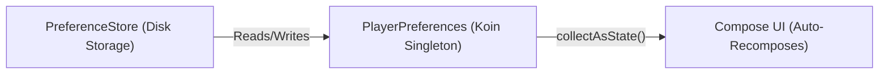

# 💾 Module 2: State, Preferences & Dependency Injection

State is the single source of truth in any modern app. If user preferences change, the UI must update automatically.



---

## 1. How Preferences Work (`PreferenceStore`)

In projects like **mpvRex**, settings are saved asynchronously using a key-value `PreferenceStore`.

### Defining a Preference Key:
```kotlin
class PlayerPreferences(preferenceStore: PreferenceStore) {
    // Key: "white_seekbar", Default: false
    val whiteSeekBar = preferenceStore.getBoolean("white_seekbar", false)
}
```

### Collecting State in Compose:
```kotlin
@Composable
fun SeekbarComponent() {
    val playerPreferences = koinInject<PlayerPreferences>()
    // Recomposes automatically whenever whiteSeekBar changes in SharedPreferences
    val whiteSeekBar by playerPreferences.whiteSeekBar.collectAsState()
}
```

---

## 2. Dependency Injection with Koin

Instead of creating instances manually (`val prefs = PlayerPreferences(...)`), Koin injects instances globally anywhere in Compose:

```kotlin
// Injected cleanly into any Composable function:
val appearancePreferences = koinInject<AppearancePreferences>()
val gesturePreferences = koinInject<GesturePreferences>()
```

---
*Next: Proceed to [Module 3: Custom UI, Canvas & Component Drawing](./module3-custom-ui-canvas).*
