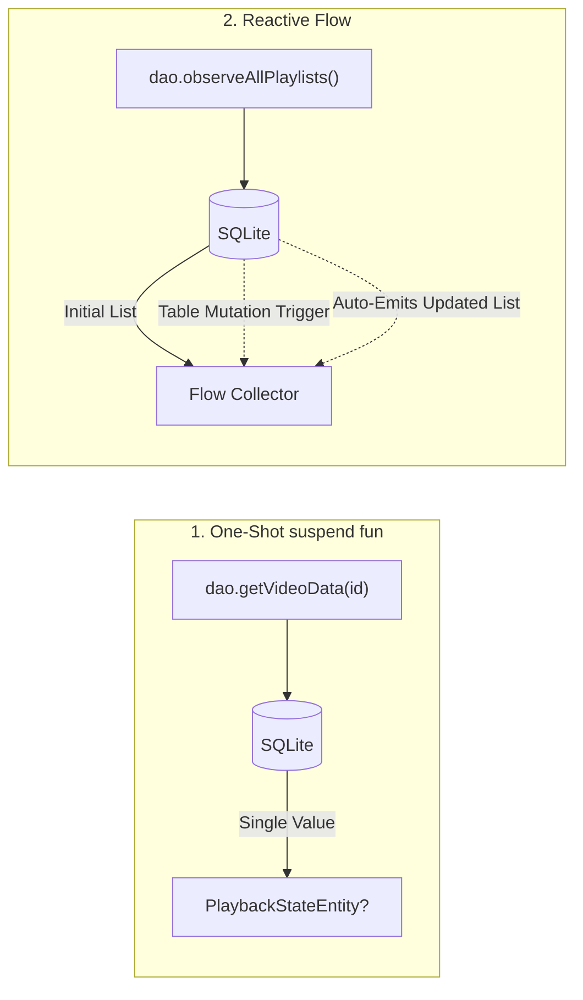

# ⚡ DAOs, Reactive Flow Queries & Transactions

In this guide, you will master writing high-performance **Data Access Objects (DAOs)** in Room. We cover modern CRUD patterns like `@Upsert`, advanced SQL queries, pagination, aggregation, conditional subqueries with `COALESCE`, reactive real-time database observation with Kotlin `Flow`, and atomic multi-step `@Transaction` methods using real code from **mpvRex**.

---

## 👶 1. The Beginner Analogy: The Automated Concierge

A **DAO (Data Access Object)** is like a 5-star hotel concierge:
- Instead of rummaging through storage rooms yourself, you hand the concierge a note: *"Bring me the 20 most recently watched movies."*
- The concierge translates your English/Kotlin request into formal SQL, talks to SQLite, filters out deleted items, sorts them by timestamp, and hands you back a clean, typed list of Kotlin objects.
- If you request a **`Flow`**, the concierge sets up a live monitor: whenever a new movie is finished or deleted, they automatically update the screen in real-time without you ever having to press a "Refresh" button!

---

## 🛠️ 2. Modern CRUD Operations: Upsert vs Insert

### A. The `@Upsert` Revolution
In older versions of SQLite, updating a video's position required either:
1. Running a `SELECT` query to see if the video exists, followed by `IF exists UPDATE ELSE INSERT`.
2. Or using `@Insert(onConflict = OnConflictStrategy.REPLACE)`, which behind the scenes **deleted the entire row and re-inserted it**, triggering cascading foreign key events and re-allocating row IDs!

With Room 2.5+, Room introduced **`@Upsert`**:
```kotlin
@Dao
interface PlaybackStateDao {
    // ⚡ Atomically inserts if absent, or updates matching columns if present!
    @Upsert
    suspend fun upsert(playbackState: PlaybackStateEntity)
}
```
`@Upsert` generates native SQLite `INSERT INTO ... ON CONFLICT DO UPDATE SET ...` syntax, preserving row identity and avoiding unnecessary delete-insert overhead.

---

### B. Conflict Strategies for Batch Inserts
When saving scanned files from storage into Room:

```kotlin
@Dao
interface PlaylistDao {
    // Replace existing item if id matches:
    @Insert(onConflict = OnConflictStrategy.REPLACE)
    suspend fun insertPlaylistItem(item: PlaylistItemEntity): Long

    // Batch insert multiple items:
    @Insert(onConflict = OnConflictStrategy.REPLACE)
    suspend fun insertPlaylistItems(items: List<PlaylistItemEntity>)

    @Update
    suspend fun updatePlaylist(playlist: PlaylistEntity)

    @Delete
    suspend fun deletePlaylist(playlist: PlaylistEntity)
}
```

---

## 🔍 3. Advanced SQL Queries in Production (mpvRex Case Study)

DAOs in **mpvRex** use SQLite's full power for filtering, aggregation, and subqueries.

### A. Dynamic Parameter Binding & Pagination
Colon prefixes (`:variableName`) bind Kotlin parameters safely into SQL, completely preventing **SQL Injection attacks**:

```kotlin
@Dao
interface RecentlyPlayedDao {
    // 1. Parameterized limit query:
    @Query("SELECT * FROM RecentlyPlayedEntity ORDER BY timestamp DESC LIMIT :limit")
    fun getRecentlyPlayed(limit: Int): Flow<List<RecentlyPlayedEntity>>

    // 2. Pagination with LIMIT and OFFSET:
    @Query("""
        SELECT * FROM RecentlyPlayedEntity 
        ORDER BY timestamp DESC 
        LIMIT :limit OFFSET :offset
    """)
    suspend fun getRecentlyPlayedPaged(limit: Int, offset: Int): List<RecentlyPlayedEntity>

    // 3. Search query with wildcards:
    @Query("""
        SELECT * FROM RecentlyPlayedEntity 
        WHERE fileName LIKE '%' || :searchQuery || '%' 
        ORDER BY timestamp DESC
    """)
    fun searchRecentlyPlayed(searchQuery: String): Flow<List<RecentlyPlayedEntity>>
}
```

---

### B. Aggregation Queries: Counting & Maximums
Instead of loading thousands of items into Android RAM just to count them, let SQLite calculate aggregates directly on disk:

```kotlin
@Dao
interface PlaylistDao {
    // 📊 Count items directly in SQLite:
    @Query("SELECT COUNT(*) FROM PlaylistItemEntity WHERE playlistId = :playlistId")
    suspend fun getPlaylistItemCount(playlistId: Int): Int

    // 📊 Real-time reactive item count for UI badges:
    @Query("SELECT COUNT(*) FROM PlaylistItemEntity WHERE playlistId = :playlistId")
    fun observePlaylistItemCount(playlistId: Int): Flow<Int>

    // 🔝 Get highest position index for appending new items:
    @Query("SELECT MAX(position) FROM PlaylistItemEntity WHERE playlistId = :playlistId")
    suspend fun getMaxPosition(playlistId: Int): Int?
}
```

---

### C. Advanced Subqueries & `COALESCE`
In mpvRex, a playlist can have a custom thumbnail set by the user. If none is set, it falls back to the thumbnail of the first video in that playlist.
Instead of writing complex Kotlin fallback logic, **mpvRex solves this in a single SQLite query** using `COALESCE` and nested subqueries ([`PlaylistDao.kt`](file:///root/Projects/mpvRex/app/src/main/kotlin/xyz/mpv/rex/database/dao/PlaylistDao.kt)):

```kotlin
@Query("""
    SELECT COALESCE(
      (SELECT customThumbnailPath FROM PlaylistEntity WHERE id = :playlistId),
      (SELECT filePath FROM PlaylistItemEntity WHERE playlistId = :playlistId ORDER BY position ASC LIMIT 1)
    )
""")
suspend fun getEffectiveThumbnailPath(playlistId: Int): String?
```
> [!NOTE]
> `COALESCE(val1, val2)` returns the first non-null argument. If `customThumbnailPath` is null, SQLite automatically executes the second subquery and retrieves the first item's file path!

---

## 🌊 4. Reactive Streams: One-Shot `suspend` vs Real-Time `Flow`

Room provides two distinct query modes:



### When to Use Which:
- **`suspend fun`:** Use for one-time operations. For example, when opening a video, you fetch its saved resume timestamp **once**:
  ```kotlin
  @Query("SELECT * FROM PlaybackStateEntity WHERE mediaTitle = :mediaTitle LIMIT 1")
  suspend fun getVideoDataByTitle(mediaTitle: String): PlaybackStateEntity?
  ```
- **`Flow<T>`:** Use whenever the UI displays a list that might change while the user is looking at it (e.g. History list, Playlists, Downloads):
  ```kotlin
  @Query("SELECT * FROM PlaylistEntity ORDER BY updatedAt DESC")
  fun observeAllPlaylists(): Flow<List<PlaylistEntity>>
  ```
  Room registers an internal table invalidation tracker. The moment any background worker inserts, updates, or deletes a playlist row, Room automatically re-executes the query and emits the fresh list down the Flow!

---

## 🔐 5. Multi-Step Atomic Transactions (`@Transaction`)

Consider reordering items inside a playlist. If a user drags item #5 up to item #1, the positions of 5 different rows must be updated.
If the phone battery dies or the app crashes halfway through:
- Item #3 and #4 could end up with identical position numbers.
- The playlist order becomes corrupted.

### The Solution: `@Transaction`
Marking a DAO method with `@Transaction` guarantees **ACID Atomicity** (All or Nothing). If any single step fails, the entire transaction rolls back:

```kotlin
@Dao
interface PlaylistDao {
    @Query("UPDATE PlaylistItemEntity SET position = :newPosition WHERE id = :itemId")
    suspend fun updateItemPosition(itemId: Int, newPosition: Int)

    // ⚡ Atomic batch execution in a single database transaction:
    @Transaction
    suspend fun reorderPlaylistItems(playlistId: Int, newOrder: List<Int>) {
        newOrder.forEachIndexed { index, itemId ->
            updateItemPosition(itemId, index)
        }
    }
}
```

---

## 🎯 Summary Checklist for DAOs

1. **Use `@Upsert`** for save/resume states to eliminate unnecessary delete/insert cycles.
2. **Never run DAOs on the Main Thread:** Always call DAO methods inside a Coroutine (`viewModelScope.launch(Dispatchers.IO)`).
3. **Use `Flow<List<T>>` for screens:** Let Room handle real-time UI updates automatically.
4. **Use `@Transaction` for multi-step updates:** Protect relational and sequential data from partial writes.
