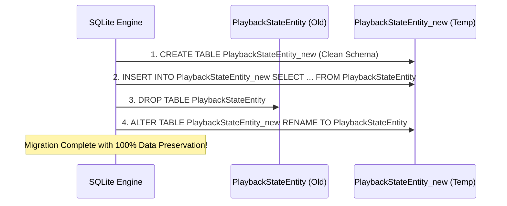
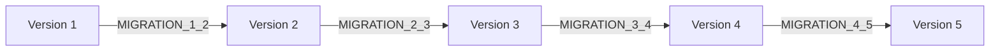

# 🔄 Database Migrations & Schema Evolution Masterclass

In this guide, you will master the most critical and high-risk discipline in Android database engineering: **Database Migrations**. You will learn why schema changes cause immediate app crashes in production if handled incorrectly, how to write non-destructive SQL migrations, how to execute the **SQLite 12-Step Table Recreation Pattern**, and how **mpvRex** safely evolved its database across 18 major versions without ever losing user watch history or playlists.

---

## 👶 1. The Beginner Analogy: Remodeling a Bank Vault While the Bank is Open

Imagine a bank vault containing thousands of safety deposit boxes (user data):
- One day, the bank manager decides every customer box must now have a second digital fingerprint scanner (`new column`).
- **Option A (Destructive):** You blow up the entire vault with dynamite, build a brand new one from scratch, and apologize to customers that all their gold and savings have vanished! (`fallbackToDestructiveMigration()`).
- **Option B (Safe Migration):** A team of structural engineers works overnight: they carefully build the new scanners onto each box, verify every lock still works, and when the doors open in the morning, all customer data is intact! (`androidx.room.migration.Migration`).

---

## 💥 2. The Deadly Room Crash: Why Unhandled Changes Crash Apps

Whenever Room opens a database, it checks two values:
1. The **`user_version`** integer stored in the SQLite database header.
2. The **`identity_hash`** calculated from your Kotlin `@Entity` classes at compile-time.

If you add a single property to an entity:
```kotlin
// You added this new property:
val subtitleCodec: String = ""
```
and you simply increment `version = 2` without providing a `Migration(1, 2)`, Room throws this fatal exception the moment the app boots:

```text
java.lang.IllegalStateException: A migration from 1 to 2 was required but not found. 
Please provide the necessary Migration path via RoomDatabase.Builder.addMigration(Migration ...) 
or allow for destructive migrations via one of the RoomDatabase.Builder.fallbackToDestructiveMigration* methods.
```

### The Temptation of Destructive Migration
```kotlin
// ⚠️ DANGEROUS: Wipes all user data on update!
Room.databaseBuilder(...)
    .fallbackToDestructiveMigration() // ❌ NEVER ship this in a production release!
    .build()
```
If you enable destructive fallback, every time you release an update on Google Play or GitHub, **all user watch history, custom playlists, saved credentials, and playback bookmarks are permanently erased!**

In **mpvRex**, destructive migration is explicitly forbidden ([`DatabaseModule.kt`](file:///root/Projects/mpvRex/app/src/main/kotlin/xyz/mpv/rex/di/DatabaseModule.kt)):
```kotlin
.fallbackToDestructiveMigration(false) // 🛡️ Guarantees zero data loss
```

---

## 🛠️ 3. Type 1: Simple Schema Migrations (`ALTER TABLE`)

When you are only **adding new columns** to an existing table, SQLite provides the fast `ALTER TABLE ADD COLUMN` statement.

### Case Study: Adding Subtitle Codec in mpvRex (`MIGRATION_2_3`)
In version 3 of mpvRex, two new columns were added across two existing tables ([`DatabaseModule.kt`](file:///root/Projects/mpvRex/app/src/main/kotlin/xyz/mpv/rex/di/DatabaseModule.kt)):

```kotlin
val MIGRATION_2_3 = object : Migration(2, 3) {
    override fun migrate(db: SupportSQLiteDatabase) {
        try {
            android.util.Log.d("Migration_2_3", "Starting migration v2 -> v3")

            // 1. Add non-null column with a default empty string:
            db.execSQL(
                "ALTER TABLE `PlaybackStateEntity` ADD COLUMN `externalSubtitles` TEXT NOT NULL DEFAULT ''"
            )

            // 2. Add non-null column to video metadata cache table:
            db.execSQL(
                "ALTER TABLE video_metadata_cache ADD COLUMN subtitleCodec TEXT NOT NULL DEFAULT ''"
            )

            android.util.Log.d("Migration_2_3", "Migration v2 -> v3 completed successfully")
        } catch (e: Exception) {
            android.util.Log.e("Migration_2_3", "Migration failed", e)
            throw e // Re-throw to prevent corrupt state
        }
    }
}
```

### Golden Rules for `ADD COLUMN` in SQLite:
1. **If column is `NOT NULL`:** You **MUST** supply a `DEFAULT` value (e.g. `DEFAULT ''` or `DEFAULT 0`), otherwise SQLite will reject the command because existing rows would have `NULL`!
2. **Nullable columns:** Can default to `NULL` (e.g. `ADD COLUMN m3uSourceUrl TEXT DEFAULT NULL`).
3. **Boolean columns:** SQLite has no native boolean type. Store as `INTEGER NOT NULL DEFAULT 0` (0 = false, 1 = true).

---

## 🏗️ 4. Type 2: Complex Migrations (The 12-Step Table Recreation Pattern)

What happens if you need to:
- **Delete an existing column?**
- **Rename a column?**
- **Change a column's data type (e.g. `INTEGER` to `TEXT`)?**
- **Add or change a `FOREIGN KEY` constraint?**

Because older Android SQLite engines do not support `DROP COLUMN` or modifying constraints, Android engineers use the **Table Recreation Pattern**.

### Real mpvRex Production Case Study: `MIGRATION_1_2`
In mpvRex v1.1.0, the `PlaybackStateEntity` needed to remove two obsolete subtitle columns (`secondarySid`, `secondarySubDelay`) and add a `videoZoom` column.

Here is the exact step-by-step recreation logic executed in [`DatabaseModule.kt`](file:///root/Projects/mpvRex/app/src/main/kotlin/xyz/mpv/rex/di/DatabaseModule.kt):



### The Exact SQL Code:

```kotlin
val MIGRATION_1_2 = object : Migration(1, 2) {
    override fun migrate(db: SupportSQLiteDatabase) {
        try {
            // STEP 1: Create new temporary table with the exact new schema:
            db.execSQL("""
                CREATE TABLE IF NOT EXISTS `PlaybackStateEntity_new` (
                    `mediaTitle` TEXT NOT NULL,
                    `lastPosition` INTEGER NOT NULL,
                    `playbackSpeed` REAL NOT NULL,
                    `videoZoom` REAL NOT NULL DEFAULT 0.0,
                    `sid` INTEGER NOT NULL,
                    `subDelay` INTEGER NOT NULL,
                    `subSpeed` REAL NOT NULL,
                    `aid` INTEGER NOT NULL,
                    `audioDelay` INTEGER NOT NULL,
                    `timeRemaining` INTEGER NOT NULL DEFAULT 0,
                    PRIMARY KEY(`mediaTitle`)
                )
            """.trimIndent())

            // STEP 2: Copy valid data from old table into new table:
            db.execSQL("""
                INSERT INTO `PlaybackStateEntity_new` 
                (`mediaTitle`, `lastPosition`, `playbackSpeed`, `videoZoom`, `sid`, `subDelay`, 
                 `subSpeed`, `aid`, `audioDelay`, `timeRemaining`)
                SELECT `mediaTitle`, `lastPosition`, `playbackSpeed`, 0.0, `sid`, `subDelay`, 
                       `subSpeed`, `aid`, `audioDelay`, `timeRemaining`
                FROM `PlaybackStateEntity`
            """.trimIndent())

            // STEP 3: Drop the old table:
            db.execSQL("DROP TABLE `PlaybackStateEntity`")

            // STEP 4: Rename temporary table to official table name:
            db.execSQL("ALTER TABLE `PlaybackStateEntity_new` RENAME TO `PlaybackStateEntity`")

            // STEP 5: Drop obsolete legacy tables no longer needed:
            db.execSQL("DROP TABLE IF EXISTS `ExternalSubtitleEntity`")

            // STEP 6: Create brand-new tables added in this version:
            db.execSQL("""
                CREATE TABLE IF NOT EXISTS `PlaylistEntity` (
                    `id` INTEGER PRIMARY KEY AUTOINCREMENT NOT NULL,
                    `name` TEXT NOT NULL,
                    `createdAt` INTEGER NOT NULL,
                    `updatedAt` INTEGER NOT NULL
                )
            """.trimIndent())

        } catch (e: Exception) {
            android.util.Log.e("Migration_1_2", "Migration failed", e)
            throw e
        }
    }
}
```

---

## ⛓️ 5. Migration Chaining: How Room Upgrades Multi-Version Skips

What happens if a user didn't open the app for six months and upgrades from **Version 1** directly to **Version 5**?



You do **NOT** need to write a custom `MIGRATION_1_5`!
When you register all migrations with `.addMigrations(...)`, Room uses a shortest-path graph search algorithm to automatically chain migrations in order:
```kotlin
Room.databaseBuilder(context, MpvExDatabase::class.java, "mpvex.db")
    .addMigrations(
        MIGRATION_1_2,
        MIGRATION_2_3,
        MIGRATION_3_4,
        MIGRATION_4_5,
        // ... up to MIGRATION_17_18
    )
    .build()
```
Room starts at version 1, executes `MIGRATION_1_2`, increments `user_version` to 2, runs `MIGRATION_2_3`, and continues until the database matches version 5 seamlessly!

---

## 🎯 Summary Checklist for Migrations

1. **Never use `fallbackToDestructiveMigration()` in production:** It erases user data.
2. **Always increment `version` in `@Database`:** Whenever any entity class or column changes.
3. **Always supply `DEFAULT` for `NOT NULL` columns** in `ALTER TABLE ADD COLUMN`.
4. **Use Table Recreation Pattern** for removing columns, renaming columns, or altering foreign keys.
5. **Always test migrations:** Verify that real database instances from previous APKs migrate without crashing.
