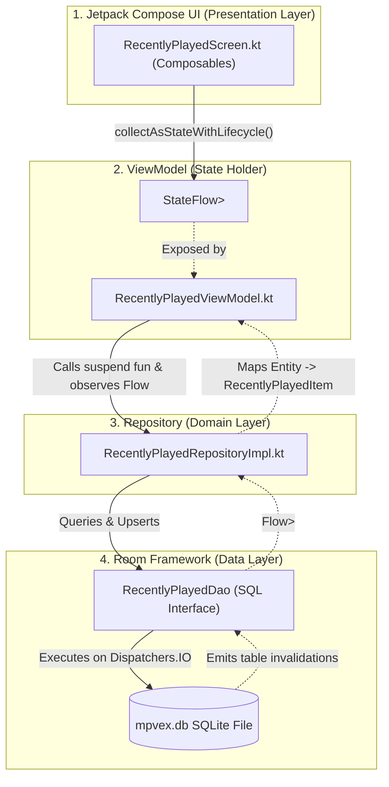

# 🔗 Repository Pattern & Jetpack Compose Integration

In this guide, you will learn how to connect Room databases cleanly to your application's user interface using **Clean Architecture**. We explore why UI components must never access DAOs directly, how the **Repository Pattern** abstracts data sources, how **Koin** injects database singletons, how to convert Room database `Flow` streams into lifecycle-aware `StateFlow` inside ViewModels, and how **Jetpack Compose** renders real-time database updates smoothly without frame drops.

---

## 👶 1. The Beginner Analogy: The Restaurant Waiter

Imagine dining at an upscale restaurant:
- **The Database & DAO:** The kitchen pantry and prep cooks chopping raw ingredients.
- **The UI Screen (Compose):** The customer sitting at a table with an empty plate.
- **The Mistake (Violating Architecture):** Letting the customer walk straight into the kitchen, open the walk-in freezer, grab raw chicken, and cook it on the stove! (Calling DAOs directly inside Compose composables).
- **The Repository Pattern:** A polite, professional waiter (Repository). The waiter visits the kitchen (DAO), plates the food into an elegant meal (maps Entity to UI Domain Model), and delivers it directly to the customer's table (ViewModel and Compose).

---

## 🏗️ 2. Architectural Data Flow: From SQLite Disk to Compose UI



---

## 🛡️ 3. The Repository Layer (Case Study: mpvRex)

The Repository is responsible for:
1. Orchestrating data from one or more DAOs (e.g. video files + playlist info).
2. Handling business logic (e.g. checking whether a file exists on disk before showing it in history).
3. Transforming raw database entities into clean UI models.

### The Repository Implementation ([`RecentlyPlayedRepositoryImpl.kt`](file:///root/Projects/mpvRex/app/src/main/kotlin/xyz/mpv/rex/database/repository/RecentlyPlayedRepositoryImpl.kt)):

```kotlin
package xyz.mpv.rex.database.repository

import xyz.mpv.rex.database.dao.RecentlyPlayedDao
import xyz.mpv.rex.database.entities.RecentlyPlayedEntity
import xyz.mpv.rex.domain.recentlyplayed.repository.RecentlyPlayedRepository
import kotlinx.coroutines.Dispatchers
import kotlinx.coroutines.withContext

class RecentlyPlayedRepositoryImpl(
    private val recentlyPlayedDao: RecentlyPlayedDao
) : RecentlyPlayedRepository {

    // ⚡ Thread-safe record upsert on IO thread:
    override suspend fun addRecentlyPlayed(
        filePath: String,
        fileName: String,
        videoTitle: String?,
        duration: Long,
        fileSize: Long,
        width: Int,
        height: Int,
        launchSource: String?,
        playlistId: Int?
    ) = withContext(Dispatchers.IO) {
        val existingEntry = recentlyPlayedDao.getByFilePath(filePath)
        
        val entity = if (existingEntry != null) {
            // Update timestamp and existing properties:
            existingEntry.copy(
                timestamp = System.currentTimeMillis(),
                duration = if (duration > 0) duration else existingEntry.duration
            )
        } else {
            // Create a brand-new entry:
            RecentlyPlayedEntity(
                filePath = filePath,
                fileName = fileName,
                videoTitle = videoTitle,
                duration = duration,
                fileSize = fileSize,
                width = width,
                height = height,
                timestamp = System.currentTimeMillis(),
                launchSource = launchSource,
                playlistId = playlistId
            )
        }
        recentlyPlayedDao.insert(entity)
    }

    override fun observeRecentlyPlayed(): Flow<List<RecentlyPlayedEntity>> {
        return recentlyPlayedDao.observeRecentlyPlayed()
    }
}
```

---

## 💉 4. Dependency Injection with Koin: Wiring DAOs & Repositories

In [`DatabaseModule.kt`](file:///root/Projects/mpvRex/app/src/main/kotlin/xyz/mpv/rex/di/DatabaseModule.kt), we bind our database singleton, extract the DAOs, and inject them into our repositories:

```kotlin
val databaseModule = module {
    // 1. Singleton Database Instance:
    single<MpvExDatabase> {
        Room.databaseBuilder(androidContext(), MpvExDatabase::class.java, "mpvex.db")
            .setJournalMode(RoomDatabase.JournalMode.WRITE_AHEAD_LOGGING)
            .addMigrations(*ALL_MIGRATIONS)
            .fallbackToDestructiveMigration(false)
            .build()
    }

    // 2. Extract DAOs as singletons:
    single { get<MpvExDatabase>().recentlyPlayedDao() }
    single { get<MpvExDatabase>().playlistDao() }

    // 3. Inject DAO into Repository:
    single<RecentlyPlayedRepository> {
        RecentlyPlayedRepositoryImpl(recentlyPlayedDao = get())
    }
}
```

---

## 🧠 5. The ViewModel: Transforming Room Flow to StateFlow

In [`RecentlyPlayedViewModel.kt`](file:///root/Projects/mpvRex/app/src/main/kotlin/xyz/mpv/rex/ui/browser/recentlyplayed/RecentlyPlayedViewModel.kt), we consume the repository and expose a state holder:

```kotlin
class RecentlyPlayedViewModel(
    private val repository: RecentlyPlayedRepository
) : ViewModel() {

    // ⚡ Hot StateFlow that pauses query execution 5 seconds after screen goes to background:
    val recentItems: StateFlow<List<RecentlyPlayedItem>> = repository.observeRecentlyPlayed()
        .map { entityList ->
            // Map Database Entities to UI Items:
            entityList.map { entity ->
                RecentlyPlayedItem(
                    id = entity.id,
                    title = entity.videoTitle ?: entity.fileName,
                    path = entity.filePath,
                    formattedDuration = MediaFormatter.formatDuration(entity.duration),
                    timestamp = entity.timestamp
                )
            }
        }
        .stateIn(
            scope = viewModelScope,
            started = SharingStarted.WhileSubscribed(5_000), // 🔋 Saves phone battery!
            initialValue = emptyList()
        )
}
```

> [!TIP]
> `SharingStarted.WhileSubscribed(5_000)` keeps the database flow active while the user is actively viewing the screen. When the user locks the phone or switches apps, Room automatically unsubscribes from SQLite after 5 seconds to eliminate background CPU and battery drain!

---

## 🎨 6. The Jetpack Compose UI: Rendering Real-Time Data

In Compose, we collect the `StateFlow` safely using lifecycle-aware collectors:

```kotlin
package xyz.mpv.rex.ui.browser.recentlyplayed

import androidx.compose.foundation.lazy.LazyColumn
import androidx.compose.foundation.lazy.items
import androidx.compose.material3.*
import androidx.compose.runtime.Composable
import androidx.compose.runtime.getValue
import androidx.lifecycle.compose.collectAsStateWithLifecycle
import org.koin.androidx.compose.koinViewModel

@Composable
fun RecentlyPlayedScreen(
    viewModel: RecentlyPlayedViewModel = koinViewModel(),
    onVideoClick: (String) -> Unit
) {
    // ⚡ Automatically pauses collection when Compose goes into the backstack:
    val items by viewModel.recentItems.collectAsStateWithLifecycle()

    if (items.isEmpty()) {
        EmptyStateView(message = "No recently played videos")
    } else {
        LazyColumn {
            items(
                items = items,
                key = { item -> item.id } // 🔑 Unique key guarantees fast recomposition!
            ) { item ->
                VideoHistoryCard(
                    title = item.title,
                    duration = item.formattedDuration,
                    onClick = { onVideoClick(item.path) }
                )
            }
        }
    }
}
```

---

## 🎯 Architecture Golden Rules

1. **Entities are internal to the Data Layer:** Never pass `@Entity` classes directly into `@Composable` functions. Map them to pure UI data classes.
2. **Never invoke DAOs directly from Composables:** Always route operations through the `ViewModel` -> `Repository` -> `DAO`.
3. **Use `collectAsStateWithLifecycle()`:** Avoid plain `collectAsState()` in Compose to ensure flows pause during configuration changes or backgrounding.
4. **Use unique item keys in LazyColumn:** Supplying `key = { it.id }` lets Compose animate item insertions and deletions without re-drawing the entire list.
