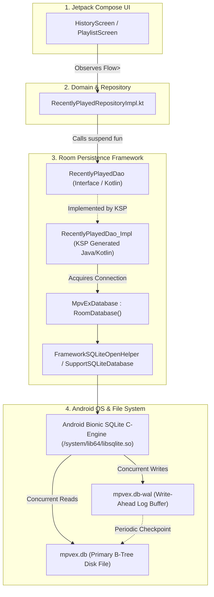

# 🗄️ SQLite & Room Architecture Fundamentals

In this guide, you will master the foundational architecture of persistent local storage on Android. We explore the internal mechanics of the **SQLite B-Tree storage engine**, how Android manages raw databases, why Google created the **Room Persistence Library**, and how real-world production apps like **mpvRex** configure thread-safe, high-speed database singletons with **Write-Ahead Logging (WAL)**.

---

## 👶 1. The Beginner Analogy: The Filing Room & The Smart Librarian

To understand databases in mobile development, compare them to physical office records:

| Concept | Real-World Analogy | Android Equivalent |
| :--- | :--- | :--- |
| **Raw File / DataStore** | A sticky note on the monitor with a single boolean or integer. | `preferencesDataStore` |
| **SQLite Engine** | A giant steel filing cabinet with thousands of folders arranged alphabetically in drawers. | C-based SQLite engine in the Android Bionic C runtime (`/system/lib64/libsqlite.so`). |
| **The Database File** | The physical room where the cabinet sits on the phone's internal flash storage. | `/data/data/xyz.mpv.rex/databases/mpvex.db` |
| **Room Library** | A smart, multilingual chief librarian who speaks typed Kotlin, translates requests into SQL, verifies spelling at compile time, and fetches folders on background threads without ever blocking the front desk. | `androidx.room:room-runtime` |

---

## 🏗️ 2. Architectural Blueprint: The Room Persistence Layer

Room sits directly between your Kotlin application code and the low-level SQLite database. It completely eliminates error-prone `Cursor` iteration and raw string concatenation.



---

## ⚙️ 3. Under the Hood: How SQLite Works on Android

Every Android device since version 1.0 ships with SQLite compiled directly into the OS. SQLite is an embedded relational database engine:
1. **Zero-Configuration:** It requires no external server process or network daemon like PostgreSQL or MySQL.
2. **Single-File Storage:** The entire database (schema, tables, indexes, and records) lives inside a single `.db` file in your application's private sandbox directory:
   ```bash
   /data/data/<package_name>/databases/<database_name>.db
   ```
3. **Strict Sandboxing:** Android security isolates this file via Unix user ID (UID) permissions. No other app on the phone can read or tamper with your database without root privileges.

### Why Raw `SQLiteOpenHelper` is Dangerous in Modern Apps
Before Room, developers used Android's native `SQLiteOpenHelper` and `rawQuery()`:
```kotlin
// ❌ THE OLD, DANGEROUS WAY (Prone to crashes & memory leaks)
val cursor = db.rawQuery("SELECT * FROM videos WHERE duration > ?", arrayOf("60"))
if (cursor.moveToFirst()) {
    do {
        // Run-time column name typos crash the app in production!
        val title = cursor.getString(cursor.getColumnIndexOrThrow("mediaTitel")) // TYPO!
        val pos = cursor.getLong(cursor.getColumnIndexOrThrow("lastPos"))
    } while (cursor.moveToNext())
}
cursor.close() // Forgetting to close leaks native file descriptors!
```

**Room solves all four historical problems:**
- **Compile-Time SQL Validation:** If you misspell a column name in `@Query("SELECT * FROM videos WHERE titl = :t")`, KSP halts compilation immediately with a red error!
- **Zero Cursor Boilerplate:** Room automatically deserializes SQLite result rows into Kotlin data classes.
- **First-Class Coroutines & Flow:** DAOs support `suspend` functions and reactive `Flow<T>` emissions natively.
- **Migration Verification:** Room verifies database schema hashes at boot to guarantee data integrity.

---

## 🚀 4. Performance Tuning: Write-Ahead Logging (WAL)

By default, classic SQLite operates in **Rollback Journal Mode**. In this mode:
- When a write transaction begins, SQLite locks the entire database file.
- **Readers are completely blocked** while a write is occurring.
- If your background video scanner is indexing 500 files from storage, the UI thread freezes when trying to read the playlist!

### The Solution: WAL Mode
In **Write-Ahead Logging (WAL)**:
- Reads and writes happen **simultaneously without locking each other**.
- New writes are appended to an auxiliary journal file (`mpvex.db-wal`).
- Readers read unmodified pages from `mpvex.db` and newly written pages from `mpvex.db-wal`.
- Periodically, a background thread commits (checkpoints) the WAL records back into the main database.

Here is how **mpvRex** configures WAL mode inside its Koin dependency injection module ([`DatabaseModule.kt`](file:///root/Projects/mpvRex/app/src/main/kotlin/xyz/mpv/rex/di/DatabaseModule.kt)):

```kotlin
single<MpvExDatabase> {
    val context = androidContext()
    Room.databaseBuilder(
        context,
        MpvExDatabase::class.java,
        "mpvex.db"
    )
    // ⚡ Enables concurrent reads & writes for maximum player performance:
    .setJournalMode(RoomDatabase.JournalMode.WRITE_AHEAD_LOGGING)
    .addMigrations(*ALL_MIGRATIONS)
    .fallbackToDestructiveMigration(false)
    .build()
}
```

---

## 📦 5. Gradle Dependencies for Modern Room

To configure Room in your Android project with Kotlin Symbol Processing (KSP):

```kotlin
// In build.gradle.kts (app module):
plugins {
    alias(libs.plugins.android.application)
    alias(libs.plugins.kotlin.android)
    alias(libs.plugins.ksp) // Kotlin Symbol Processing
}

dependencies {
    val roomVersion = "2.6.1"

    // Core Room runtime
    implementation("androidx.room:room-runtime:$roomVersion")
    
    // Kotlin Coroutines & Flow extensions for Room
    implementation("androidx.room:room-ktx:$roomVersion")
    
    // Code generator (KSP)
    ksp("androidx.room:room-compiler:$roomVersion")
}
```

---

## 🧩 6. Defining the RoomDatabase Abstract Class

The root database class must be abstract, extend `RoomDatabase`, and declare the list of entities and DAOs:

```kotlin
package xyz.mpv.rex.database

import androidx.room.Database
import androidx.room.RoomDatabase
import androidx.room.TypeConverters
import xyz.mpv.rex.database.converters.NetworkProtocolConverter
import xyz.mpv.rex.database.dao.*
import xyz.mpv.rex.database.entities.*

@Database(
    entities = [
        PlaybackStateEntity::class,
        RecentlyPlayedEntity::class,
        VideoMetadataEntity::class,
        PlaylistEntity::class,
        PlaylistItemEntity::class
    ],
    version = 18,            // Incremented whenever any table structure changes
    exportSchema = true       // Generates JSON schema contracts for migration diffing
)
@TypeConverters(NetworkProtocolConverter::class)
abstract class MpvExDatabase : RoomDatabase() {
    // Abstract getters for each DAO interface:
    abstract fun playbackStateDao(): PlaybackStateDao
    abstract fun recentlyPlayedDao(): RecentlyPlayedDao
    abstract fun videoMetadataDao(): VideoMetadataDao
    abstract fun playlistDao(): PlaylistDao
}
```

---

## 🎯 Key Takeaways for Developers

1. **SQLite is native to Android:** Every device runs the C-based engine under `/system/lib64/libsqlite.so`.
2. **Room is a compile-time compiler:** It generates the tedious `SQLiteOpenHelper` and `Cursor` mapping code during build via KSP.
3. **Always use WAL mode in media apps:** `RoomDatabase.JournalMode.WRITE_AHEAD_LOGGING` prevents database lock contention when scanning media while the user browses the UI.
4. **Never create multiple database instances:** Always provide `RoomDatabase` as a singleton via Koin or Hilt to prevent database corruption.
