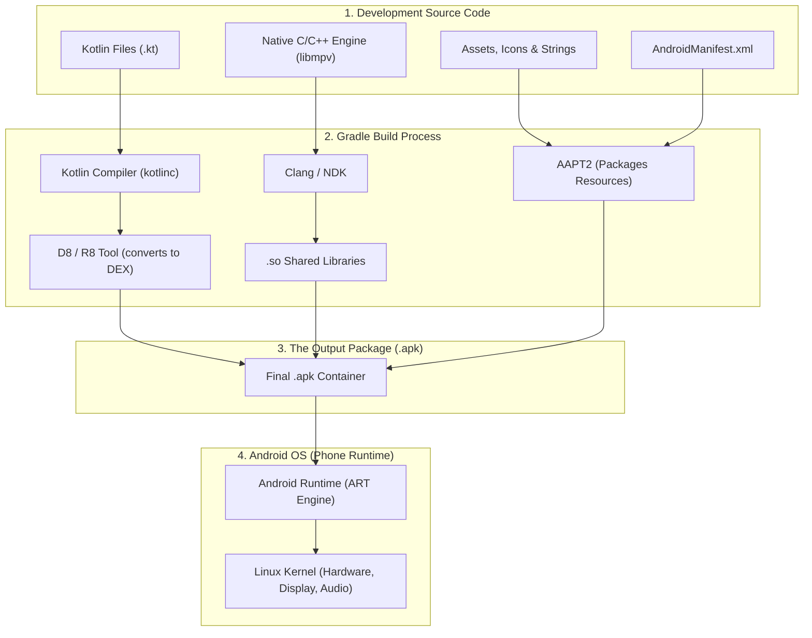

# 📱 What is an Android App Really?


Welcome to Lesson 01. Before touching any code or build tools, you need a rock-solid mental model of what an Android application actually is when it lives and executes on your phone.

---

## 👶 1. The Beginner Analogy: The Restaurant in a Box

Imagine an Android app as a **self-contained pop-up restaurant**:
1. **The Recipe Book (`classes.dex`):** The exact instructions (written in code) explaining how the chef cooks and serves meals.
2. **The Decor & Furniture (`res/` & `assets/`):** The images, icons, colors, and layout blueprints of the dining room.
3. **The Building Permit (`AndroidManifest.xml`):** The official legal document given to the city (Android OS) stating the restaurant's name, what entrance doors exist, and what permissions it requires (like using the camera or playing audio).
4. **The Specialist Chef (`libmpv.so`):** A high-speed native expert (compiled C/C++ code) brought in to handle heavy tasks like decoding 4K 60fps video frames.

When packaged together and sealed with a digital cryptographic signature, this entire restaurant is called an **APK** (`.apk` file).

---

## 📊 2. Visual Architecture: From Code to Phone Screen



---

## 🔍 3. Core Concepts Breakdown

### 📦 A. What is an `.apk` File?
An `.apk` (Android Package) file is simply a **renamed ZIP archive**. If you rename any `.apk` file to `.zip` and open it, you will see:
- `classes.dex`: Your compiled Kotlin/Java code converted into Dalvik Executable bytecode.
- `res/`: Compiled XML resources (drawables, layouts, values).
- `resources.arsc`: The index table connecting string names (e.g. `app_name`) to screen text.
- `AndroidManifest.xml`: The binary-compiled app manifest.
- `lib/`: Platform-specific native binaries (e.g. `arm64-v8a/libmpv.so`).
- `META-INF/`: Digital signatures verifying that the app was not tampered with.

### ⚡ B. Why DEX Bytecode and ART?
Desktop computers run x86/ARM machine code or standard Java `.class` files. However, mobile devices need extreme battery efficiency and low memory overhead:
- Standard Java creates one `.class` file for every single class, creating massive duplicate constant pools.
- Android uses **D8/R8** to merge all classes into a single, highly compressed **`classes.dex`** file.
- The **Android Runtime (ART)** on your phone compiles and runs this DEX bytecode directly using Ahead-Of-Time (AOT) and Just-In-Time (JIT) compilation.

### 🛡️ C. Android Sandboxing & Linux Permissions
Android is built on top of the **Linux Kernel**:
- Every app installed on your phone is assigned its own unique Linux User ID (`u0_a123`).
- App A cannot look inside the private memory or storage of App B.
- If an app wants to access storage, open a network socket, or access hardware, it must declare these in its manifest and ask the OS for permission.

---

## ⚡ 4. Real-World Connection: How mpvRex Exists on Your Phone

In standard Android apps, everything runs inside Kotlin/DEX bytecode. But **mpvRex** is a high-performance media player, so it combines two worlds:

```text
mpvRex APK
├── classes.dex           ──> Modern Jetpack Compose UI, Playback Controls, Preferences (Kotlin)
├── lib/arm64-v8a/
│   └── libmpv.so         ──> High-speed C/C++ engine decoding video frames and subtitles
└── AndroidManifest.xml   ──> Declares video playback permissions, Picture-in-Picture & storage access
```

1. **The UI Layer (Kotlin):** Renders the buttons, seekbars, menus, and handles your finger taps.
2. **The Engine (C/C++ `libmpv.so`):** Runs blazing-fast native video decoding directly on the phone processor.
3. **The Bridge (JNI):** Kotlin passes simple messages (like *"play file X"* or *"seek to 02:15"*) to the C engine.

---

## 🎯 5. Key Takeaways

- [x] An Android app is a signed ZIP container (`.apk`) containing compiled DEX bytecode, resources, manifest, and optional native libraries.
- [x] Kotlin code compiles down to DEX bytecode executed by the Android Runtime (ART).
- [x] Android treats each app as an isolated Linux user for security and resource management.
- [x] Media players like **mpvRex** use Kotlin for responsive UI and compiled native `.so` libraries for heavy video decoding.
