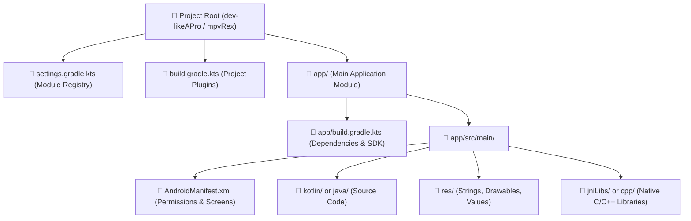

# 📂 Android Project Anatomy Decoded


In this lesson, we will unpack the folder structure of an Android project so you never feel lost when opening an unfamiliar repository.

---

## 👶 1. The Beginner Analogy: The Blueprint & The House

If an Android app is a finished house, the project repository is the **construction workshop**:

1. **`AndroidManifest.xml` (The Identity & Building Permit):** Declares who owns the house, what doors exist (screens/Activities), and what utility lines are connected (permissions like Internet or Storage).
2. **`src/main/kotlin/` (The Living Space & Brain):** Where all the actual logic, buttons, math, and workflows are programmed in Kotlin.
3. **`src/main/res/` (The Furniture & Paint):** Where static assets like button labels (`strings.xml`), vector icons (`drawable/`), and app colors live.
4. **`build.gradle.kts` (The Construction Contract):** Tells the build tool which external tools, libraries, and compiler versions are required to construct the house.

---

## 📊 2. Visual Project Hierarchy



---

## 🔍 3. Core Folder Breakdown

### 📄 A. `AndroidManifest.xml`
The single most important configuration file in any Android app. The Android OS reads this file before launching the app.

```xml
<manifest xmlns:android="http://schemas.android.com/apk/res/android"
    package="org.mpvrex.player">

    <!-- 1. Permissions requested by the app -->
    <uses-permission android:name="android.permission.READ_MEDIA_VIDEO" />
    <uses-permission android:name="android.permission.WAKE_LOCK" />

    <application
        android:label="@string/app_name"
        android:icon="@mipmap/ic_launcher"
        android:theme="@style/Theme.MpvRex">

        <!-- 2. The Main Screen (Entry Point) -->
        <activity
            android:name=".MainActivity"
            android:exported="true">
            <intent-filter>
                <action android:name="android.intent.action.MAIN" />
                <category android:name="android.intent.category.LAUNCHER" />
            </intent-filter>
        </activity>

    </application>
</manifest>
```

- **`package` / `namespace`:** The globally unique ID for your app (e.g. `org.mpvrex.player`).
- **`<uses-permission>`:** Tells the Android OS what capabilities the app needs.
- **`<activity android:name=".MainActivity">`:** Declares a screen. The `<intent-filter>` with `MAIN` and `LAUNCHER` tells the Android home screen: *"Show an app icon that opens this Activity when tapped."*

---

### 🧠 B. `src/main/kotlin/` (Source Code)
Code is organized into reverse domain packages matching your package name:

```text
src/main/kotlin/org/mpvrex/player/
├── ui/                  ──> Jetpack Compose UI (Screens, Seekbars, Dialogs)
│   ├── player/          ──> Player controls overlay, seekbars, gestures
│   └── settings/        ──> Preference screens and settings toggles
├── data/                ──> Preference storage, DataStore, file scanners
└── player/              ──> Player engine state machine, JNI wrappers
```

---

### 🎨 C. `src/main/res/` (Resources)
All non-code assets live here, organized by type:

| Folder | What Lives Inside | Example |
| :--- | :--- | :--- |
| `res/values/strings.xml` | All human-readable text on screen | `<string name="seek_forward">+10s</string>` |
| `res/values/colors.xml` | Base palette definitions | `<color name="primary">#00E5FF</color>` |
| `res/drawable/` | Vector graphics, SVG/XML icons | `ic_play.xml`, `ic_pause.xml` |
| `res/mipmap/` | App launcher icons at multiple phone densities | `ic_launcher.webp` (`hdpi`, `xxhdpi`, `xxxhdpi`) |

> [!TIP] Never Hardcode Text in Kotlin!
> Professional Android apps put user-facing text in `strings.xml`. This makes multi-language translation and localization effortless.

---

### ⚙️ D. `src/main/jniLibs/` (Native C/C++ Libraries)
For media players like **mpvRex**, compiled `.so` (shared object) files are placed here:

```text
src/main/jniLibs/
├── arm64-v8a/
│   └── libmpv.so        ──> 64-bit ARM compiled video engine (most modern phones)
└── armeabi-v7a/
    └── libmpv.so        ──> 32-bit ARM compiled video engine (older devices)
```

---

## ⚡ 4. Real-World Connection: Navigating mpvRex's Structure

When you work on **mpvRex**, here is where your common tasks will take place:

1. **Adding a new setting toggle:**
   - Add the text in `res/values/strings.xml`.
   - Store the preference in `data/PlayerPreferences.kt`.
   - Add the UI toggle in `ui/settings/PlayerPreferencesScreen.kt`.
2. **Modifying player seekbar or video controls:**
   - Look in `ui/player/Seekbar.kt` or `ui/player/ControlsOverlay.kt`.
3. **Modifying hardware decoding or mpv commands:**
   - Look in `player/MpvPlayer.kt` or the JNI bridge.

---

## 🎯 5. Key Takeaways

- [x] `AndroidManifest.xml` defines permissions, entry activities, and application metadata.
- [x] All Kotlin logic lives under `src/main/kotlin/` partitioned by domain packages.
- [x] Static text, colors, and icons live under `src/main/res/`.
- [x] Precompiled native C/C++ binaries live in `jniLibs/` matching the device CPU architecture (`arm64-v8a`).
