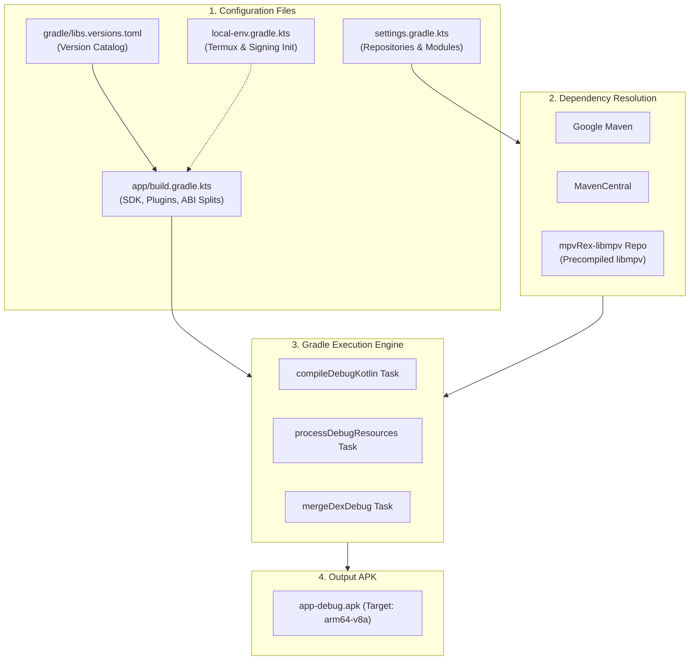

# ⚙️ Gradle Build System Demystified


Welcome to Lesson 03. In this lesson, we demystify **Gradle**—the automated build system that transforms your Kotlin files, icons, and native C++ code into an installable `.apk`.

---

## 👶 1. The Beginner Analogy: The Automated Factory Manager

If your code is a collection of raw car parts (engine, tires, metal body), **Gradle is the automated robotic factory**:
1. It downloads the external parts you need (like tires from Michelin ➔ *Koin*, *Compose*, *libmpv* libraries).
2. It sends instructions to the specialized welders (➔ *Kotlin Compiler*, *D8/R8*, *AAPT2*).
3. It packages, tests, and polishes the car until a finished, drivable car rolls off the line (➔ `app-debug.apk`).

---

## 📊 2. Visual Architecture: Gradle in mpvRex



---

## 🔍 3. Core Gradle Files Decoded (Line by Line)

Let's look directly at the real build configuration files from `mpvRex`.

### 📄 A. `settings.gradle.kts` (The Module & Repository Registry)
This is the very first file Gradle reads:
```kotlin
dependencyResolutionManagement {
  repositories {
    google()       // Google libraries (Jetpack Compose, AndroidX)
    mavenCentral() // Open source community libraries (Koin, OkHttp)
    maven(url = "https://mpvrex.github.io/mpvRex-libmpv") // Precompiled libmpv engine!
  }
}

rootProject.name = "mpvEx"
include(":app")    // Tells Gradle to build the 'app' module
```

---

### 📦 B. `gradle/libs.versions.toml` (The Modern Version Catalog)
Instead of hardcoding version numbers inside build files, modern Android uses a single TOML catalog:

```toml
[versions]
kotlin = "2.4.10"
composeBom = "2026.02.01"
koin = "4.1.1"

[libraries]
# Precompiled native player engine
mpv-lib = "com.github.sfsakhawat999:mpvRex-libmpv:0.0.9"

# Dependency Injection
koin-android = { module = "io.insert-koin:koin-android" }

# Compose Bill of Materials (manages all Compose UI versions together)
androidx-compose-bom = { group = "androidx.compose", name = "compose-bom", version.ref = "composeBom" }
```

---

### 🛠️ C. `app/build.gradle.kts` (The Application Blueprint)
This file defines how your specific application compiles:

```kotlin
plugins {
  alias(libs.plugins.android.application) // Android app plugin
  alias(libs.plugins.kotlin.compose.compiler) // Compose UI compiler
}

android {
  namespace = "xyz.mpv.rex" // Unique identifier for R classes
  compileSdk = 36          // Android SDK version used to compile

  defaultConfig {
    applicationId = "xyz.mpv.rex" // Package ID on the phone
    minSdk = 26                  // Minimum Android version (Android 8.0 Oreo)
    targetSdk = 36               // Target Android version (Android 16)
    versionCode = 213            // Integer incremented for each release
    versionName = "5.2.0"        // Human-readable version string
  }

  // ABI Split: Packages native libmpv for 64-bit phones
  splits {
    abi {
      isEnable = true
      reset()
      include("armeabi-v7a", "arm64-v8a", "x86", "x86_64")
      isUniversalApk = true
    }
  }
}
```

---

## 📱 4. Mobile / Termux Development: `local-env.gradle.kts`

When developing on a phone inside **Termux / AndroidIDE**, standard desktop Gradle behavior can be slow and run into environment permission traps. 

`mpvRex` uses a specialized init script: `local-env.gradle.kts`:

### Why `-I local-env.gradle.kts` is Critical:
1. **Build Tools Version Override:** Automatically locks the build tools version (e.g. `36.1.0`) so Termux doesn't fail due to missing desktop SDK paths.
2. **Local Keystore Injection:** Automatically finds `tmp/keys/keystore.properties` to sign preview/release builds on your phone.
3. **Speed Optimization:** Skips unnecessary multi-architecture compiles when testing locally.

### Standard Execution Command in Termux:
```bash
# 1. Fast compilation check (verifies syntax without packaging full APK)
./gradlew compileDebugKotlin -I local-env.gradle.kts

# 2. Build and install directly to your device
./gradlew installDebug -I local-env.gradle.kts
```

> [!WARNING] Golden Rule for Mobile Development
> Never run Gradle commands on mobile without passing `-I local-env.gradle.kts`.

---

## 🎯 5. Key Takeaways

- [x] `settings.gradle.kts` declares where libraries are downloaded from (Maven Central, Google, custom repos).
- [x] `libs.versions.toml` acts as the single source of truth for library versions.
- [x] `compileSdk` is the API level used at build time; `minSdk` is the oldest Android phone your app can run on.
- [x] `compileDebugKotlin` is the fastest way to verify that your Kotlin code compiles without waiting for APK packaging.
- [x] `local-env.gradle.kts` adapts Gradle for smooth execution on mobile Termux environments.
