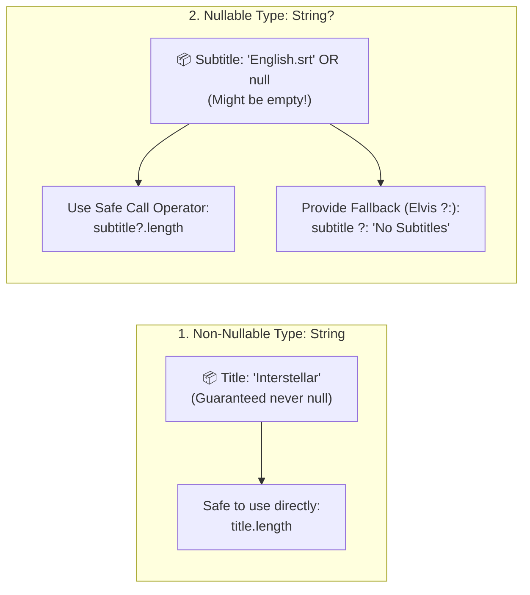

# 🔤 Kotlin Fundamentals for Beginners


In this lesson, you will learn the core building blocks of **Kotlin**—the official programming language for modern Android development.

---

## 👶 1. The Beginner Analogy: Labeled Boxes & Safety Seals

In programming, everything is about storing information and making decisions:
1. **`val` (The Locked Safe):** A value you put in once and cannot change (e.g. your app's package name or a movie's total duration).
2. **`var` (The Open Whiteboard):** A value that changes continuously (e.g. the current playback position or volume level).
3. **Null Safety `?` (The Sealed Envelope):** In older languages like Java, opening an empty envelope crashes the whole app (`NullPointerException`). In Kotlin, a `?` mark warns the compiler: *"This envelope might be empty, check it first!"*

---

## 📊 2. Visual Mental Model: Null Safety



---

## 🔍 3. Core Kotlin Syntax Decoded

### 📦 A. `val` vs `var` and Basic Types

```kotlin
// val = Immutable (Read-Only). ALWAYS prefer val!
val appName: String = "mpvRex"
val sampleRate: Int = 48000
val currentPositionMs: Long = 125400L  // Long is used for video time in milliseconds
val playbackSpeed: Float = 1.25f       // Float is used for speed, volume, and alpha
val isHwDecEnabled: Boolean = true

// var = Mutable (Can be reassigned)
var currentVolume: Int = 75
currentVolume = 80 // Allowed!

// Type Inference: Kotlin is smart enough to guess the type!
val movieTitle = "Avatar 2" // Kotlin automatically knows this is a String
```

---

### 🛡️ B. Null Safety (Preventing App Crashes)

In Android, if a video file has no external subtitle file, the subtitle variable is `null` (empty).

```kotlin
// 1. Non-nullable: Will NOT allow null
var videoTitle: String = "Inception"
// videoTitle = null  <-- COMPILER ERROR! (Protects your app)

// 2. Nullable: Uses '?' to indicate it can be null
var currentSubtitleTrack: String? = null

// 3. Safe Call Operator (?.): Only calls length if not null
val length: Int? = currentSubtitleTrack?.length // Returns null instead of crashing!

// 4. Elvis Operator (?:): Provide a default fallback value if null
val displayName: String = currentSubtitleTrack ?: "None"
// If currentSubtitleTrack is null, displayName becomes "None"

// 5. Safe Smart-Casting:
if (currentSubtitleTrack != null) {
    // Kotlin automatically knows it's safe inside this block!
    println(currentSubtitleTrack.uppercase())
}
```

> [!CAUTION] Avoid the Double-Exclamation `!!`
> `currentSubtitleTrack!!.length` forces Kotlin to assume the value is never null. If it *is* null at runtime, **your app will crash immediately**. Always prefer `?.` and `?:`.

---

### 🔀 C. Expressive Control Flow: `if` & `when`

In Kotlin, `if` and `when` are **expressions**—they can return a value directly!

#### 1. `if` as an Expression:
```kotlin
val isMuted = false
val iconColor = if (isMuted) Color.Gray else Color.White
```

#### 2. The `when` Expression (Kotlin's Superpower):
In `mpvRex`, the player engine can be in several states. We use `when` to handle each state cleanly:

```kotlin
val playerState = "PLAYING"

val statusText = when (playerState) {
    "BUFFERING" -> "Loading video stream..."
    "PLAYING"   -> "Playback active"
    "PAUSED"    -> "Paused"
    "IDLE"      -> "No media loaded"
    else        -> "Unknown status"
}
```

---

## ⚡ 4. Real-World Connection: How mpvRex Uses This

Look at this typical helper function from `xyz.mpv.rex.utils`:

```kotlin
// Formats milliseconds (e.g. 75000ms) into "01:15"
fun formatDuration(positionMs: Long?): String {
    // 1. If null or negative, return fallback immediately
    if (positionMs == null || positionMs <= 0) return "--:--"

    val totalSeconds = positionMs / 1000
    val minutes = totalSeconds / 60
    val seconds = totalSeconds % 60

    // String template formatting: %02d pads single digits with 0
    return String.format("%02d:%02d", minutes, seconds)
}
```

1. **`positionMs: Long?`**: Accepts a nullable timestamp safely.
2. **Elvis / Early return**: Gracefully exits if no media is loaded.
3. **`val totalSeconds`**: Uses immutable variables for clean math.

---

## 🎯 5. Key Takeaways

- [x] Always default to **`val`**; only use **`var`** when a variable must change.
- [x] Use **`Long`** for media timestamps (ms) and **`Float`** for visual scales/speeds.
- [x] The **`?`** indicates a type can be `null`.
- [x] Use **`?.`** (safe call) and **`?:`** (Elvis fallback) to prevent `NullPointerException` crashes.
- [x] **`when`** expressions cleanly handle state transitions in player engines.
