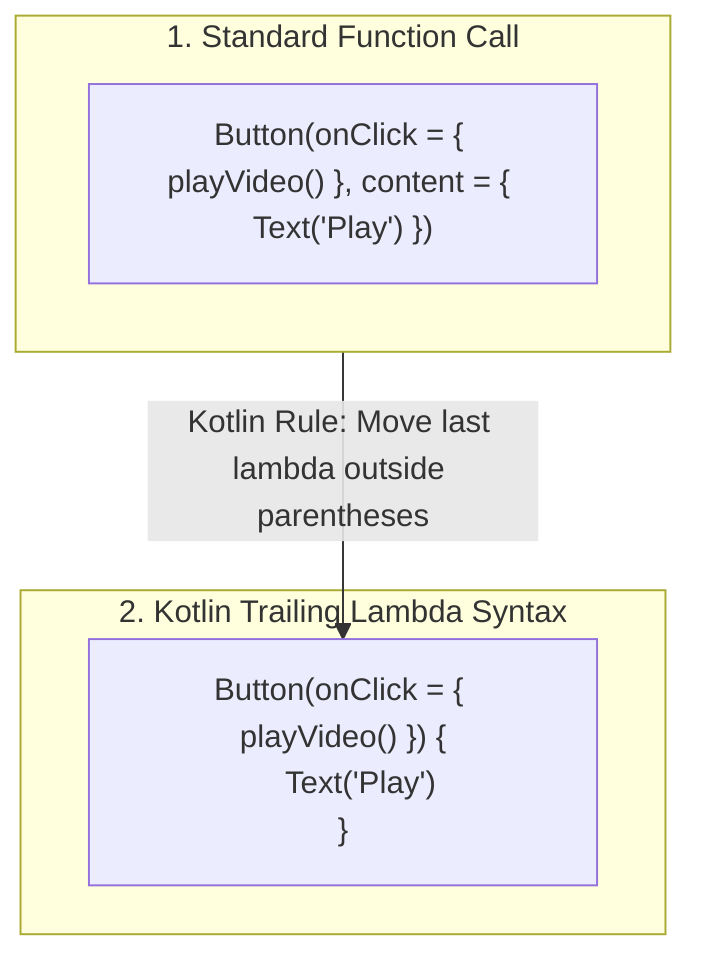

# ⚡ Functions, Lambdas & Scope Functions


In this lesson, you will learn how Kotlin handles actions and functions—including **lambdas**, the foundational syntax behind Jetpack Compose UI.

---

## 👶 1. The Beginner Analogy: Action Buttons & Remote Controls

1. **A Function (`fun`):** A pre-wired button on a remote control. Press it, and it performs a task (e.g. *Mute Audio*).
2. **A Lambda (`{ ... }`):** A blank customizable button. You can hand this button to someone else and say: *"When the user taps the screen, execute whatever code I wrote inside this block."*
3. **Trailing Lambda Syntax:** Kotlin's superpower that allows UI code to look clean, readable, and structured like a document rather than messy nested parenthesis.

---

## 📊 2. Visual Architecture: Trailing Lambdas in Compose



---

## 🔍 3. Core Kotlin Function Syntax

### 🛠️ A. Standard & Single-Expression Functions

```kotlin
// 1. Standard Function:
fun calculateSeekOffset(currentMs: Long, deltaSeconds: Int): Long {
    val target = currentMs + (deltaSeconds * 1000L)
    return target.coerceAtLeast(0L) // Never seek before 00:00
}

// 2. Single-Expression Function (Concise syntax):
fun isPlaybackActive(state: String): Boolean = state == "PLAYING"
```

---

### ⚙️ B. Default and Named Arguments

In older languages, you had to write 5 overloaded versions of the same function. In Kotlin, you provide default values:

```kotlin
// Function with default parameters:
fun configurePlayback(
    speed: Float = 1.0f,
    preservePitch: Boolean = true,
    hardwareDecoding: Boolean = true
) {
    // Engine configuration logic...
}

// Calling the function:
configurePlayback() // Uses all defaults (1.0f, true, true)
configurePlayback(speed = 1.5f) // Overrides speed, keeps others default
configurePlayback(hardwareDecoding = false, speed = 2.0f) // Named arguments in any order!
```

---

### 🪄 C. Lambdas & Higher-Order Functions

A **lambda** is an anonymous function that can be passed around like a variable:

```kotlin
// A variable holding a function that takes a Float (seek progress) and returns nothing (Unit)
val onSeekProgress: (Float) -> Unit = { progress ->
    println("User is seeking to: ${progress * 100}%")
}

// Executing the lambda:
onSeekProgress(0.45f)
```

#### The Special `it` Keyword:
If a lambda has only one parameter, you don't even need to name it; Kotlin calls it **`it`**:

```kotlin
val printSpeed: (Float) -> Unit = {
    println("Speed: ${it}x")
}
```

---

### 📦 D. Scope Functions (`let`, `apply`, `takeIf`)

Scope functions execute a block of code within the context of an object:

#### 1. `.let` (Null-Safe Execution):
Runs the block only if the object is NOT null:
```kotlin
val subtitleFile: File? = getSubtitleFile()

subtitleFile?.let { file ->
    // Runs ONLY if subtitleFile is not null
    println("Loading subtitle: ${file.name}")
}
```

#### 2. `.apply` (Object Configuration):
Configures properties on an object and returns the object:
```kotlin
val paint = Paint().apply {
    color = Color.WHITE
    strokeWidth = 4f
    isAntiAlias = true
}
```

#### 3. `.takeIf` (Filtering Values):
Returns the value if it satisfies a condition, otherwise returns `null`:
```kotlin
val validSpeed = rawSpeed.takeIf { it > 0.0f } ?: 1.0f
```

---

## ⚡ 4. Real-World Connection: How mpvRex Uses Lambdas

In `mpvRex`, player controls are built as decoupled Composables. The seekbar component doesn't know about `libmpv` directly—it simply fires lambda callbacks!

```kotlin
// Inside mpvRex UI: Seekbar.kt
@Composable
fun VideoSeekbar(
    position: Long,
    duration: Long,
    onSeek: (Long) -> Unit,        // Lambda callback for dragging
    onSeekFinished: () -> Unit     // Lambda callback when finger lifts
) {
    // When the user drags the seekbar:
    Slider(
        value = position.toFloat(),
        valueRange = 0f..duration.toFloat(),
        onValueChange = { newPosition ->
            onSeek(newPosition.toLong()) // Notify the parent player
        },
        onValueChangeFinished = {
            onSeekFinished() // Tell player engine to finalize seek
        }
    )
}
```

---

## 🎯 5. Key Takeaways

- [x] Functions use **`fun`**; use single-expression `= ...` for one-liners.
- [x] Default arguments eliminate boilerplate overload methods.
- [x] **Lambdas** (`{ it -> ... }`) allow you to pass behavior as arguments.
- [x] **Trailing lambda syntax** is why Compose UI hierarchy looks clean and declarative.
- [x] Use **`.let`** for safe null unpacking and **`.apply`** for object initialization.
