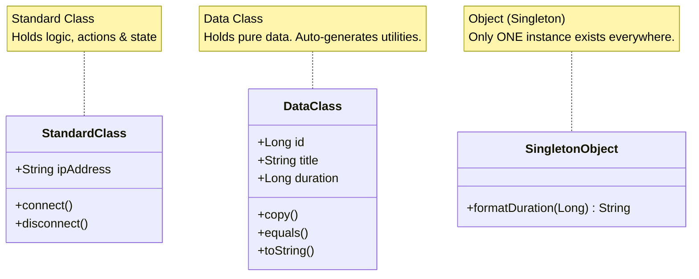

# 🧱 Classes, Data Classes & Objects


In this lesson, you will learn how Kotlin models information and creates objects using `class`, `data class`, and `object`.

---

## 👶 1. The Beginner Analogy: Blueprints, ID Cards & Singletons

1. **A Standard `class` (The Architectural Blueprint):** Tells you how to build something with behavior and methods (e.g. `Anime4KManager` or `NetworkRepository`).
2. **A `data class` (The ID Badge / File Dossier):** Exists purely to hold structured information (e.g. video title, duration, resolution, size).
3. **An `object` (The Town Clock / Singleton):** A class where only **one single instance** can ever exist in the entire universe of your app.

---

## 📊 2. Visual Comparison: The Three Class Types



---

## 🔍 3. Core Concepts Breakdown

### 📄 A. The Power of `data class`
In older languages like Java, to create a class that holds a video's properties, you had to write 80+ lines of boilerplate (`getters`, `setters`, `equals`, `hashCode`, `toString`).

In Kotlin, you write **one single line**:

```kotlin
data class Video(
    val id: Long,
    val title: String,
    val duration: Long,
    val resolution: String
)
```

#### Why `data class` is special:
Kotlin automatically generates:
1. **`.toString()`:** Prints clean text like `Video(title=Movie.mkv, duration=120000)` instead of memory hash junk like `Video@7f8a9`.
2. **`.equals()` (`==`):** Compares the actual data inside the boxes, not memory addresses.
3. **`.copy()`:** Clones an object while changing only specific fields:
   ```kotlin
   val original = Video(id = 1, title = "Avatar", duration = 9000, resolution = "1080p")
   val upgraded = original.copy(resolution = "4K") // Keeps id, title, duration identical!
   ```

---

### 🎨 B. The Compose `@Immutable` Annotation
When creating data models in Jetpack Compose, you will often see:

```kotlin
@Immutable
data class Video(
    val id: Long,
    val title: String
)
```

- **What it does:** Guarantees to the Jetpack Compose compiler that once created, none of the properties will change without creating a new instance.
- **Why it matters:** Compose skips re-rendering screens if the data didn't change, saving battery and preventing frame drops during video playback.

---

### 🏛️ C. `object` (Singletons) & `companion object`

#### 1. Standalone `object` (Singleton):
Used when you want utility tools that don't need multiple copies:
```kotlin
object TimeUtils {
    fun format(ms: Long): String {
        val seconds = ms / 1000
        return "${seconds / 60}:${seconds % 60}"
    }
}

// Called directly anywhere in the app:
val formatted = TimeUtils.format(120000L)
```

#### 2. `companion object` (Static Factory Members):
Lives inside a class, acting like static functions:
```kotlin
class PlayerEngine {
    companion object {
        const val DEFAULT_BUFFER_SIZE = 1024 * 1024 * 32 // 32MB
        fun createDefault(): PlayerEngine = PlayerEngine()
    }
}

// Accessed via class name:
val buffer = PlayerEngine.DEFAULT_BUFFER_SIZE
```

---

## ⚡ 4. Real-World Connection: How mpvRex Models a Video

Look directly at `xyz.mpv.rex.domain.media.model.Video.kt`:

```kotlin
package xyz.mpv.rex.domain.media.model

import android.net.Uri
import androidx.compose.runtime.Immutable

@Immutable
data class Video(
    val id: Long,
    val title: String,
    val displayName: String,
    val path: String,
    val uri: Uri,
    val duration: Long,
    val durationFormatted: String,
    val size: Long,
    val sizeFormatted: String,
    val width: Int,
    val height: Int,
    val rotation: Int = 0,               // Default parameter
    val fps: Float,
    val resolution: String,
    val hasEmbeddedSubtitles: Boolean = false,
    val isAudio: Boolean = false,
    val savedOrientation: Int? = null    // Nullable if user has no custom lock
)
```

### Why this design is professional:
1. **`@Immutable`**: Prevents Compose from unnecessary recomposition.
2. **Immutable `val` throughout**: Prevents accidental data tampering across background threads.
3. **Sensible defaults (`= false`, `= 0`)**: You don't need to specify every single parameter when creating a dummy or test video.

---

## 🎯 5. Key Takeaways

- [x] Use **`data class`** for models, UI states, and data records.
- [x] `data class` automatically provides `.copy()`, `.toString()`, and value-based `equals()`.
- [x] Annotate UI data classes with **`@Immutable`** to optimize Compose rendering performance.
- [x] Use **`object`** when you need a single shared utility across the app without instantiation.
- [x] Use **`companion object`** for constants and factory constructors tied to a specific class.
