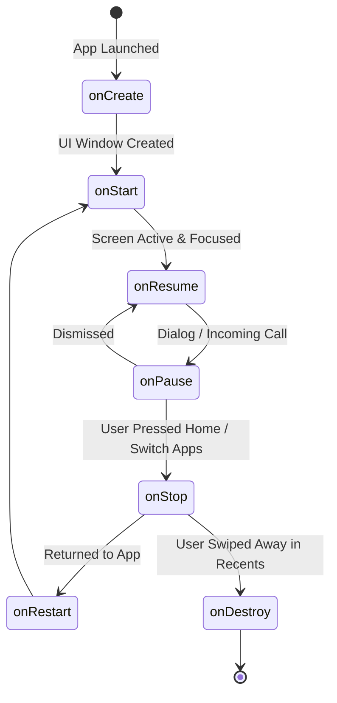

# 🎭 The Android Activity & Lifecycle


In this lesson, you will learn what an **Activity** is, how the Android Operating System manages its lifespan, and how your app survives phone calls, backgrounding, and screen rotations.

---

## 👶 1. The Beginner Analogy: An Actor on Stage

An **Activity** is an actor performing on stage:
1. **`onCreate()` (Dressing in Costume Backstage):** Preparing the set, loading initial memory, creating the UI window.
2. **`onStart()` (Walking Out onto the Stage):** The actor is visible, but the spotlight is not yet on them.
3. **`onResume()` (In the Spotlight, Talking to Audience):** The app is running, in the foreground, and actively responding to user finger taps.
4. **`onPause()` (Interrupted by a Phone Call / Dialog):** An incoming alert or phone call partially covers the screen.
5. **`onStop()` (Walking Offstage into the Green Room):** The user pressed the Home button or switched apps. The app is completely invisible.
6. **`onDestroy()` (Going Home):** The app was closed from the Recents menu, or Android killed it to save memory for a game.

---

## 📊 2. Visual Architecture: The Activity Lifecycle Flow



---

## 🔍 3. Core Concepts Decoded

### 🚪 A. What is `ComponentActivity`?
In modern Android development, your main class inherits from `ComponentActivity`:

```kotlin
class MainActivity : ComponentActivity() {
    override fun onCreate(savedInstanceState: Bundle?) {
        super.onCreate(savedInstanceState)
        
        // Android initializes the screen here
    }
}
```

---

### 🌉 B. The Bridge: `setContent { }`
In older Android, developers inflated XML files using `setContentView(R.layout.activity_main)`. 

In modern Compose apps, **`setContent { }`** is the exact bridge where traditional Android hands full control over to **Jetpack Compose**:

```kotlin
override fun onCreate(savedInstanceState: Bundle?) {
    super.onCreate(savedInstanceState)
    
    // Everything inside this block is 100% Jetpack Compose!
    setContent {
        MpvexTheme {
            MainPlayerScreen()
        }
    }
}
```

---

### 📱 C. Edge-to-Edge Display (`enableEdgeToEdge()`)
Modern video players cannot have ugly black borders around the top camera cutout (status bar) or bottom swipe bar (navigation bar). 

By calling **`enableEdgeToEdge()`** before `setContent`, Android allows video frames to draw behind the system bars across the entire physical glass display.

---

## ⚡ 4. Real-World Connection: How mpvRex Initializes `MainActivity`

Look directly at `MainActivity.kt` in `mpvRex`:

```kotlin
class MainActivity : ComponentActivity() {
    override fun onCreate(savedInstanceState: Bundle?) {
        // 1. Android 12+ Splash Screen integration
        installSplashScreen()
        
        // 2. Enable full screen edge-to-edge drawing
        enableEdgeToEdge()
        
        super.onCreate(savedInstanceState)

        // 3. Hand control to Jetpack Compose
        setContent {
            val appearancePreferences = koinInject<AppearancePreferences>()
            val isDarkMode by appearancePreferences.isDarkMode.collectAsState()

            // 4. Wrap everything in our custom theme & navigation
            MpvexTheme(darkTheme = isDarkMode) {
                Surface(
                    modifier = Modifier.fillMaxSize(),
                    color = MaterialTheme.colorScheme.background
                ) {
                    MainNavigationHost()
                }
            }
        }
    }
}
```

### Media Lifecycle Rules in mpvRex:
- **When user leaves (`onPause` / `onStop`):** If background playback is disabled, `mpvRex` pauses the playback engine to save battery. If Picture-in-Picture (PIP) is enabled, it transitions smoothly into a floating mini-window.
- **When user closes app (`onDestroy`):** `libmpv` is safely terminated via JNI, releasing hardware video decoders and audio tracks.

---

## 🎯 5. Key Takeaways

- [x] An **Activity** represents a single focused screen / container managed by the Android OS.
- [x] **`onCreate()`** is where your app sets up resources, themes, and screen content.
- [x] **`setContent { }`** is the bridge that launches Jetpack Compose inside an Activity.
- [x] **`enableEdgeToEdge()`** allows video players to utilize 100% of the display behind status and navigation bars.
- [x] Media players must monitor lifecycle events to pause playback, handle PIP, and release native C resources on `onDestroy()`.
