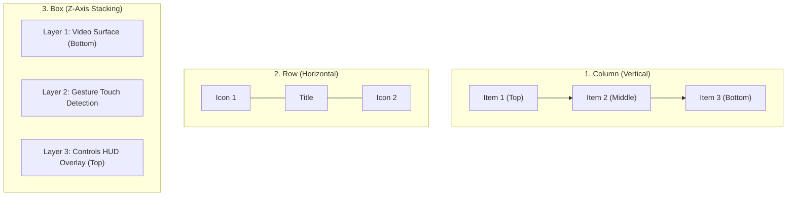

# 📦 Layout Primitives (Box, Column, Row)


In this lesson, you will learn how to arrange visual elements on an Android screen using the three core layout atoms of Jetpack Compose: **`Box`**, **`Column`**, and **`Row`**.

---

## 👶 1. The Beginner Analogy: Building with Lego Blocks

1. **`Column` (The Tower):** Stacks children vertically from top to bottom (like a list of messages or settings items).
2. **`Row` (The Train):** Places children horizontally side-by-side from left to right (like a player toolbar with Rewind, Play, and Fast Forward).
3. **`Box` (The Sandwich / Stacking Layers):** Places children on top of each other along the Z-axis (like putting subtitles or a play button on top of a video surface).

---

## 📊 2. Visual Architecture: Layout Coordinate Systems



---

## 🔍 3. Core Layout Primitives Explained

### 🧱 A. `Column`: Stacking Vertically
```kotlin
Column(
    modifier = Modifier.fillMaxWidth().padding(16.dp),
    verticalArrangement = Arrangement.spacedBy(8.dp), // Even spacing between items
    horizontalAlignment = Alignment.CenterHorizontally // Center horizontally
) {
    Text(text = "Now Playing", style = MaterialTheme.typography.titleMedium)
    Text(text = "Interstellar (2014)", color = Color.Gray)
}
```

---

### 🚂 B. `Row`: Stacking Horizontally
```kotlin
Row(
    modifier = Modifier.fillMaxWidth(),
    horizontalArrangement = Arrangement.SpaceBetween, // Pushes time labels to edges
    verticalAlignment = Alignment.CenterVertically
) {
    Text(text = "01:24") // Current Position (Left)
    Text(text = "02:49:10") // Total Duration (Right)
}
```

---

### 🥪 C. `Box`: The Foundation of Every Video Player
`Box` allows components to overlap. Children defined later in the code are rendered **on top** of earlier children:

```kotlin
Box(
    modifier = Modifier.fillMaxSize()
) {
    // 1. Bottom Layer: The Video Canvas
    VideoPlayerSurface(modifier = Modifier.fillMaxSize())

    // 2. Middle Layer: Top Header Bar
    TopPlayerBar(
        modifier = Modifier.align(Alignment.TopCenter)
    )

    // 3. Center Layer: Play / Pause Big Button
    CenterControls(
        modifier = Modifier.align(Alignment.Center)
    )

    // 4. Top Layer: Progress Seekbar
    BottomSeekbar(
        modifier = Modifier.align(Alignment.BottomCenter)
    )
}
```

---

## ⚡ 4. Real-World Connection: How mpvRex Uses Layouts

In `mpvRex`, look at how `PlayerControls.kt` organizes the entire player HUD:

```kotlin
// Simplified from xyz.mpv.rex.ui.player.controls.PlayerControls.kt
@Composable
fun PlayerControls(
    modifier: Modifier = Modifier,
    controlsShown: Boolean,
    onToggleControls: () -> Unit
) {
    // The master container is a Box filling the entire screen glass
    Box(
        modifier = modifier
            .fillMaxSize()
            .clickable(onClick = onToggleControls)
    ) {
        if (controlsShown) {
            // Top Bar: Pinned to Top Center
            PlayerTopBar(
                modifier = Modifier
                    .align(Alignment.TopCenter)
                    .fillMaxWidth()
            )

            // Center Group: Pinned directly in the dead center
            Row(
                modifier = Modifier.align(Alignment.Center),
                horizontalArrangement = Arrangement.spacedBy(24.dp),
                verticalAlignment = Alignment.CenterVertically
            ) {
                RewindButton()
                PlayPauseButton()
                FastForwardButton()
            }

            // Bottom Bar: Pinned to Bottom Center
            Column(
                modifier = Modifier
                    .align(Alignment.BottomCenter)
                    .fillMaxWidth()
            ) {
                TimeRow()
                Seekbar()
            }
        }
    }
}
```

---

## 🎯 5. Key Takeaways

- [x] Use **`Column`** for vertical content and lists.
- [x] Use **`Row`** for horizontal bars, buttons, and status labels.
- [x] Use **`Box`** to stack overlays, badges, and controls on top of video frames.
- [x] The **`Alignment`** property inside a `Box` (`Alignment.TopCenter`, `Alignment.Center`, `Alignment.BottomCenter`) accurately pins controls where you want them.
- [x] In a `Box`, the last declared child is drawn on top of all preceding children.
