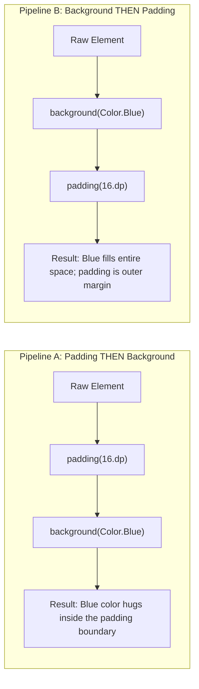

# 🎨 Modifiers Deep Dive


In this lesson, you will master **Modifiers**—the universal tool in Jetpack Compose used to style, size, position, shape, and attach touch behavior to any UI element.

---

## 👶 1. The Beginner Analogy: Tailoring a Suit

Imagine a raw Composable (like a `Text` or `Box`) as a basic white t-shirt. **Modifiers are the sequence of customizations you apply to it**:
1. Dye it dark charcoal (`background`).
2. Add hem margins around the edges (`padding`).
3. Cut the collar into a stylish curve (`clip`).
4. Attach an NFC sensor that responds when touched (`clickable`).

Just like tailoring clothes, **the order in which you apply modifications completely changes the final result**!

---

## 📊 2. The Critical Rule: Modifier Order Matters!

In Compose, modifiers are applied in a **pipeline chain** from top to bottom.



---

## 🔍 3. Common Modifiers Every Developer Must Know

### 📏 A. Sizing Modifiers
```kotlin
Modifier.fillMaxSize()           // Expand to take 100% of parent width and height
Modifier.fillMaxWidth(0.8f)      // Take 80% of parent width
Modifier.size(48.dp)             // Exactly 48dp width and 48dp height
Modifier.widthIn(min = 100.dp)   // At least 100dp wide, but can grow if needed
```

---

### 🖼️ B. Styling & Clipping Shapes
```kotlin
Modifier
    .clip(CircleShape)                          // Cut into a perfect circle
    .background(Color.Black.copy(alpha = 0.6f)) // Semi-transparent black
    .border(1.dp, Color.White, CircleShape)     // 1dp white border outline
```

---

### 👆 C. Interactivity & Clicks
```kotlin
Modifier.clickable {
    println("Item tapped!")
}

// Or with advanced gestures (click + long press):
Modifier.combinedClickable(
    onClick = { toggleControls() },
    onLongClick = { openTrackSelector() }
)
```

---

### 📱 D. System Window Insets (Status & Navigation Bars)
When building fullscreen media players, controls should not collide with the camera cutout or navigation bar:

```kotlin
Modifier
    .fillMaxWidth()
    .windowInsetsPadding(WindowInsets.statusBars) // Push top bar below camera notch
```

---

## ⚡ 4. Real-World Connection: How mpvRex Styles Player Buttons

Look at how floating control buttons are styled inside `xyz.mpv.rex.ui.player.controls.components.ControlsButton.kt`:

```kotlin
@Composable
fun PlayerIconButton(
    icon: ImageVector,
    onClick: () -> Unit,
    modifier: Modifier = Modifier
) {
    Box(
        modifier = modifier
            .size(44.dp)                           // 1. Fixed button size
            .clip(CircleShape)                     // 2. Round shape
            .background(Color.Black.copy(0.45f))   // 3. Dark frosted backdrop
            .border(1.dp, Color.White.copy(0.2f), CircleShape) // 4. Subtle glass rim
            .clickable(onClick = onClick),         // 5. Touch ripple inside circle
        contentAlignment = Alignment.Center
    ) {
        Icon(
            imageVector = icon,
            contentDescription = null,
            tint = Color.White,
            modifier = Modifier.size(24.dp)
        )
    }
}
```

### Notice the ordering:
If you put `.clickable` **before** `.clip(CircleShape)`, the touch ripple would spread out as an ugly square box outside the circle. Placing `.clip` **first** guarantees the ripple remains perfectly rounded!

---

## 🎯 5. Key Takeaways

- [x] Modifiers configure size, layout, appearance, and touch behavior.
- [x] Modifiers execute in strict sequential order from top to bottom.
- [x] To make an outer margin, place `padding()` before `background()`.
- [x] To make an inner padding, place `padding()` after `background()`.
- [x] Always place `clip()` before `clickable()` so touch ripple effects follow the curved shape.
