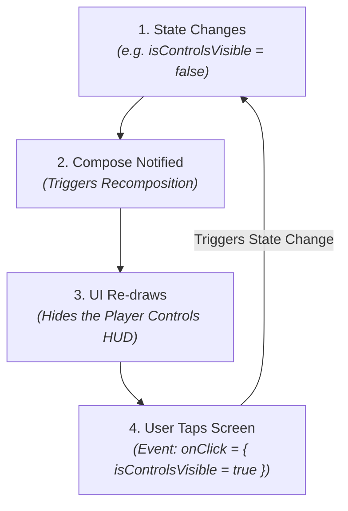

# 🔄 Introduction to Compose State


In this lesson, you will learn how **State** works in Jetpack Compose, why standard Kotlin variables don't update your UI, and how to store and hoist state correctly.

---

## 👶 1. The Beginner Analogy: The Whiteboard & The Sticky Note

Imagine a painter repainting a room every few seconds (Recomposition):
1. **A Standard Variable (`var x = 0`):** Written in chalk on the wall. Every time the painter repaints the wall, the chalk is erased and wiped back to zero!
2. **`remember { mutableStateOf(0) }`:** A physical sticky note preserved on a hook. No matter how many times the painter repaints the wall, the note remains untouched, keeping its value!

---

## 📊 2. Visual Architecture: The State & Recomposition Loop



---

## 🔍 3. Core State Mechanics in Compose

### ❌ The Common Beginner Mistake:
```kotlin
@Composable
fun Counter() {
    var count = 0 // BUG: Will reset back to 0 on every click!

    Button(onClick = { count++ }) {
        Text("Count: $count")
    }
}
```
**Why this fails:** When `count++` happens, Compose recomposes the `Counter` function. The function starts from the top and resets `count = 0`!

---

### ✅ The Correct Way: `remember` + `mutableStateOf`
```kotlin
import androidx.compose.runtime.getValue
import androidx.compose.runtime.mutableStateOf
import androidx.compose.runtime.remember
import androidx.compose.runtime.setValue

@Composable
fun Counter() {
    // Preserves the state across recompositions!
    var count by remember { mutableStateOf(0) }

    Button(onClick = { count++ }) {
        Text("Count: $count")
    }
}
```

- **`mutableStateOf(0)`**: Creates an observable state holder. Whenever its value changes, Compose is notified to re-render.
- **`remember { ... }`**: Ensures the value survives recompositions.
- **`by` keyword**: Kotlin property delegation, so you can write `count++` instead of `count.value++`.

---

### 🔄 Surviving Screen Rotations: `rememberSaveable`
When you rotate your phone between Portrait and Landscape:
- The entire Android Activity is destroyed and recreated.
- Standard `remember` is cleared from RAM!
- Use **`rememberSaveable`** to save lightweight UI state into the Android `savedInstanceState` bundle:

```kotlin
var isControlsLocked by rememberSaveable { mutableStateOf(false) }
```

---

### 🏗️ State Hoisting (The Golden Pattern)
**State Hoisting** means moving state **up** to the caller function to make components reusable and testable:

```kotlin
// 1. Stateful Container (Holds state)
@Composable
fun PlayerScreen() {
    var isMuted by remember { mutableStateOf(false) }

    // Passes state down, receives events up:
    MuteButton(
        isMuted = isMuted,
        onToggleMute = { isMuted = !isMuted }
    )
}

// 2. Stateless Component (Pure UI, zero state logic!)
@Composable
fun MuteButton(
    isMuted: Boolean,
    onToggleMute: () -> Unit
) {
    IconButton(onClick = onToggleMute) {
        Icon(
            imageVector = if (isMuted) Icons.Default.VolumeOff else Icons.Default.VolumeUp,
            contentDescription = null
        )
    }
}
```

---

## ⚡ 4. Real-World Connection: How mpvRex Manages Player State

In `mpvRex`, heavy player state (like current playback millisecond or video duration) is hoisted all the way up to **`PlayerViewModel`** as a reactive `StateFlow`.

However, fast, temporary visual state (such as whether the subtitle color picker is expanded) is stored locally using `remember`:

```kotlin
// Inside mpvRex Subtitle Settings Panel:
@Composable
fun SubtitleColorCard() {
    // Local transient state: only this card cares whether it's expanded!
    var isExpanded by remember { mutableStateOf(false) }

    Card(onClick = { isExpanded = !isExpanded }) {
        if (isExpanded) {
            ColorPickerGrid()
        }
    }
}
```

---

## 🎯 5. Key Takeaways

- [x] Standard Kotlin variables reset on every recomposition; use **`remember { mutableStateOf(...) }`**.
- [x] Use the **`by`** keyword with `getValue` and `setValue` imports for clean variable syntax.
- [x] Use **`rememberSaveable`** for state that must survive phone orientation rotations.
- [x] **State Hoisting** separates UI appearance from business logic: state flows down, events flow up.
- [x] Use local `remember` for transient visual toggles (like menus and dialogs), and ViewModels for critical app data.
