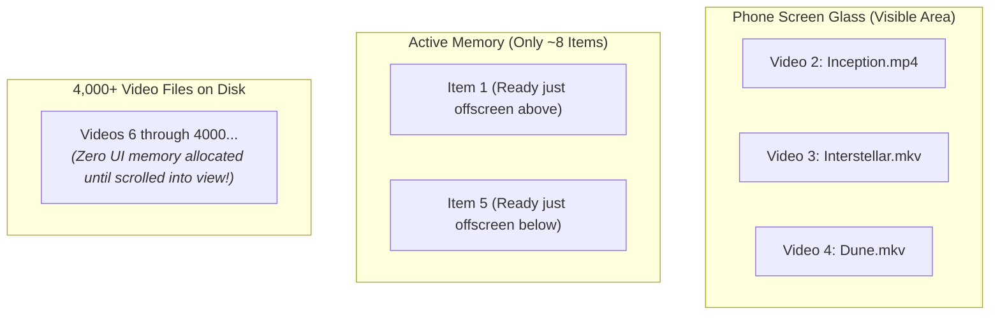

# 📜 High-Performance Lists (LazyColumn & Grids)


In this lesson, you will learn how Android renders massive lists of hundreds or thousands of files smoothly at 120 FPS using **`LazyColumn`** and **`LazyVerticalGrid`**.

---

## 👶 1. The Beginner Analogy: The Treadmill vs 10,000 Couches

Imagine you need to show a user 5,000 video files on their storage:
1. **The Naive Way (`Column`):** You build all 5,000 rows in memory simultaneously. The phone's RAM fills up instantly, animations stutter, and the app crashes with an `OutOfMemoryError`.
2. **The Modern Way (`LazyColumn`):** A revolving treadmill! The phone creates only the **8 rows** visible on screen. As the user scrolls down, rows that leave the top are recycled and reused for new items appearing at the bottom.

---

## 📊 2. Visual Architecture: Virtualization in LazyColumn



---

## 🔍 3. Core Mechanics of `LazyColumn`

### ❌ Never Do This for Big Lists:
```kotlin
// WRONG: Allocates all items in memory at once!
Column {
    videoList.forEach { video ->
        VideoRow(video)
    }
}
```

---

### ✅ The Professional Way: `LazyColumn`
```kotlin
LazyColumn(
    modifier = Modifier.fillMaxSize(),
    contentPadding = PaddingValues(16.dp), // Margins around the entire list
    verticalArrangement = Arrangement.spacedBy(8.dp) // Spacing between items
) {
    // Renders a list of items efficiently:
    items(
        items = videoList,
        key = { video -> video.id } // CRITICAL: Unique key for smooth animations!
    ) { video ->
        VideoCard(video = video)
    }
}
```

---

### 🔑 Why the `key` Parameter is Essential
```kotlin
key = { video -> video.id }
```
When a video is deleted or reordered:
- Without a key, Compose destroys and rebuilds all rows below it, causing visual stuttering.
- With a unique key, Compose knows exactly which row moved, animating it smoothly without reloading thumbnails.

---

### 🔲 Grid Layouts: `LazyVerticalGrid`
For thumbnail grids (like the folder view in a media player), use `LazyVerticalGrid`:

```kotlin
LazyVerticalGrid(
    columns = GridCells.Adaptive(minSize = 160.dp), // Automatically fits columns based on screen width!
    contentPadding = PaddingValues(12.dp)
) {
    items(videoList, key = { it.id }) { video ->
        VideoThumbnailCard(video)
    }
}
```

- **`GridCells.Adaptive(160.dp)`**: On a phone in portrait, it shows 2 columns. Rotate to landscape or tablet, and it automatically expands to 4 or 5 columns!

---

## ⚡ 4. Real-World Connection: How mpvRex Explores Media

In `mpvRex`, look at `xyz.mpv.rex.ui.browser.components.UnifiedExplorerContent.kt`:

```kotlin
@Composable
fun <T> UnifiedExplorerContent(
    items: List<T>,
    isLoading: Boolean,
    modifier: Modifier = Modifier
) {
    val listState = rememberLazyListState()

    LazyColumn(
        state = listState,
        modifier = modifier.fillMaxSize(),
        contentPadding = PaddingValues(bottom = 80.dp) // Space for floating bottom bar!
    ) {
        items(
            items = items,
            key = { item ->
                when (item) {
                    is Video -> "video_${item.id}"
                    is VideoFolder -> "folder_${item.path}"
                    else -> item.hashCode()
                }
            }
        ) { item ->
            when (item) {
                is Video -> VideoCard(video = item)
                is VideoFolder -> FolderCard(folder = item)
            }
        }
    }
}
```

---

## 🎯 5. Key Takeaways

- [x] Always use **`LazyColumn`** or **`LazyRow`** for lists of unknown or large size.
- [x] Only items currently visible on the screen consume memory.
- [x] Always supply a unique **`key`** inside `items()` to guarantee smooth list reordering and scrolling.
- [x] Use **`GridCells.Adaptive`** to build responsive layouts that look great on both portrait phones and landscape tablets.
