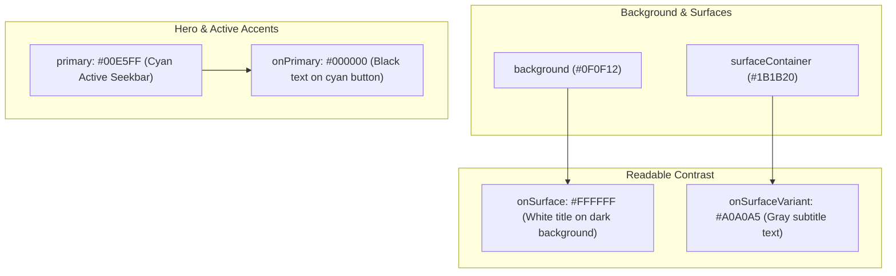

# 🎨 Material 3 Theming & Styling


In this lesson, you will learn how modern Android styling works using **Material 3 (M3)**, dynamic system colors (Material You), and OLED pure black dark themes.

---

## 👶 1. The Beginner Analogy: The Interior Designer's Style Guide

Instead of picking random colors for every single button, an interior designer creates a **harmonious master palette**:
1. **The Hero Color (`primary`):** The signature accent (e.g. vibrant cyan or electric purple) used for active toggles and progress bars.
2. **The Canvas (`surface` & `background`):** The walls of the room (e.g. dark charcoal or pitch black).
3. **The Contrast Rule ("On" Colors):** Whatever you paint on the wall must be readable. If the wall is painted `primary`, any text painted on top of it **must** use `onPrimary`!

---

## 📊 2. Visual Architecture: The Material 3 Color Roles



---

## 🔍 3. Core Mechanics of Material 3

### 🎨 A. The "On" Rule (Guaranteed Contrast)
In Material 3, colors always come in matching pairs:
- **`primary`** ➔ paired with **`onPrimary`**
- **`surface`** ➔ paired with **`onSurface`**
- **`error`** ➔ paired with **`onError`**

```kotlin
// A button colored with primary:
Surface(
    color = MaterialTheme.colorScheme.primary,
    shape = CircleShape
) {
    Text(
        text = "HD",
        // ALWAYS use onPrimary for text sitting on top of primary!
        color = MaterialTheme.colorScheme.onPrimary
    )
}
```

---

### 📱 B. Dynamic Theming (Material You)
Starting in Android 12, apps can extract accent colors directly from the user's phone wallpaper:

```kotlin
val colorScheme = when {
    dynamicColor && Build.VERSION.SDK_INT >= Build.VERSION_CODES.S -> {
        val context = LocalContext.current
        if (darkTheme) dynamicDarkColorScheme(context) else dynamicLightColorScheme(context)
    }
    darkTheme -> DarkColorScheme
    else -> LightColorScheme
}
```

---

### 🖤 C. OLED Pure Black Dark Mode
For media players, standard dark gray (`#121212`) is not enough. Video viewers prefer **Pure Black (`#000000`)** because:
1. OLED screens physically turn off individual pixels for true `#000000`.
2. It maximizes video contrast and saves battery on mobile phones.

---

## ⚡ 4. Real-World Connection: How mpvRex Builds Its Theme

Look at `xyz.mpv.rex.ui.theme.Theme.kt` and `AppTheme.kt`:

```kotlin
@Composable
fun MpvexTheme(
    darkTheme: Boolean = isSystemInDarkTheme(),
    pureBlack: Boolean = true,
    content: @Composable () -> Unit
) {
    val colorScheme = when {
        darkTheme && pureBlack -> DarkColorScheme.copy(
            surface = Color.Black,
            background = Color.Black,
            surfaceContainer = Color(0xFF0F0F0F)
        )
        darkTheme -> DarkColorScheme
        else -> LightColorScheme
    }

    MaterialTheme(
        colorScheme = colorScheme,
        typography = Typography,
        shapes = Shapes,
        content = content
    )
}
```

### Accessing Theme Colors Anywhere in UI:
Whenever you write Compose code, never hardcode hex colors (`#FF0000`). Always reference the active theme:

```kotlin
// Seekbar thumb color automatically adopts the user's theme!
val thumbColor = MaterialTheme.colorScheme.primary
val textColor = MaterialTheme.colorScheme.onSurface
```

---

## 🎯 5. Key Takeaways

- [x] Material 3 defines standardized color roles (`primary`, `surface`, `error`).
- [x] Text drawn on top of a color should always use its matching **"On"** color (e.g. `onPrimary` on `primary`).
- [x] Never hardcode hex values like `Color(0xFF...)` in UI widgets; use **`MaterialTheme.colorScheme.*`**.
- [x] **`MpvexTheme`** supports OLED Pure Black mode to save battery and enhance video playback contrast.
