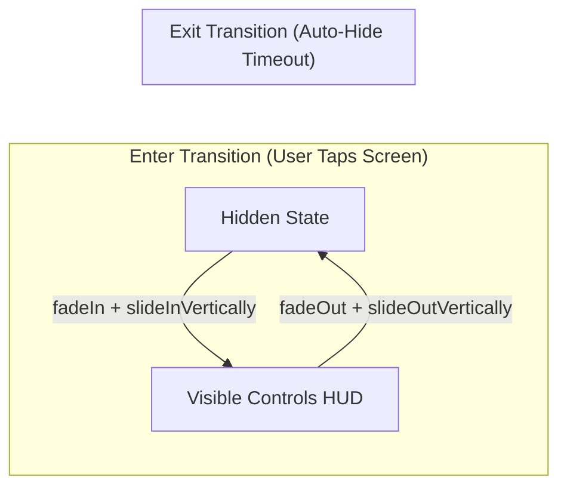

# ✨ Fluid Animations & Transitions


In this lesson, you will learn how to animate UI components in Jetpack Compose, from smooth fade-in/slide transitions to physics-based springs.

---

## 👶 1. The Beginner Analogy: Smooth Curtains vs Sudden Teleportation

Imagine a video player:
1. **Without Animations:** When the user taps the screen, the controls HUD instantly appears like a flashbang. When it hides, it abruptly vanishes. The app feels rigid and cheap.
2. **With Compose Animations:** The controls glide down from the top edge with a gentle fade-in, and the center play button expands with a subtle spring. The app feels alive, polished, and premium.

---

## 📊 2. Visual Architecture: Entering and Exiting Transitions



---

## 🔍 3. Core Compose Animation APIs

### 🎭 A. `AnimatedVisibility` (Showing & Hiding Components)
The simplest and most powerful tool to animate components entering or leaving the screen:

```kotlin
var isControlsVisible by remember { mutableStateOf(true) }

AnimatedVisibility(
    visible = isControlsVisible,
    enter = fadeIn(animationSpec = tween(300)) + slideInVertically(
        initialOffsetY = { -it } // Slide down from top edge
    ),
    exit = fadeOut(animationSpec = tween(250)) + slideOutVertically(
        targetOffsetY = { -it }  // Slide back up out of view
    )
) {
    PlayerTopBar()
}
```

---

### 🌊 B. Value Animations: `animateFloatAsState`
When you want to animate a single property (like opacity, volume scale, or rotation):

```kotlin
val targetAlpha = if (isControlsVisible) 1.0f else 0.0f

// Compose smoothly interpolates alpha between 0.0f and 1.0f!
val animatedAlpha by animateFloatAsState(
    targetValue = targetAlpha,
    animationSpec = tween(durationMillis = 200),
    label = "ControlsAlpha"
)

Box(
    modifier = Modifier
        .fillMaxSize()
        .graphicsLayer(alpha = animatedAlpha) // Hardware-accelerated alpha!
) {
    ControlsOverlay()
}
```

---

### 🦘 C. Tween vs Spring (Physics-Based Motion)

| Animation Spec | How It Moves | Best Used For |
| :--- | :--- | :--- |
| **`tween(durationMillis = 300)`** | Predictable, fixed-time duration with easing curve | Fading HUD overlays, progress bars |
| **`spring(dampingRatio, stiffness)`** | Physics-based; bounces naturally without fixed time | Button presses, sheet drag snapping, dialog popups |

```kotlin
// Example spring animation:
val scale by animateFloatAsState(
    targetValue = if (isPressed) 0.92f else 1.0f,
    animationSpec = spring(
        dampingRatio = Spring.DampingRatioMediumBouncy,
        stiffness = Spring.StiffnessLow
    )
)
```

---

## ⚡ 4. Real-World Connection: How mpvRex Animates Controls

Look at the top of `xyz.mpv.rex.ui.player.controls.PlayerControls.kt`:

```kotlin
// Simplified from PlayerControls.kt
AnimatedVisibility(
    visible = controlsShown,
    enter = fadeIn(tween(200)) + slideInVertically(
        initialOffsetY = { fullHeight -> -fullHeight }
    ),
    exit = fadeOut(tween(200)) + slideOutVertically(
        targetOffsetY = { fullHeight -> -fullHeight }
    )
) {
    TopControlsBar(modifier = Modifier.fillMaxWidth())
}
```

When you tap the screen in `mpvRex`, the top title bar and bottom seekbar don't pop instantly—they slide into the frame while cross-fading, powered by these exact lines!

---

## 🎯 5. Key Takeaways

- [x] Use **`AnimatedVisibility`** to animate elements entering and leaving the composition.
- [x] Combine transitions using the **`+`** operator (e.g. `fadeIn() + slideInVertically()`).
- [x] Use **`animateFloatAsState`** for continuous property transitions (like alpha, scale, rotation).
- [x] Apply animated alpha via **`Modifier.graphicsLayer(alpha = ...)`** for hardware-accelerated rendering.
- [x] Use **`tween()`** for predictable fades and **`spring()`** for natural, bouncy touch feedback.
