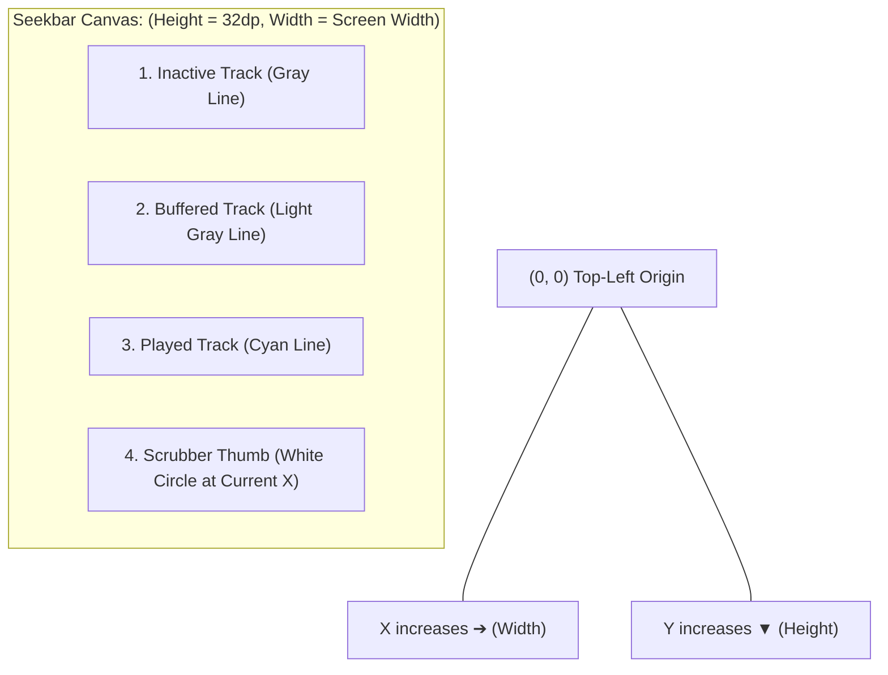

# 🖌️ Drawing Custom Graphics with Canvas


In this lesson, you will learn how to bypass standard UI buttons and draw custom shapes, wave lines, and interactive seekbars directly onto the screen using **`Canvas`**.

---

## 👶 1. The Beginner Analogy: The Digital Artist's Grid

Imagine a blank digital drafting board:
- Standard Compose components (`Text`, `Button`) are pre-made plastic stamps.
- **`Canvas` is a blank sheet of paper and a set of pens:** You can draw lines, circles, gradients, and squiggly sine waves at exact pixel coordinates `(X, Y)`.

This is the exact technology used in **mpvRex** to draw custom video progress bars!

---

## 📊 2. Visual Architecture: The Canvas Coordinate System

In Android graphics, **`(0, 0)` is the TOP-LEFT corner**:
- Moving **Right** increases **X**.
- Moving **Down** increases **Y**.



---

## 🔍 3. Core Canvas Drawing Mechanics

### 📏 A. The `Canvas` Composable and `DrawScope`
Inside `Canvas`, you are given a `DrawScope` with the current canvas dimensions (`size.width`, `size.height`):

```kotlin
Canvas(
    modifier = Modifier
        .fillMaxWidth()
        .height(30.dp)
) {
    // Current canvas dimensions in pixels:
    val canvasWidth = size.width
    val canvasHeight = size.height
    val centerY = canvasHeight / 2

    // 1. Draw Inactive Track Line
    drawLine(
        color = Color.Gray.copy(alpha = 0.3f),
        start = Offset(x = 0f, y = centerY),
        end = Offset(x = canvasWidth, y = centerY),
        strokeWidth = 6.dp.toPx(),
        cap = StrokeCap.Round
    )
}
```

---

### ⚪ B. Drawing the Scrubbing Thumb Circle
To draw the circular handle showing the current playback head:

```kotlin
// Calculate thumb X position based on percentage (0.0f to 1.0f):
val progressFraction = 0.45f // 45% through movie
val thumbX = canvasWidth * progressFraction

drawCircle(
    color = Color.White,
    radius = 8.dp.toPx(),
    center = Offset(x = thumbX, y = centerY)
)
```

---

### 〰️ C. Drawing Curves and Wavy Paths (`Path`)
For animated squiggly seekbars (like Android 13's media player):

```kotlin
val path = Path().apply {
    moveTo(0f, centerY)
    // Draw waves using cubic bezier curves:
    cubicTo(
        x1 = 20f, y1 = centerY - 15f,
        x2 = 40f, y2 = centerY + 15f,
        x3 = 60f, y3 = centerY
    )
}

drawPath(
    path = path,
    color = Color.Cyan,
    style = Stroke(width = 4.dp.toPx(), cap = StrokeCap.Round)
)
```

---

## ⚡ 4. Real-World Connection: How mpvRex Builds Its Seekbar

Look at `xyz.mpv.rex.ui.player.controls.components.Seekbar.kt`:

The seekbar in `mpvRex` combines a `Canvas` with touch gesture detection:

```kotlin
// Simplified from Seekbar.kt in mpvRex:
@Composable
fun VideoProgressCanvas(
    positionMs: Long,
    durationMs: Long,
    bufferMs: Long,
    onSeekTo: (Long) -> Unit
) {
    var isDragging by remember { mutableStateOf(false) }
    var dragProgress by remember { mutableFloatStateOf(0f) }

    Canvas(
        modifier = Modifier
            .fillMaxWidth()
            .height(24.dp)
            .pointerInput(Unit) {
                // Listen to finger drag gestures on screen:
                detectDragGestures(
                    onDragStart = { offset ->
                        isDragging = true
                        dragProgress = (offset.x / size.width).coerceIn(0f, 1f)
                    },
                    onDrag = { change, _ ->
                        dragProgress = (change.position.x / size.width).coerceIn(0f, 1f)
                    },
                    onDragEnd = {
                        isDragging = false
                        // Convert percentage back to video millisecond timestamp!
                        val targetMs = (dragProgress * durationMs).toLong()
                        onSeekTo(targetMs)
                    }
                )
            }
    ) {
        val centerY = size.height / 2
        val activeFraction = if (isDragging) dragProgress else (positionMs.toFloat() / durationMs)
        val activeX = activeFraction * size.width

        // 1. Draw Background Track (Gray)
        drawLine(Color.DarkGray, Offset(0f, centerY), Offset(size.width, centerY), strokeWidth = 4f)

        // 2. Draw Buffer Track (Light Gray)
        val bufferX = (bufferMs.toFloat() / durationMs) * size.width
        drawLine(Color.Gray, Offset(0f, centerY), Offset(bufferX, centerY), strokeWidth = 4f)

        // 3. Draw Active Played Track (Accent Color)
        drawLine(Color(0xFF00E5FF), Offset(0f, centerY), Offset(activeX, centerY), strokeWidth = 6f)

        // 4. Draw Thumb Circle
        drawCircle(Color.White, radius = 10f, center = Offset(activeX, centerY))
    }
}
```

### The Math is Beautifully Simple:
$$\text{Progress \%} = \frac{\text{Touch X Coordinate}}{\text{Canvas Total Width}}$$
$$\text{Target Seek (ms)} = \text{Progress \%} \times \text{Total Video Duration (ms)}$$

---

## 🎯 5. Key Takeaways

- [x] Use **`Canvas`** whenever you need custom geometry, graphs, or interactive seekbars.
- [x] Coordinate **`(0, 0)`** is the top-left; X grows to the right, Y grows down.
- [x] `drawLine`, `drawCircle`, and `drawPath` provide high-performance, GPU-accelerated 2D graphics.
- [x] Combine `Canvas` with **`pointerInput`** and **`detectDragGestures`** to convert finger positions into video seek timestamps.
- [x] This is the exact foundation powering both standard and wavy seekbars in **mpvRex**.
