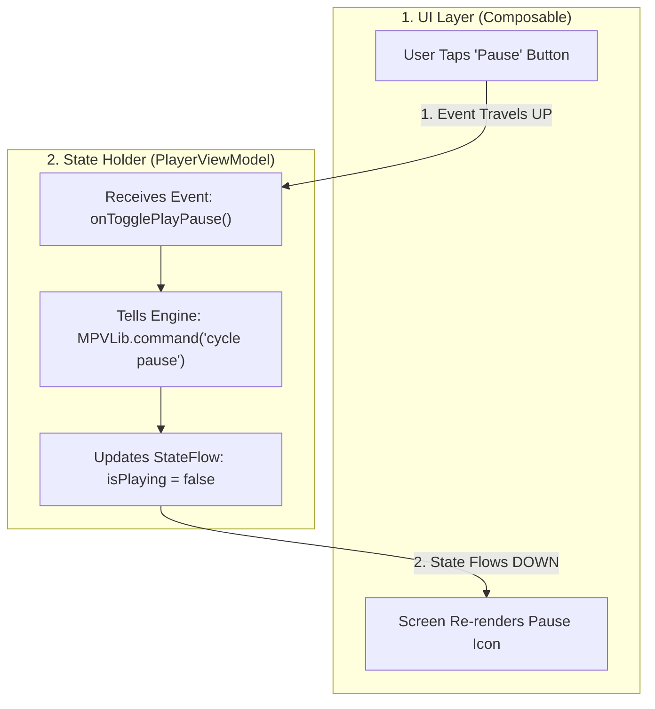

# 🔄 Unidirectional Data Flow (UDF)


In this lesson, you will learn the most important architectural pattern in modern Android development: **Unidirectional Data Flow (UDF)** and the **Single Source of Truth (SSOT)** principle.

---

## 👶 1. The Beginner Analogy: The River & The Radio Station

Imagine a waterwheel beside a fast-flowing river:
1. **The River flows in only ONE direction (Downstream):** Water never spontaneously reverses and flows uphill.
2. **The Radio Station:** The host speaks into the microphone (Event). Thousands of radios broadcast the exact same voice (State). If a listener wants a new song, they don't mess with their radio hardware—they call the station (send an Event) and request it!

---

## 📊 2. Visual Architecture: The UDF Cycle



---

## 🔍 3. The Two Core Rules of UDF

### Rule 1: State Flows DOWN
- The screen does not store or invent the playback state.
- The screen receives an immutable snapshot: *"Here is the current state of the player: `isPlaying = false`, `time = 01:24`."*

### Rule 2: Events Travel UP
- When the user interacts with the screen, the UI does **not** change its own variables directly.
- The UI fires an event up to the ViewModel: *"The user clicked the pause button."*

---

## 🚫 Why Bi-Directional State Causes Disasters

In older, poorly architected apps, both the UI button and the background player engine tried to update each other:
1. Background engine gets stuck buffering a 4K frame.
2. User taps Pause. The button switches itself to "Paused".
3. Half a second later, the engine wakes up and fires "Playing".
4. The button switches back to "Playing", but the video is stopped!
5. The UI and the player engine are now completely desynchronized.

> [!IMPORTANT] The Golden Rule: Single Source of Truth
> In UDF, **only one entity** is allowed to decide what the current state is: the ViewModel / Manager. The UI simply displays whatever state it is given.

---

## ⚡ 4. Real-World Connection: How mpvRex Enforces UDF

In `mpvRex`, look at how decoupled the player controls are from `libmpv`:

```kotlin
// 1. Stateless UI: PlayerControls.kt
@Composable
fun CenterPlayButton(
    isPlaying: Boolean,             // STATE: Flows DOWN from ViewModel
    onTogglePlayPause: () -> Unit   // EVENT: Flows UP to ViewModel
) {
    IconButton(onClick = onTogglePlayPause) {
        Icon(
            imageVector = if (isPlaying) Icons.Default.Pause else Icons.Default.PlayArrow,
            contentDescription = null
        )
    }
}
```

```kotlin
// 2. State Holder: PlayerViewModel.kt
class PlayerViewModel : ViewModel() {
    private val _isPlaying = MutableStateFlow(false)
    val isPlaying: StateFlow<Boolean> = _isPlaying.asStateFlow()

    // Handles the EVENT sent up from UI:
    fun togglePlayPause() {
        val nextState = !_isPlaying.value
        // Tell native C engine:
        MPVLib.setPropertyBoolean("pause", !nextState)
        // Update Single Source of Truth:
        _isPlaying.value = nextState
    }
}
```

---

## 🎯 5. Key Takeaways

- [x] **State flows DOWN** from the ViewModel to Composables as immutable data.
- [x] **Events flow UP** from Composables to the ViewModel as lambda function calls.
- [x] A Composable should never directly mutate business state.
- [x] The **Single Source of Truth (SSOT)** ensures the screen and background engines are always in 100% agreement.
