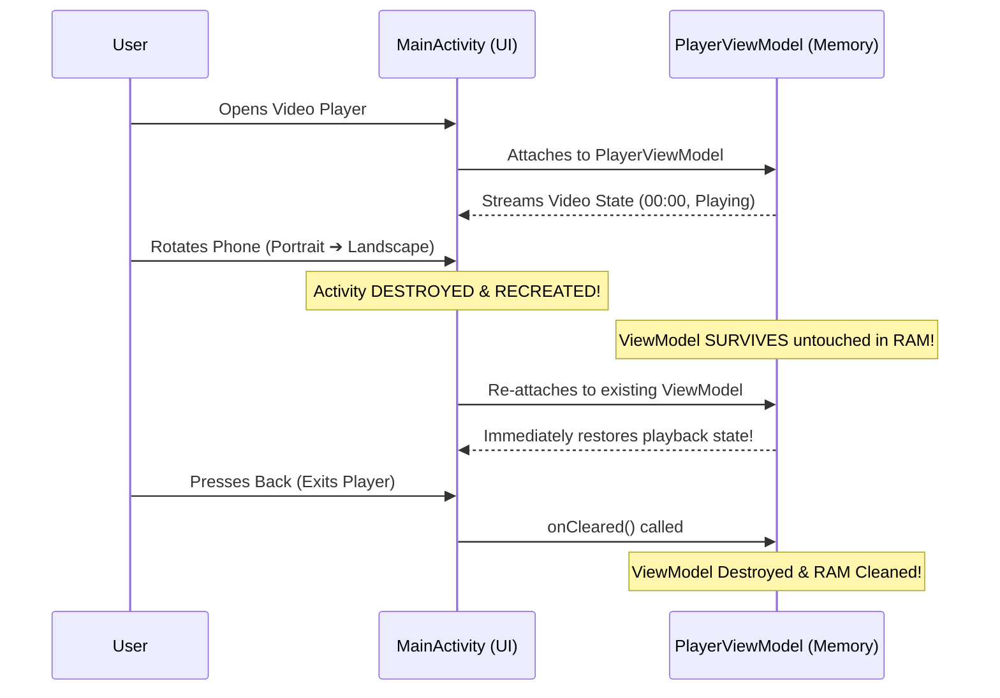

# 🧠 ViewModels & UI State Holders


In this lesson, you will learn what a **ViewModel** is, why it survives screen rotations when Activities are destroyed, and how to structure clean business logic using `viewModelScope`.

---

## 👶 1. The Beginner Analogy: The Vault Behind the Cashier Counter

Imagine a bank:
1. **The Activity (The Cashier at the Front Desk):** Whenever someone rotates the building (phone rotation), the cashier is replaced by a new worker (`Activity.onDestroy()` ➔ `Activity.onCreate()`).
2. **The ViewModel (The Fireproof Vault Behind the Wall):** All the money, open accounts, and active transactions stay locked safely inside the vault. The new cashier simply walks up to the vault and reads the current balances without losing a single cent!

---

## 📊 2. Visual Architecture: Activity Lifecycle vs ViewModel Lifecycle



---

## 🔍 3. Core Mechanics of a ViewModel

### 🏛️ A. Defining a ViewModel
A ViewModel extends the AndroidX `ViewModel` class:

```kotlin
import androidx.lifecycle.ViewModel
import androidx.lifecycle.viewModelScope
import kotlinx.coroutines.flow.MutableStateFlow
import kotlinx.coroutines.flow.asStateFlow
import kotlinx.coroutines.launch

class VideoPlayerViewModel : ViewModel() {
    // 1. Private mutable state (Only ViewModel can write)
    private val _positionMs = MutableStateFlow(0L)
    
    // 2. Public read-only state (UI can only observe)
    val positionMs = _positionMs.asStateFlow()

    // 3. Built-in Coroutine Scope
    fun startPositionTracker() {
        viewModelScope.launch {
            while (true) {
                // Background tracking...
            }
        }
    }
}
```

---

### 🛡️ B. Why `viewModelScope` Prevents Memory Leaks
If you launch a background task inside a standard thread, and the user closes the app, that thread keeps running in the background, wasting battery and leaking memory.

With **`viewModelScope`**:
- When the user exits the screen, the ViewModel's `onCleared()` method is invoked automatically.
- **Every single coroutine running inside `viewModelScope` is instantly cancelled!**

---

### 🧩 C. Connecting ViewModels to Jetpack Compose
In Compose, you obtain a ViewModel instance with:

```kotlin
@Composable
fun PlayerScreen(
    viewModel: PlayerViewModel = koinViewModel() // Or viewModel()
) {
    val position by viewModel.positionMs.collectAsState()
    
    Text(text = "Current: $position ms")
}
```

---

## ⚡ 4. Real-World Connection: How mpvRex Organizes PlayerViewModel

In a complex media player like `mpvRex`, a single ViewModel could easily balloon into an unreadable 10,000-line "God Object". 

To prevent this, `mpvRex` divides responsibilities into **specialized sub-managers** inside `PlayerViewModel.kt`:

```kotlin
// Inside xyz.mpv.rex.ui.player.PlayerViewModel.kt:
class PlayerViewModel : ViewModel(), KoinComponent {

    // Decoupled sub-managers for specific features:
    val playbackManager = PlaybackManager(this)
    val subtitleManager = SubtitleManager(this)
    val trackManager = TrackManager(this)
    val gestureManager = PlayerGestureManager(this)
    val snapshotManager = PlayerSnapshotManager(this)
    
    // Clean delegation:
    fun seekTo(position: Long) = playbackManager.seekTo(position)
    fun setSubtitleDelay(delay: Float) = subtitleManager.setDelay(delay)
}
```

### Why this architecture wins:
- You never have to search through a massive file to fix subtitle issues; you open `SubtitleManager.kt`!
- The ViewModel acts as the clean orchestration hub.

---

## 🎯 5. Key Takeaways

- [x] A **ViewModel** survives configuration changes (like screen rotations) that destroy Activities.
- [x] Always launch background coroutines inside **`viewModelScope`** to prevent memory leaks.
- [x] Keep state write-access private (`MutableStateFlow`) and expose read-only state (`StateFlow`).
- [x] Break giant ViewModels down into modular **Managers** to maintain high code readability.
