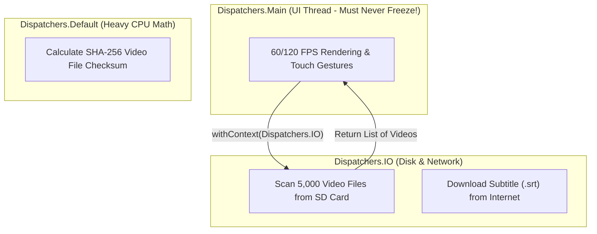

# ⏱️ Kotlin Coroutines Demystified


In this lesson, you will learn how **Kotlin Coroutines** allow Android apps to read files from disk, fetch online subtitles, and run timers smoothly without freezing the screen.

---

## 👶 1. The Beginner Analogy: The Multi-Tasking Chef vs The Frozen Kitchen

Imagine a chef preparing dinner:
1. **The Blocking Way (`Thread.sleep`):** The chef puts a pizza in the oven for 20 minutes, stands frozen like a statue staring at the oven door, and refuses to chop vegetables or answer the phone. The restaurant grinds to a halt (**ANR Crash - App Not Responding**).
2. **The Coroutine Way (`suspend`):** The chef puts the pizza in the oven, sets a digital timer, and immediately turns around to chop salad. When the timer rings, the chef smoothly resumes pizza duty!

---

## 📊 2. Visual Architecture: Threads & Dispatchers



---

## 🔍 3. Core Coroutine Building Blocks

### 🛑 A. The Main Thread Rule
In Android:
- **All UI drawing and touch detection runs on ONE single thread: The Main Thread.**
- If you block the Main Thread for more than **5 seconds**, Android terminates your app with the dreaded dialog: *"App isn't responding. Do you want to close it?"*
- Therefore, **any disk I/O, database query, or network request MUST run on a background thread.**

---

### ⏳ B. The `suspend` Function
A `suspend` function is a function that can pause execution without blocking the underlying thread:

```kotlin
// 'suspend' indicates this function pauses without freezing the CPU:
suspend fun loadSubtitleFile(url: String): String {
    // Switches execution to background IO thread pool:
    return withContext(Dispatchers.IO) {
        // Network or disk operations happen safely here!
        URL(url).readText()
    }
}
```

---

### 🔀 C. Coroutine Dispatchers Explained

| Dispatcher | What It Does | When to Use |
| :--- | :--- | :--- |
| **`Dispatchers.Main`** | Runs on the UI Thread | Updating Compose state, showing dialogs, playing animations |
| **`Dispatchers.IO`** | Offloads to an elastic pool of background threads | Reading/writing disk files, network requests, SQLite queries |
| **`Dispatchers.Default`** | Uses threads equal to your phone's CPU cores | Sorting massive lists, image resizing, heavy math |

---

### ⏰ D. Non-Blocking Delay: `delay()`
Never call `Thread.sleep()` in Android! It freezes the entire OS thread. Always use **`delay()`**:

```kotlin
// Automatically hides controls after 3 seconds of inactivity:
fun scheduleControlsHide() {
    hideJob?.cancel() // Cancel previous countdown if user tapped again
    hideJob = viewModelScope.launch {
        delay(3000L) // Pauses coroutine for 3s WITHOUT blocking UI!
        _controlsShown.value = false
    }
}
```

---

## ⚡ 4. Real-World Connection: How mpvRex Uses Coroutines

In `mpvRex`, calculating video checksums or reading media headers would lock the phone if done on the Main Thread.

Look at `xyz.mpv.rex.utils.media.ChecksumUtils.kt`:

```kotlin
// Running heavy file checksums in the background:
suspend fun calculateChecksum(file: File): String = withContext(Dispatchers.IO) {
    // Reads file buffer on background IO thread:
    val digest = MessageDigest.getInstance("MD5")
    file.inputStream().use { stream ->
        val buffer = ByteArray(8192)
        var read: Int
        while (stream.read(buffer).also { read = it } > 0) {
            digest.update(buffer, 0, read)
        }
    }
    digest.digest().joinToString("") { "%02x".format(it) }
}
```

### Why this is rock-solid:
- The UI stays buttery-smooth at 120 FPS.
- The user can still drag the seekbar while the checksum calculates in the background.

---

## 🎯 5. Key Takeaways

- [x] Never perform disk reads, database queries, or network requests on the **Main Thread**.
- [x] **`suspend`** pauses a function without blocking the CPU thread.
- [x] Use **`withContext(Dispatchers.IO)`** to switch heavy tasks to background threads.
- [x] Never use `Thread.sleep()`; always use **`delay()`** for non-blocking timers.
- [x] Coroutines launched in **`viewModelScope`** are cancelled automatically when screens close.
