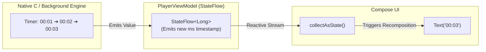

# 🌊 Reactive Streams with Flow & StateFlow


In this lesson, you will master **Kotlin Flow** and **StateFlow**—the reactive pipelines used to push continuous real-time updates (like changing video timestamps and buffer percentages) from background engines directly into Jetpack Compose.

---

## 👶 1. The Beginner Analogy: A Water Pipe vs A Cup of Water

1. **A Standard Variable (`val x = 5`):** A cup of water. It has one fixed amount of water right now.
2. **A Flow (`Flow<T>`):** A running water pipe! Water (data) continuously streams through it over time.
3. **A StateFlow (`StateFlow<T>`):** A water dispenser with a digital gauge. It always holds the **latest** temperature/level, and whenever that level changes, every connected screen instantly updates!

---

## 📊 2. Visual Architecture: StateFlow in Compose



---

## 🔍 3. Core Mechanics of StateFlow

### 🔒 A. Encapsulation: Private Write, Public Read
A ViewModel should never allow outside classes to tamper with its state directly:

```kotlin
class PlayerViewModel : ViewModel() {
    // 1. Private Mutable State: Only this ViewModel can write to it
    private val _positionMs = MutableStateFlow(0L)

    // 2. Public Read-Only State: Exposed to Compose as an immutable StateFlow
    val positionMs: StateFlow<Long> = _positionMs.asStateFlow()

    // 3. Updating the state safely:
    fun updatePosition(newMs: Long) {
        _positionMs.value = newMs
    }
}
```

---

### 🛡️ B. Atomic State Updates: `.update { }`
When updating complex data classes or multiple properties simultaneously, avoid race conditions by using **`.update { }`**:

```kotlin
data class PlayerUiState(
    val isPlaying: Boolean = false,
    val speed: Float = 1.0f
)

private val _uiState = MutableStateFlow(PlayerUiState())
val uiState = _uiState.asStateFlow()

fun togglePlay() {
    // Atomically updates the state without thread race conditions!
    _uiState.update { currentState ->
        currentState.copy(isPlaying = !currentState.isPlaying)
    }
}
```

---

### 📺 C. Collecting State in Jetpack Compose
In Compose, you convert a `StateFlow` into Compose state using **`collectAsState()`**:

```kotlin
@Composable
fun VideoTimeDisplay(viewModel: PlayerViewModel) {
    // Subscribes to the stream! Recomposes ONLY when positionMs changes:
    val position by viewModel.positionMs.collectAsState()

    Text(
        text = formatMilliseconds(position),
        color = Color.White
    )
}
```

---

### 🔀 D. Combining Streams with `combine()`
In media players, you often need to derive a state from multiple sources (e.g. are we ready to seek?):

```kotlin
// Emits true only if duration > 0 AND player is not currently buffering:
val canSeek: StateFlow<Boolean> = combine(
    durationMs,
    isBuffering
) { duration, buffering ->
    duration > 0 && !buffering
}.stateIn(viewModelScope, SharingStarted.WhileSubscribed(5000), false)
```

---

## ⚡ 4. Real-World Connection: How mpvRex Uses StateFlow

Look directly at `xyz.mpv.rex.ui.player.PlayerViewModel.kt`:

`mpvRex` powers its entire player interface using StateFlows:
- `val position: StateFlow<Long>` (Updated every 200–500ms by the mpv engine event observer)
- `val duration: StateFlow<Long>` (Emits total length when video loads)
- `val isBuffering: StateFlow<Boolean>` (Shows/hides the circular loading spinner)
- `val playbackSpeed: StateFlow<Float>` (Updates the speed indicator badge)

Because Compose observes these flows with `collectAsState()`, **the UI updates in real time with zero manual refresh calls!**

---

## 🎯 5. Key Takeaways

- [x] A **`Flow`** emits multiple values sequentially over time.
- [x] A **`StateFlow`** is a hot stream that always holds the latest state value.
- [x] Always hide mutable state behind **`private val _state = MutableStateFlow(...)`** and expose **`asStateFlow()`**.
- [x] Use **`collectAsState()`** in Compose to reactively listen to Flow updates.
- [x] Use **`.update { }`** to perform atomic, thread-safe state mutations.
