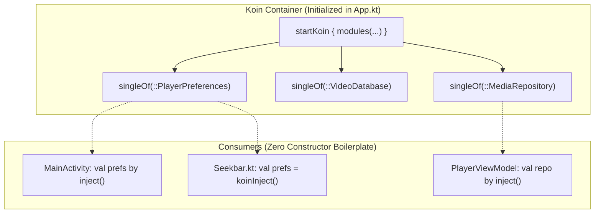

# 💉 Dependency Injection (DI) with Koin


In this lesson, you will learn what **Dependency Injection (DI)** is, why modern Android avoids manual instantiation (`new` / constructors everywhere), and how **Koin** injects tools across your app.

---

## 👶 1. The Beginner Analogy: The Coffee Delivery Service

Imagine you work in an office and need coffee every morning:
1. **Without Dependency Injection:** Every time you want coffee, you have to buy coffee beans, build a grinder, assemble a water heater, and construct a coffee machine from raw metal. If the machine brand changes, you must rewrite your whole morning routine.
2. **With Dependency Injection (Koin):** There is a central barista service (`Koin`). Whenever any employee calls `koinInject<Coffee>()`, the barista hands them a hot, perfectly prepared cup instantly!

---

## 📊 2. Visual Architecture: The Koin Dependency Container



---

## 🔍 3. Core Mechanics of Koin

### 📦 A. Defining Koin Modules
In Koin, you group related tools into a **`module`**:

```kotlin
import org.koin.dsl.module
import org.koin.core.module.dsl.singleOf

val PreferencesModule = module {
    // 1. 'single': Creates ONE singleton instance shared by everyone
    single { AndroidPreferenceStore(androidContext()) }

    // 2. 'singleOf': Modern shortcut to register class constructors automatically
    singleOf(::PlayerPreferences)
    singleOf(::DecoderPreferences)
    singleOf(::AppearancePreferences)
}
```

- **`single { ... }`**: Ensures only **one** instance lives in memory across the entire app.
- **`factory { ... }`**: Creates a **brand new** instance every time it is injected.

---

### 🚀 B. Starting Koin in `App.kt`
Koin must be started when the Android Application process boots up in `Application.onCreate()`:

```kotlin
class App : Application() {
    override fun onCreate() {
        super.onCreate()

        startKoin {
            androidContext(this@App) // Injects the application context
            modules(
                PreferencesModule,
                DatabaseModule,
                domainModule
            )
        }
    }
}
```

---

### ⚡ C. Using Dependencies in Kotlin & Jetpack Compose

#### 1. Inside standard Kotlin classes or ViewModels:
```kotlin
class PlayerViewModel : ViewModel(), KoinComponent {
    // Lazy injection:
    private val playerPreferences: PlayerPreferences by inject()
}
```

#### 2. Inside `@Composable` UI functions:
```kotlin
@Composable
fun VideoSeekbar() {
    // Direct Composable injection!
    val playerPreferences = koinInject<PlayerPreferences>()
    val whiteBar by playerPreferences.whiteSeekBar.collectAsState()
}
```

---

## ⚡ 4. Real-World Connection: How mpvRex Uses Koin

Look at `xyz.mpv.rex.di.PreferencesModule.kt`:

```kotlin
val PreferencesModule = module {
    single { JellyfinPreferences(androidContext()) }
    single { AndroidPreferenceStore(androidContext()) }.bind(PreferenceStore::class)

    single { AppearancePreferences(get()) }
    singleOf(::PlayerPreferences)
    singleOf(::GesturePreferences)
    singleOf(::DecoderPreferences)
    singleOf(::SubtitlesPreferences)
    singleOf(::AudioPreferences)
    singleOf(::AdvancedPreferences)
    singleOf(::SettingsManager)
}
```

Notice `single { AppearancePreferences(get()) }`:
- **`get()`** tells Koin: *"Look inside your registry, find whatever `PreferenceStore` was already registered, and pass it into `AppearancePreferences` automatically."*
- You never have to manually pass `context` or `stores` around!

---

## 🎯 5. Key Takeaways

- [x] **Dependency Injection** eliminates manual object construction and reduces tight coupling.
- [x] **`single`** registers a singleton; **`singleOf`** provides automatic constructor resolution.
- [x] Start Koin inside your custom **`Application.onCreate()`** with `startKoin`.
- [x] Inject anywhere in Compose using **`koinInject<T>()`**.
- [x] Use **`get()`** inside Koin modules to automatically wire dependencies into other classes.
