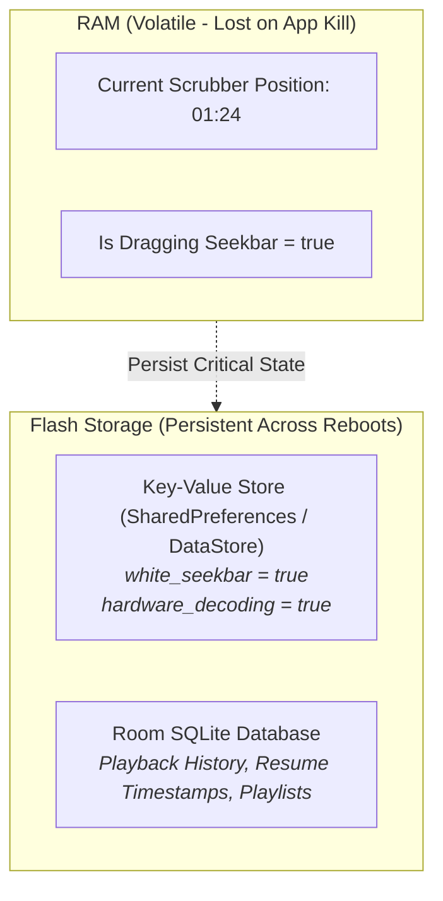

# 💾 Settings & Data Persistence


In this lesson, you will learn how Android saves user settings, playback history, and preferences across app restarts using **SharedPreferences**, **DataStore**, and reactive preference stores.

---

## 👶 1. The Beginner Analogy: Sticky Notes vs The Filing Cabinet

1. **RAM Variables (`remember` / `val`):** A temporary sticky note on your desk. When you go home and turn off the lights (app process killed), the janitor sweeps all notes into the trash!
2. **Persistent Storage (`DataStore` / `Preferences`):** An iron filing cabinet in the corner of the office. Whatever you lock inside remains safe, even if the building loses power for weeks.

---

## 📊 2. Visual Architecture: The Persistence Hierarchy



---

## 🔍 3. Core Mechanics of Key-Value Persistence

### 🗄️ A. What is a Preference Store?
Instead of reading raw files, Android provides a key-value store:

```kotlin
// Saving a preference:
preferenceStore.setBoolean("white_seekbar", true)

// Loading a preference (with default fallback if not set yet):
val isWhite = preferenceStore.getBoolean("white_seekbar", false)
```

---

### 🌊 B. Making Preferences Reactive with `StateFlow`
In older apps, changing a setting in the Settings Menu required restarting the player. 

Modern Android wraps preferences into a **`StateFlow`**:

```kotlin
class PlayerPreferences(private val preferenceStore: PreferenceStore) {
    // 1. Reactive preference: Automatically emits new value when changed on disk!
    val whiteSeekBar = preferenceStore.getBoolean("white_seekbar", false)
    val useWavySeekbar = preferenceStore.getBoolean("use_wavy_seekbar", true)
    val defaultSpeed = preferenceStore.getFloat("default_playback_speed", 1.0f)
}
```

---

### 📺 C. Consuming Reactive Preferences in Compose
Because the preference is a Flow/StateFlow, any Composable observing it updates instantly:

```kotlin
@Composable
fun VideoSeekbar() {
    val playerPreferences = koinInject<PlayerPreferences>()
    
    // UI automatically re-colors itself the moment the user toggles the switch!
    val isWhite by playerPreferences.whiteSeekBar.collectAsState()
    
    val barColor = if (isWhite) Color.White else MaterialTheme.colorScheme.primary
}
```

---

## ⚡ 4. Real-World Connection: How mpvRex Organizes Preferences

`mpvRex` splits user configuration into specialized preference domains:

```text
xyz.mpv.rex.preferences/
├── PlayerPreferences.kt      ──> Seekbar styles, skip durations, auto-play
├── AppearancePreferences.kt  ──> Pure black OLED toggle, theme colors
├── DecoderPreferences.kt     ──> HW decoding vs SW decoding, deband filter
├── GesturePreferences.kt     ──> Left-edge brightness, right-edge volume swipe
├── AudioPreferences.kt       ──> Audio delay, night mode compression
└── SubtitlesPreferences.kt   ──> Subtitle font, size, border colors
```

### The Recipe for Adding a New Setting:
1. Open the relevant file (e.g. `PlayerPreferences.kt`).
2. Add your new preference key:
   ```kotlin
   val autoPipOnBackground = preferenceStore.getBoolean("auto_pip", true)
   ```
3. Add the toggle switch to `PlayerPreferencesScreen.kt`.
4. Inject and observe in your player Activity or Composable!

---

## 🎯 5. Key Takeaways

- [x] RAM state is wiped when an app is killed; disk storage survives across restarts.
- [x] Use key-value storage (**Preferences / DataStore**) for user settings and toggles.
- [x] Use **SQLite / Room** for large structured data like playback history and playlists.
- [x] Wrap preferences into **`StateFlow`** streams so the UI reacts instantly to settings changes without requiring an app restart.
