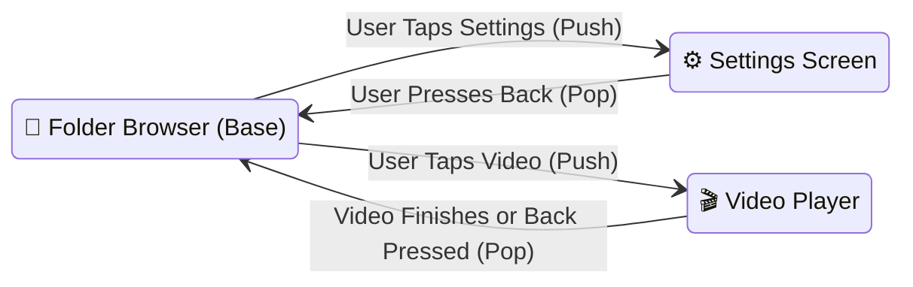

# 🧭 Compose Navigation Architecture


In this lesson, you will learn how modern Android apps transition between screens without opening multiple activities, using **Compose Navigation** and the **Back Stack**.

---

## 👶 1. The Beginner Analogy: The Stack of Playing Cards

Imagine a deck of playing cards:
1. **The Root Screen (Bottom Card):** The main video folder browser.
2. **Pushing a Screen (`push`):** You place a new card on top (e.g. *Settings Screen*). The user now sees only the top card.
3. **Popping a Screen (`pop` / Back Button):** The user presses Back. You discard the top card, instantly revealing the previous screen exactly as they left it!

---

## 📊 2. Visual Architecture: The Navigation Back Stack



---

## 🔍 3. Core Mechanics of Compose Navigation

### 🃏 A. The Single-Activity Architecture
In legacy Android, every screen was a separate `Activity` defined in `AndroidManifest.xml`. 

In modern Compose:
- The entire app lives inside **one single Activity** (`MainActivity`).
- Navigation simply swaps which Composable is currently being rendered inside that Activity window!
- **Benefit:** Superfast transitions, zero Activity creation overhead, and seamless shared state.

---

### 🗺️ B. Managing the Back Stack
```kotlin
// 1. Create and remember the back stack:
val backStack = rememberNavBackStack(initialEntries = listOf(Screen.Home))

// 2. Render whichever screen is on top of the stack:
NavDisplay(
    backstack = backStack,
    entryProvider = { screen ->
        when (screen) {
            is Screen.Home -> NavEntry(screen) { FolderBrowserScreen() }
            is Screen.Settings -> NavEntry(screen) { SettingsScreen() }
            is Screen.Player -> NavEntry(screen) { VideoPlayerScreen(screen.videoUri) }
        }
    }
)
```

---

### 🔙 C. Intercepting the Back Button with `BackHandler`
What happens when the user presses their phone's hardware/gesture Back button? 

If you want custom behavior (like collapsing a bottom sheet or minimizing a video into a Mini-Player before leaving the screen), use **`BackHandler`**:

```kotlin
var isBottomSheetOpen by remember { mutableStateOf(false) }

// Intercepts the back button ONLY when the bottom sheet is open:
BackHandler(enabled = isBottomSheetOpen) {
    // Closes sheet instead of leaving the app!
    isBottomSheetOpen = false
}
```

---

## ⚡ 4. Real-World Connection: How mpvRex Navigates

Look directly at `xyz.mpv.rex.MainActivity.kt`:

`mpvRex` uses modern Navigation3 with `rememberNavBackStack`:

```kotlin
// Simplified from MainActivity.kt:
val backstack: NavBackStack<Screen> = rememberNavBackStack(listOf(Screen.Home))

// Providing backstack to child composables via CompositionLocal:
CompositionLocalProvider(LocalBackStack provides backstack) {
    Surface {
        NavDisplay(
            backstack = backstack,
            transitionSpec = {
                // Smooth fade and scale transitions between screens:
                fadeIn(tween(300)) togetherWith fadeOut(tween(300))
            }
        )
    }
}
```

### The Mini-Player Back Interception:
If a video is playing in the floating Mini-Player at the bottom of the screen, pressing Back doesn't quit the app—`BackHandler` stops the video first or closes the search bar cleanly!

---

## 🎯 5. Key Takeaways

- [x] Modern Android uses a **Single-Activity Architecture**, swapping `@Composable` screens dynamically.
- [x] The **Back Stack** works like a stack of cards (`push` to open, `pop` to go back).
- [x] Use **`NavDisplay`** / **`NavHost`** to map destinations to their Composable UI.
- [x] Use **`BackHandler`** to intercept system back gestures for closing sheets, dialogs, or mini-players.
