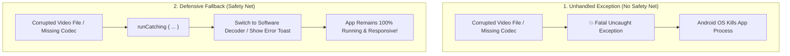

# 🛡️ Defensive Programming & Error Recovery


In this lesson, you will learn how to make Android apps resilient against corrupted files, network drops, and unexpected crashes using **`runCatching`**, **codec fallbacks**, and a **Global Crash Handler**.

---

## 👶 1. The Beginner Analogy: The Trapeze Artist's Safety Net

Imagine an acrobat performing high above the ground:
1. **Without Error Handling:** If the acrobat slips, they hit the concrete floor (**App Crash Dialog: "mpvRex has stopped"**). The audience leaves immediately.
2. **With Defensive Programming:** There is a thick safety net stretched underneath. If the acrobat slips, the net catches them, they bounce back up with a smile, and the show continues smoothly!

---

## 📊 2. Visual Architecture: Crash vs Graceful Recovery



---

## 🔍 3. Core Kotlin Error Handling Patterns

### 🪢 A. The `runCatching` Idiom
In Kotlin, you rarely need messy `try-catch` blocks. Kotlin provides **`runCatching`**:

```kotlin
// Safely parsing an integer from user input without crashing:
val skipSeconds = runCatching {
    userInputText.toInt()
}.getOrDefault(10) // Defaults to 10s if the user typed letters!
```

#### Handling Success and Failure:
```kotlin
runCatching {
    loadSubtitleFromDisk(fileUri)
}.onSuccess { subtitles ->
    displaySubtitles(subtitles)
}.onFailure { error ->
    Log.e("Player", "Failed to parse subtitle file", error)
    showToast("Invalid subtitle format")
}
```

---

### ⚙️ B. Hardware Decoding Fallbacks
Modern phones have hardware chips (MediaCodec) to decode H.264 and HEVC videos. However, if a user opens an unusual video format (e.g. 10-bit AV1 with exotic color profiles), the hardware decoder may fail:

```kotlin
fun startPlayback(videoUri: Uri) {
    try {
        // Attempt fast hardware decoding:
        mpvEngine.setHardwareDecoding(true)
        mpvEngine.loadFile(videoUri)
    } catch (e: Exception) {
        Log.w("Decoder", "Hardware decoding failed! Falling back to Software CPU decoding.")
        // Graceful fallback to CPU decoding:
        mpvEngine.setHardwareDecoding(false)
        mpvEngine.loadFile(videoUri)
    }
}
```

---

### 🚨 C. The Ultimate Net: `GlobalExceptionHandler`
What happens if a developer introduces a critical bug that wasn't caught anywhere in code?

Instead of letting Android display a jarring system crash popup, professional apps install a **Global Exception Handler** in `Application.onCreate()`:

```kotlin
Thread.setDefaultUncaughtExceptionHandler { thread, throwable ->
    // 1. Intercept the crash before Android kills the app
    Log.e("CRASH", "Fatal exception on thread: ${thread.name}", throwable)

    // 2. Launch a dedicated CrashActivity to show the error log to the user!
    val intent = Intent(context, CrashActivity::class.java).apply {
        putExtra("error_trace", throwable.stackTraceToString())
        addFlags(Intent.FLAG_ACTIVITY_NEW_TASK or Intent.FLAG_ACTIVITY_CLEAR_TASK)
    }
    context.startActivity(intent)

    // 3. Terminate the broken process cleanly
    exitProcess(2)
}
```

---

## ⚡ 4. Real-World Connection: How mpvRex Handles Crashes

Look at `xyz.mpv.rex.presentation.crash.GlobalExceptionHandler.kt` and `CrashActivity.kt`:

`mpvRex` installs a custom crash handler in `App.kt`:
1. If an unexpected error occurs anywhere in the app, `GlobalExceptionHandler` intercepts it.
2. It gathers the phone model, Android API version, and complete stack trace.
3. It opens **`CrashActivity`**, presenting a clean UI with:
   - A friendly explanation: *"mpvRex ran into an unexpected problem."*
   - A **"Copy Error Log"** button so you can easily report it on GitHub!

---

## 🎯 5. Key Takeaways

- [x] Unhandled exceptions cause Android to kill your app immediately.
- [x] Use **`runCatching { ... }.getOrDefault(...)`** to safely parse data and user inputs.
- [x] In media apps, always provide a **software decoding fallback** if hardware decoders fail.
- [x] A **`GlobalExceptionHandler`** catches catastrophic crashes and shows a helpful error screen with a copyable log instead of an abrupt exit.
