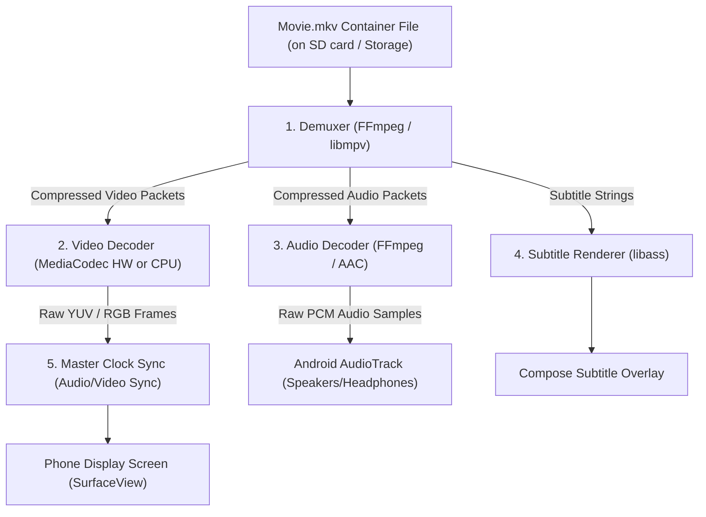

# 🎬 How Video Playback Actually Works

In this lesson, you will learn what actually happens inside a phone when you tap play on a movie file—from demuxing compressed containers down to raw video frames.

---

## 👶 1. The Beginner Analogy: The Russian Matryoshka Doll

When you have a movie file like `Interstellar.mkv`, it is not a raw video. It is a **Russian Matryoshka Doll**:
1. **The Container (The Outer Doll - `.mp4`, `.mkv`):** A single shipping box that holds multiple separate tracks together.
2. **The Tracks (The Inner Dolls):**
   - Track 1: Compressed Video Stream (e.g. H.264 or AV1)
   - Track 2: English Audio Stream (e.g. 5.1 Dolby Digital)
   - Track 3: Spanish Audio Stream (e.g. Stereo AAC)
   - Track 4: Subtitles (`.ass` or `.srt`)
3. **The Unpacker (The Demuxer):** Cuts the box open and separates video packets from audio packets.
4. **The Decompressor (The Decoder):** Uncompresses millions of compressed bytes into raw RGB colored pixels and pushes them to your phone screen at 60 or 120 times every second!

---

## 📊 2. Visual Architecture: The Video Playback Pipeline

---

## 🔍 3. Core Media Concepts Decoded

### 📦 A. Container vs Codec (The Critical Difference)
- **Container (`.mp4`, `.mkv`, `.webm`, `.avi`):** Just the wrapper envelope! It does not dictate quality. An `.mkv` file can hold anything from 1990s MPEG-1 to 2026 8K AV1.
- **Codec (H.264 / AVC, H.265 / HEVC, AV1, VP9):** The compression algorithm. Uncompressed 4K video takes **1,000 Gigabytes per hour**. A codec compresses this by 99% using temporal motion vectors (only storing pixels that move between frames).

---

### ⏱️ B. The Master Clock & A/V Sync
Why don't the actor's lips get out of sync with their voice?
- Video frames can take varying amounts of time to decode.
- Audio playback runs on a rigid hardware crystal clock inside your phone's DAC (Digital-to-Analog Converter).
- **The player uses the Audio Clock as the Master Reference.** If video decoding falls 50 milliseconds behind the audio clock, the video engine drops non-essential frames to catch back up!

---

## ⚡ 4. Real-World Connection: How mpvRex Uses `libmpv`

Building a video pipeline from scratch in Kotlin would require writing tens of thousands of lines of low-level C code. 

Instead, **mpvRex** embeds **`libmpv`** (the gold-standard open-source media player engine that powers MPV, IINA, and Plex):

1. **Kotlin UI:** Sends commands like `MPVLib.command("loadfile", filePath)`.
2. **`libmpv`:** Handles demuxing MKV/MP4 files, hardware acceleration (MediaCodec), audio clock synchronization, and subtitle rendering internally at C speeds.
3. **Android Surface:** Receives decoded video frames directly from `libmpv`'s OpenGL/Vulkan rendering loop.

---

## 🎯 5. Key Takeaways

- [x] Video files are **containers** (`.mkv`, `.mp4`) packaging video, audio, and subtitle streams together.
- [x] A **Demuxer** splits container tracks; a **Decoder** decompresses packets into raw image frames.
- [x] **Codecs** (H.264, HEVC, AV1) compress video data so it fits on mobile storage.
- [x] The **Master Clock** keeps video frames synchronized with audio output.
- [x] **mpvRex** delegates heavy demuxing, decoding, and syncing to the native **`libmpv`** engine.
