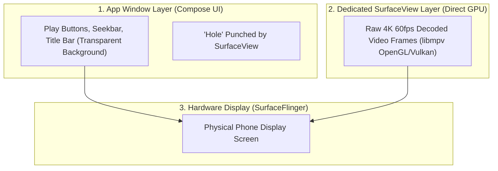

# 🖼️ Displaying Video (SurfaceView vs TextureView)


In this lesson, you will learn how video frames are rendered onto an Android phone display using **`SurfaceView`**, and why media players choose it over standard UI views.

---

## 👶 1. The Beginner Analogy: A Window in the Wall vs A Photo of the Yard

Imagine you want to see your backyard from inside a room:
1. **`TextureView` (Taking a Polaroid Photo):** The system takes a photograph of the backyard, develops it, and tapes it to the wall inside your room. You can apply filters or tilt the photo, but it costs extra paper and processing.
2. **`SurfaceView` (Cutting an Actual Window in the Wall):** You cut a hole straight through the drywall. Sunlight streams directly through the glass. It is zero-overhead, perfectly clear, and requires zero extra processing!

---

## 📊 2. Visual Architecture: The SurfaceFlinger Pipeline

Android uses an OS system service called **SurfaceFlinger** to composite visual layers onto your physical screen:



`SurfaceView` does not draw into the app's View tree. It requests its **own separate hardware layer** from the Android OS and punches a transparent hole in the UI window so the video shines through from behind!

---

## 🔍 3. SurfaceView vs TextureView Comparison

| Feature | `SurfaceView` (Preferred for Players) | `TextureView` |
| :--- | :--- | :--- |
| **Performance** | ⚡ Maximum (Zero-copy direct to GPU) | 🐢 Slower (Extra RAM buffer copy) |
| **Battery Usage** | 🔋 Low battery drain | 🪫 Higher battery drain |
| **4K / 60-120 FPS** | 🟢 Perfectly smooth | 🟡 Potential frame drops |
| **Animations / Alpha** | ⚠️ Hard to animate opacity directly | 🟢 Can be faded, rotated, animated like any View |

---

## 🛠️ 4. The Lifecycle of a Surface: `SurfaceHolder.Callback`

A `Surface` is a physical piece of graphics memory managed by the Linux display driver. It can be created or destroyed by Android at any moment:

```kotlin
class VideoSurfaceCallback : SurfaceHolder.Callback {
    // 1. Surface is ready in GPU memory:
    override fun surfaceCreated(holder: SurfaceHolder) {
        // Pass the physical surface to native C engine:
        MPVLib.attachSurface(holder.surface)
    }

    // 2. Phone rotated or window resized:
    override fun surfaceChanged(holder: SurfaceHolder, format: Int, width: Int, height: Int) {
        // Notify player engine of new dimensions:
        MPVLib.setPropertyString("android-surface-size", "${width}x${height}")
    }

    // 3. User pressed Home or screen locked:
    override fun surfaceDestroyed(holder: SurfaceHolder) {
        // MUST detach surface immediately, or app will crash when native C draws to dead memory!
        MPVLib.detachSurface()
    }
}
```

---

## ⚡ 5. Real-World Connection: How mpvRex Handles `surfaceChanged`

Look at `xyz.mpv.rex.ui.player.MPVView.kt`:

When you rotate your phone while a video is **paused**, `mpvRex` solves a famous Android glitch:
```kotlin
// Inside MPVView.kt:
override fun surfaceChanged(holder: SurfaceHolder, format: Int, width: Int, height: Int) {
    super.surfaceChanged(holder, format, width, height)
    if (isExiting) return

    val paused = runCatching { MPVLib.getPropertyBoolean("pause") }.getOrNull() == true
    if (paused) {
        // While paused, mpv's render loop is idle and won't draw a new frame.
        // Doing a zero-distance seek forces mpv to re-render the current frame
        // at the new rotated dimensions without advancing video time!
        runCatching { MPVLib.command("seek", "0", "relative+exact") }
    }
}
```

---

## 🎯 6. Key Takeaways

- [x] **`SurfaceView`** punches a hole in the UI window, drawing directly to a dedicated hardware layer.
- [x] Zero-copy hardware rendering makes `SurfaceView` the industry standard for 4K video players.
- [x] **`surfaceCreated`** is where you attach the surface to `libmpv`; **`surfaceDestroyed`** is where you must detach it.
- [x] Rotating the phone while paused requires a forced frame repaint (`seek 0 relative+exact`) to prevent stretched visual artifacts.
