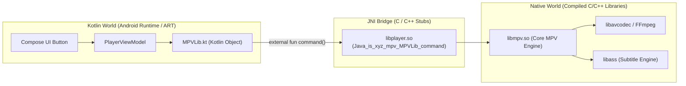

# 🌉 JNI & Native C/C++ in Android


In this lesson, you will learn what **JNI (Java Native Interface)** is, how Android loads compiled C/C++ libraries (`.so` files), and how Kotlin communicates directly with native engines like **`libmpv`**.

---

## 👶 1. The Beginner Analogy: The Diplomatic Translator

Imagine an international conference:
1. **The Kotlin Delegate:** Speaks fluent Kotlin/Java. Great at coordinating meetings, drawing buttons, and talking to the Android operating system.
2. **The C/C++ Expert (`libmpv`):** A high-speed native engineer who speaks raw machine code. Incredibly fast at crunching video pixels and decoding frames.
3. **The JNI Bridge (The Diplomatic Translator):** Stands between them. When the Kotlin delegate says *"Please load this video file"*, JNI translates the message into native C pointers and executes it instantly!

---

## 📊 2. Visual Architecture: The JNI Bridge in mpvRex



---

## 🔍 3. Core Mechanics of JNI

### 📥 A. Loading Compiled Native Libraries
Before calling any native function, Android must load the compiled shared objects (`.so` files) into the process memory:

```kotlin
object MPVLib {
    init {
        // Loads libmpv.so and libplayer.so from the APK's lib/arm64-v8a/ directory:
        System.loadLibrary("mpv")
        System.loadLibrary("player")
    }
}
```

---

### 🏷️ B. The `external` Keyword
In Kotlin, the **`external`** keyword tells the compiler:
> *"Do not look for the function body in Kotlin. A native C function with this exact signature will be linked at runtime via JNI."*

```kotlin
// Declared in Kotlin, implemented in C:
external fun create(appctx: Context)
external fun init()
external fun destroy()
external fun command(vararg cmd: String)
external fun setPropertyBoolean(property: String, value: Boolean)
external fun getPropertyDouble(property: String): Double?
```

---

### 💬 C. Sending Commands to the Engine
In `mpvRex`, sending instructions to the video player is as simple as calling string commands:

```kotlin
// 1. Tell mpv to open a video file:
MPVLib.command("loadfile", "/sdcard/Movies/Avatar.mkv")

// 2. Seek forward by 10 seconds:
MPVLib.command("seek", "10", "relative")

// 3. Pause or Resume:
MPVLib.setPropertyBoolean("pause", true)

// 4. Enable Hardware MediaCodec Decoding:
MPVLib.setPropertyString("hwdec", "mediacodec")
```

---

### 👂 D. Listening to Native Engine Events
When the video reaches the end or changes resolution, native C fires an event up to Kotlin:

```kotlin
// C calls this Kotlin function whenever a property changes:
@JvmStatic
fun onPropertyChange(property: String, value: Double) {
    if (property == "time-pos") {
        // Update current playback position!
        _playbackPositionFlow.value = (value * 1000).toLong()
    }
}
```

---

## ⚡ 4. Real-World Connection: How mpvRex Uses JNI

Look at `is.xyz.mpv.MPVLib.kt`:

`mpvRex` interacts with `libmpv` using clean Kotlin extension wrappers over native JNI calls:

```kotlin
// High-level Kotlin wrapper:
fun togglePause() {
    val isPaused = MPVLib.getPropertyBoolean("pause") ?: false
    MPVLib.setPropertyBoolean("pause", !isPaused)
}

// Grabbing high-speed video thumbnail via native C:
fun generateThumbnail(path: String, positionSec: Double): Bitmap? {
    return MPVLib.grabThumbnailFast(path, positionSec, dimension = 512, useHwDec = true)
}
```

---

## 🎯 5. Key Takeaways

- [x] **JNI (Java Native Interface)** connects Kotlin bytecode to high-speed native C/C++ libraries.
- [x] **`System.loadLibrary("mpv")`** loads compiled `.so` files from the APK into device RAM.
- [x] The **`external`** keyword marks Kotlin functions that are implemented in C/C++.
- [x] You control the player by calling native **`command()`** and setting/getting **properties** (`pause`, `time-pos`, `hwdec`).
- [x] High-performance tasks like frame decoding, thumbnail extraction, and subtitle rendering happen entirely inside native C.
