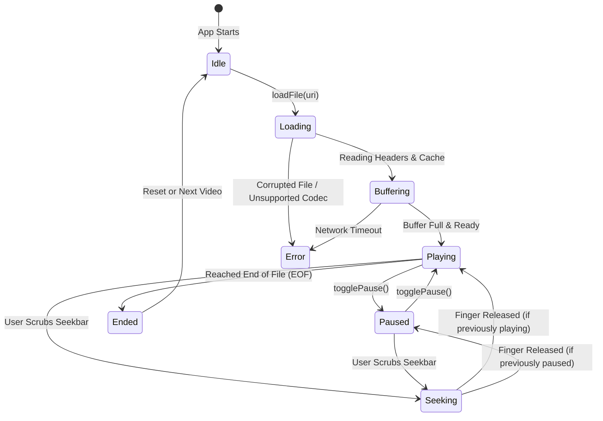

# 🚦 Player State Machines


In this lesson, you will learn how video players manage their lifecycle using a **State Machine**—guaranteeing that playback states (`Playing`, `Buffering`, `Seeking`, `Ended`) transition smoothly without glitches or deadlocks.

---

## 👶 1. The Beginner Analogy: The Train Station Signal System

Imagine a train network:
- A train cannot be simultaneously *"Arriving at the station"* and *"Traveling at full speed on the express track"*.
- It must follow a strict, orderly sequence:
  1. Parked in depot (`Idle`).
  2. Loading passengers (`Loading / Buffering`).
  3. Rolling down the tracks (`Playing`).
  4. Temporarily stopped at a red signal (`Paused`).
  5. Reaching the final terminal destination (`Ended`).

A **State Machine** guarantees that your app never attempts to do conflicting actions (like drawing video frames before the file is even loaded!).

---

## 📊 2. Visual Architecture: The Media Player State Machine



---

## 🔍 3. Modeling Player State in Kotlin

The cleanest way to represent a state machine in Kotlin is using a **`sealed interface`**:

```kotlin
sealed interface PlayerState {
    object Idle : PlayerState
    data class Loading(val filePath: String) : PlayerState
    data class Buffering(val percentage: Int) : PlayerState
    data class Playing(val positionMs: Long, val durationMs: Long) : PlayerState
    data class Paused(val positionMs: Long, val durationMs: Long) : PlayerState
    data class Seeking(val targetMs: Long) : PlayerState
    data class Ended(val durationMs: Long) : PlayerState
    data class Error(val message: String, val throwable: Throwable? = null) : PlayerState
}
```

---

## 📺 4. Handling State in Jetpack Compose

Because we modeled our state as a `sealed interface`, Compose can use an **exhaustive `when` expression** to render the exact right UI:

```kotlin
@Composable
fun PlayerOverlay(state: PlayerState) {
    when (state) {
        is PlayerState.Idle -> {
            Text("Select a video to begin", color = Color.Gray)
        }
        is PlayerState.Loading, is PlayerState.Buffering -> {
            // Show loading spinner while decoding or downloading:
            CircularProgressIndicator(color = MaterialTheme.colorScheme.primary)
        }
        is PlayerState.Playing, is PlayerState.Paused -> {
            // Render regular play controls and seekbars:
            StandardControlsHUD()
        }
        is PlayerState.Ended -> {
            // Show Replay button and Next Episode card:
            ReplayControlsScreen()
        }
        is PlayerState.Error -> {
            ErrorBanner(errorMessage = state.message)
        }
        is PlayerState.Seeking -> {
            SeekingTimestampBadge(targetMs = state.targetMs)
        }
    }
}
```

---

## ⚡ 5. Real-World Connection: How mpvRex Handles Seeking & EOF

Look at `xyz.mpv.rex.ui.player.managers.PlaybackManager.kt`:

### 1. Seeking Edge Case:
When a user scrubs the seekbar:
- `mpvRex` pauses background timeline updates so the seekbar thumb doesn't jitter under your finger.
- When the finger is released, it sends:
  ```kotlin
  MPVLib.command("seek", targetSeconds.toString(), "absolute+exact")
  ```
- Once the native engine confirms the seek is complete, the state transitions back to `Playing` or `Paused`.

### 2. End of File (EOF) Handling:
When `libmpv` sends the `MPV_EVENT_END_FILE` event:
- `mpvRex` checks if the user has **"Auto-play Next Video"** enabled in preferences.
- If enabled, it automatically transitions from `Ended` ➔ `Loading` the next file in the folder!

---

## 🎯 6. Key Takeaways

- [x] A **State Machine** enforces valid, orderly transitions between playback states.
- [x] Use Kotlin **`sealed interface`** to model states with type-safe properties.
- [x] Exhaustive **`when`** expressions in Compose guarantee that every state has a matching visual representation.
- [x] Seeking requires pausing UI progress updates until the seek operation finishes.
- [x] Reaching **`Ended` (EOF)** triggers playlist progression or replay overlays.
