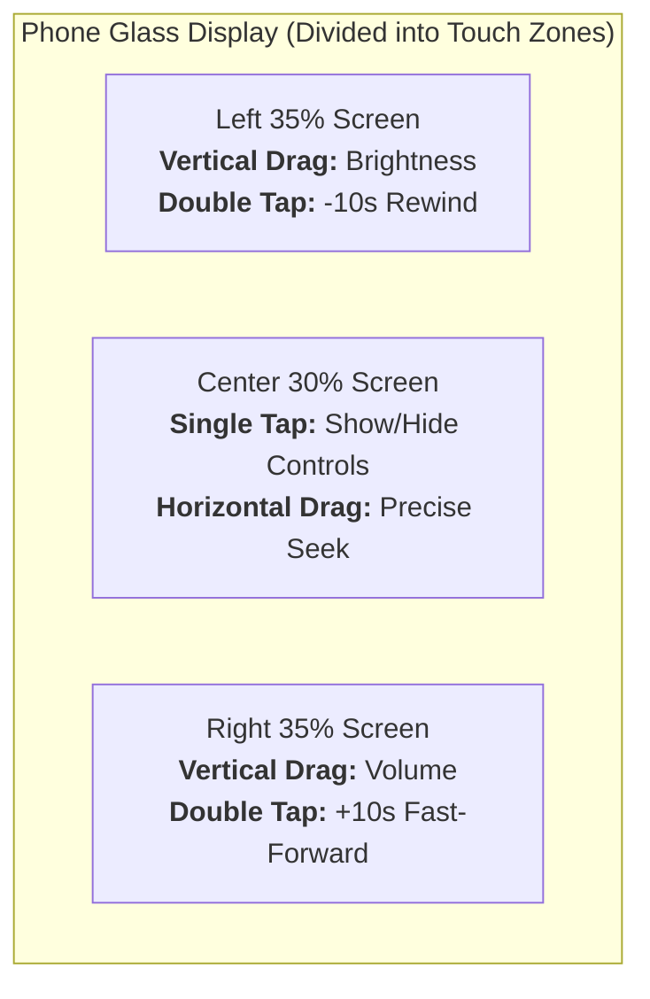

# 👆 Multi-Touch & Gesture Detection


In this lesson, you will learn how modern media players process screen touches, detect double-taps for fast-forwarding, and handle pinch-to-zoom gestures using Jetpack Compose's **`pointerInput`** and **`awaitEachGesture`**.

---

## 👶 1. The Beginner Analogy: The Interactive Glass Cockpit

Imagine the touch screen of a fighter jet:
- Touching a button on the dashboard fires that button's action.
- But tapping anywhere on the open windshield initiates navigational gestures:
  - **Single Tap:** Toggle HUD instruments on/off.
  - **Double Tap on Right:** Fast-forward jump (+10 seconds).
  - **Double Tap on Left:** Rewind jump (-10 seconds).
  - **Two-Finger Pinch:** Zoom in to inspect target details.

In a video player, the video surface is that interactive glass cockpit!

---

## 📊 2. Visual Architecture: Screen Zones & Gesture Mapping



---

## 🔍 3. Core Gesture Mechanics in Compose

### 🎯 A. The Low-Level `pointerInput` Engine
While `Modifier.clickable` is fine for basic buttons, complex media gestures require low-level raw pointer access via **`awaitEachGesture`**:

```kotlin
Modifier.pointerInput(Unit) {
    awaitEachGesture {
        // 1. Wait until a finger touches down on glass:
        val down = awaitFirstDown()
        val startX = down.position.x
        val startY = down.position.y

        // 2. Track finger movement:
        do {
            val event = awaitPointerEvent()
            val currentPos = event.changes.first().position
            val deltaX = currentPos.x - startX
            val deltaY = currentPos.y - startY
            
            // Check if user is swiping horizontally or vertically!
        } while (event.changes.any { it.pressed })
    }
}
```

---

### ⏩ B. Double-Tap Detection (+10s / -10s Seek)
Compose provides high-level tap detectors via `detectTapGestures`:

```kotlin
Modifier.pointerInput(Unit) {
    detectTapGestures(
        onTap = { offset ->
            // Single tap: Toggle HUD visibility
            toggleControlsVisibility()
        },
        onDoubleTap = { offset ->
            val screenWidth = size.width
            if (offset.x < screenWidth / 2) {
                // Double tap on LEFT half: Rewind 10s
                seekRelative(-10)
                showRewindRippleAnimation()
            } else {
                // Double tap on RIGHT half: Fast-forward 10s
                seekRelative(+10)
                showFastForwardRippleAnimation()
            }
        }
    )
}
```

---

### 🔍 C. Pinch-to-Zoom Video Transformation
To allow users to zoom in on video frames or crop 16:9 videos to fill an ultra-wide 20:9 phone screen:

```kotlin
var scale by remember { mutableFloatStateOf(1f) }
var offset by remember { mutableStateOf(Offset.Zero) }

Modifier
    .pointerInput(Unit) {
        detectTransformGestures { _, pan, zoom, _ ->
            // Clamp zoom between 100% and 300%
            scale = (scale * zoom).coerceIn(1f, 3f)
            offset += pan
        }
    }
    .graphicsLayer(
        scaleX = scale,
        scaleY = scale,
        translationX = offset.x,
        translationY = offset.y
    )
```

---

## ⚡ 4. Real-World Connection: How mpvRex Handles Double-Tap Seeking

Look at `xyz.mpv.rex.ui.player.controls.GestureHandler.kt` and `DoubleTapSeekSecondsView.kt`:

When you double-tap in `mpvRex`:
1. It registers the tap in the left or right zone.
2. If you tap again quickly (triple tap), it increments the seek from **+10s ➔ +20s ➔ +30s**.
3. It renders an animated chevron ripple effect (`>>>`) that pulses on screen and vanishes after 600ms.
4. It calls `MPVLib.command("seek", seconds.toString(), "relative")` to jump video playback instantly!

---

## 🎯 5. Key Takeaways

- [x] Use **`pointerInput`** and **`detectTapGestures`** for nuanced touch handling.
- [x] Split the screen width to distinguish left-side rewinds from right-side fast-forwards.
- [x] Use **`detectTransformGestures`** to support fluid pinch-to-zoom video scaling.
- [x] Apply scale and position offsets using **`graphicsLayer`** for 120 FPS hardware-accelerated motion.
- [x] In **mpvRex**, consecutive double taps dynamically accumulate (+10s, +20s, +30s) for rapid skipping.
