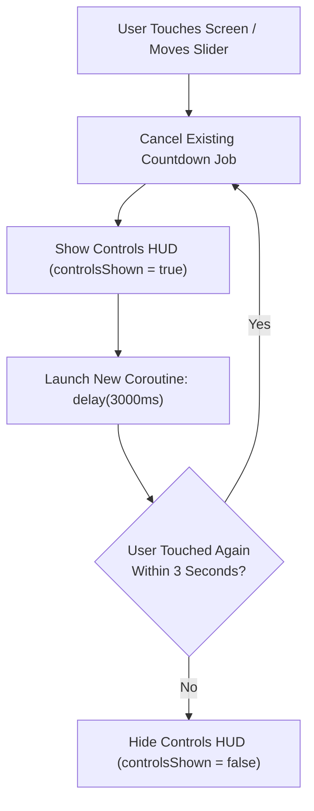

# 🎛️ Video Controls Overlay & Auto-Hide HUD


In this lesson, you will learn how to build a professional player controls overlay (HUD) that floats above the video, automatically vanishes after 3 seconds of inactivity, and intercepts user touches cleanly.

---

## 👶 1. The Beginner Analogy: The Courteous Theater Usher

Imagine sitting in a movie cinema:
1. When you enter or ask a question, the usher shines a flashlight on the floor to show you the steps (**Controls HUD appears**).
2. The moment you sit down and look back at the screen, the usher steps back into the shadows and turns off the light (**Auto-hide after 3 seconds**).
3. If you move or wave your hand, the light turns on again instantly.

The user wants to watch the movie, not stare at buttons. The controls must disappear automatically when not needed!

---

## 📊 2. Visual Architecture: The Inactivity Timer Loop



---

## 🔍 3. Core Mechanics of the Auto-Hide HUD

### ⏱️ A. The Countdown Timer Implementation
The auto-hide timer is driven by a cancellable Kotlin Coroutine Job inside the ViewModel:

```kotlin
class PlayerControlsViewModel : ViewModel() {
    private val _controlsShown = MutableStateFlow(true)
    val controlsShown: StateFlow<Boolean> = _controlsShown.asStateFlow()

    private var autoHideJob: Job? = null

    fun showControlsTemporarily(timeoutMs: Long = 3000L) {
        // 1. Cancel any active countdown so it doesn't vanish while user is interacting:
        autoHideJob?.cancel()

        // 2. Make controls visible:
        _controlsShown.value = true

        // 3. Start a new countdown timer:
        autoHideJob = viewModelScope.launch {
            delay(timeoutMs)
            _controlsShown.value = false
        }
    }

    fun toggleControls() {
        if (_controlsShown.value) {
            autoHideJob?.cancel()
            _controlsShown.value = false
        } else {
            showControlsTemporarily()
        }
    }
}
```

---

### 🛑 B. Touch Interception & Event Consumption
A common beginner bug:
- You click the "Play" button on the controls overlay.
- The button plays the video... **but the tap also leaks down through the background surface**, toggling the controls off!

In Compose, any Composable that handles a click or drag automatically **consumes** the pointer event, preventing it from reaching the layers below:

```kotlin
Box(
    modifier = Modifier.fillMaxSize()
) {
    // 1. Background gesture layer (handles fullscreen single tap)
    GestureSurface(
        onSingleTap = { viewModel.toggleControls() }
    )

    // 2. Foreground HUD (Consumes its own clicks!)
    if (controlsShown) {
        TopBar(
            modifier = Modifier
                .align(Alignment.TopCenter)
                // Consumes clicks inside the top bar area:
                .clickable(interactionSource = remember { MutableInteractionSource() }, indication = null) {
                    viewModel.showControlsTemporarily() // Reset countdown on tap!
                }
        )
    }
}
```

---

### 📱 C. Camera Cutouts & Window Insets
Modern phones have camera notches, hole-punches, and curved corners. To prevent the title text or back button from being cut in half by the physical camera:

```kotlin
TopAppBar(
    modifier = Modifier
        .fillMaxWidth()
        .windowInsetsPadding(WindowInsets.statusBars) // Pad below camera notch!
)
```

---

## ⚡ 4. Real-World Connection: How mpvRex Manages the HUD

In `mpvRex` (`PlayerControls.kt`):
- When you drag the seekbar or adjust volume, `scheduleControlsHide()` is called continuously, keeping the HUD awake while your finger is on glass.
- Once you lift your finger, the 3-second countdown begins.
- If you lock the screen using the **Padlock icon**, the HUD auto-hides and locks all gestures, preventing accidental pocket touches while watching.

---

## 🎯 5. Key Takeaways

- [x] Player controls should automatically hide after an inactivity delay (typically 3000ms).
- [x] Cancel and restart the countdown Job whenever the user interacts with any slider or button.
- [x] Prevent touch events from leaking through HUD controls into background gesture layers.
- [x] Always apply **`windowInsetsPadding`** to keep controls safely clear of camera hole-punches and gesture navigation bars.
