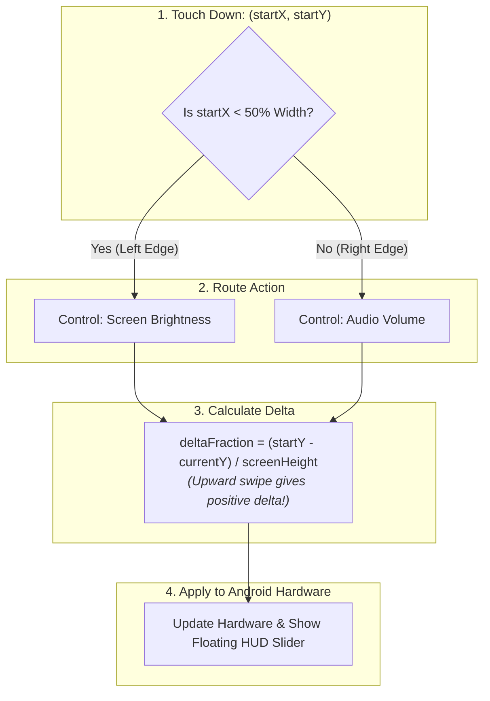

# 🎚️ Edge Swiping for Brightness & Volume


In this lesson, you will learn the exact mathematics and Android APIs used to build smooth vertical edge-swiping gestures for controlling **Screen Brightness** on the left and **Audio Volume** on the right.

---

## 👶 1. The Beginner Analogy: Two Vertical Volume Knobs

Imagine two smooth vertical slider knobs mounted directly on the glass:
- Slide your thumb UP on the **Left side** of the phone ➔ The screen glows brighter.
- Slide your thumb UP on the **Right side** of the phone ➔ The volume increases.
- Slide DOWN on either side ➔ Dim the lights or lower the volume.

While sliding, a vertical percentage pill appears on screen showing you the exact level (e.g. `Volume: 65%`), then smoothly fades away when your finger leaves the glass.

---

## 📊 2. Visual Architecture: The Vertical Swipe Math



---

## 🔍 3. The Mathematics of Dragging

In computer graphics, the **Y coordinate increases as you move DOWNwards**:
- Top-left is `(0, 0)`.
- Bottom-left is `(0, 1080)`.

Therefore, when a user swipes their finger **UP**:
- Their current $Y$ is smaller than their starting $Y$ ($currentY < startY$).
- To make swiping UP increase volume, we calculate:

$$\Delta = \frac{startY - currentY}{\text{Screen Height}}$$

If you drag your finger from bottom to top across half the screen, $\Delta = +0.5$ (+50% increase!).

---

## 🛠️ 4. Controlling Android Hardware APIs

### 🔊 A. Adjusting Audio Volume via `AudioManager`
```kotlin
val audioManager = context.getSystemService(Context.AUDIO_SERVICE) as AudioManager
val maxVolume = audioManager.getStreamMaxVolume(AudioManager.STREAM_MUSIC)

fun adjustVolume(deltaFraction: Float) {
    val currentVolume = audioManager.getStreamVolume(AudioManager.STREAM_MUSIC)
    val deltaUnits = (deltaFraction * maxVolume).toInt()
    val targetVolume = (currentVolume + deltaUnits).coerceIn(0, maxVolume)

    audioManager.setStreamVolume(
        AudioManager.STREAM_MUSIC,
        targetVolume,
        0 // Pass 0 to suppress standard system UI popup (since we draw our own!)
    )
}
```

---

### ☀️ B. Adjusting Screen Brightness via Window Attributes
Android allows an individual Activity window to override system screen brightness directly:

```kotlin
fun adjustBrightness(activity: Activity, targetFraction: Float) {
    val layoutParams = activity.window.attributes
    // Brightness is clamped between 0.01f (dimmest) and 1.0f (maximum):
    layoutParams.screenBrightness = targetFraction.coerceIn(0.01f, 1.0f)
    activity.window.attributes = layoutParams
}
```

---

## ⚡ 5. Real-World Connection: How mpvRex Renders Vertical Sliders

Look at `xyz.mpv.rex.ui.player.controls.components.VerticalSliders.kt`:

While the user is dragging:
1. `mpvRex` renders a vertical pill slider on the active side of the screen.
2. The slider shows a dynamic icon:
   - Volume: Muted icon (`VolumeOff`) at 0%, Low speaker at 30%, High speaker at 80%.
   - Brightness: Sun icon with varying ray density.
3. The slider animates in with `fadeIn()` and fades out smoothly with `fadeOut(tween(400))` 1 second after the finger lifts.

---

## 🎯 6. Key Takeaways

- [x] Partition the screen horizontally: Left 50% for Brightness, Right 50% for Volume.
- [x] Calculate vertical movement as `(startY - currentY) / height` so upward swipes yield positive values.
- [x] Control volume using Android's **`AudioManager.setStreamVolume()`**.
- [x] Override brightness per-screen using **`activity.window.attributes.screenBrightness`**.
- [x] Show an on-screen HUD indicator during the gesture to provide immediate visual feedback.
