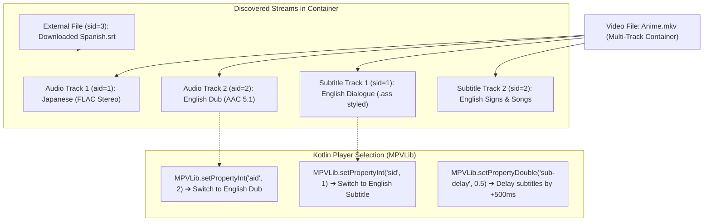

# 💬 Audio & Subtitle Track Switching


In this lesson, you will learn how media player engines discover, display, and switch between multiple **Audio Tracks** and **Subtitle Streams**, as well as how to load external `.srt` or `.ass` files.

---

## 👶 1. The Beginner Analogy: The Multi-Lingual Airline Headphones

Imagine sitting on an international airplane flight watching a movie:
1. **Audio Channel Switcher:** You can plug your headphones into Channel 1 for English, Channel 2 for Japanese, or Channel 3 for French.
2. **Subtitle Projector:** You can toggle subtitles on, switch to Spanish subtitles, or turn them off completely.
3. **The Timing Sync Dial:** If the subtitles appear 1 second before the actor speaks, you turn a small dial (+1.0s delay) until the words align with their lips perfectly!

---

## 📊 2. Visual Architecture: Multi-Track Demuxing & Selection



---

## 🔍 3. Core Mechanics of Track Management

### 🗂️ A. How Tracks are Identified
In media containers, each track has metadata properties:
- **`id`:** The numeric identifier used by the player engine (`1`, `2`, `3`).
- **`type`:** `video`, `audio`, or `sub`.
- **`lang`:** 3-letter ISO code (e.g. `eng`, `jpn`, `spa`).
- **`title`:** Human-readable label (e.g. *"Director Commentary"*, *"SDH"*).

---

### 🔊 B. Selecting Active Audio Tracks
To change the audio language or disable audio:

```kotlin
// Switch to Audio Track #2:
MPVLib.setPropertyInt("aid", 2)

// Mute / Disable all audio:
MPVLib.setPropertyString("aid", "no")

// Cycle to the next available audio track:
MPVLib.command("cycle", "audio")
```

---

### 📝 C. Selecting Active Subtitles
```kotlin
// Switch to Subtitle Track #1:
MPVLib.setPropertyInt("sid", 1)

// Turn off subtitles completely:
MPVLib.setPropertyString("sid", "no")

// Cycle to next subtitle track:
MPVLib.command("cycle", "sub")
```

---

### 📂 D. Adding External Subtitle & Audio Files
When a user downloads a subtitle file from the internet, you inject it directly into the running player session:

```kotlin
fun loadExternalSubtitle(fileUri: Uri) {
    val filePath = resolveFilePath(fileUri)
    // Tells libmpv to load the file and immediately select it:
    MPVLib.command("sub-add", filePath, "select")
}

fun loadExternalAudioTrack(fileUri: Uri) {
    val filePath = resolveFilePath(fileUri)
    MPVLib.command("audio-add", filePath, "select")
}
```

---

### ⏱️ E. Adjusting Subtitle Delay (Lip-Sync)
If subtitles appear too early or too late, you adjust the timing offset in seconds:

```kotlin
// Delay subtitles by 500 milliseconds:
MPVLib.setPropertyDouble("sub-delay", 0.5)

// Speed up subtitles by 200 milliseconds:
MPVLib.setPropertyDouble("sub-delay", -0.2)
```

---

## ⚡ 4. Real-World Connection: How mpvRex Manages Tracks

Look at `xyz.mpv.rex.ui.player.managers.TrackManager.kt` and `SubtitleManager.kt`:

`mpvRex` features full track selection modal bottom sheets:
1. When you tap the **Subtitle / Audio icon** on the player HUD, it opens `SubtitleTracksSheet.kt` or `AudioTracksSheet.kt`.
2. It queries `MPVLib` for all available tracks and displays them in a clean radio list showing track language, codec, and channels.
3. Tapping a track calls `TrackManager.selectTrack(trackId)`, updating the stream instantly without reloading the video.

---

## 🎯 5. Key Takeaways

- [x] Containers like MKV can package dozens of parallel audio and subtitle streams.
- [x] Control active audio streams with **`aid`** and subtitle streams with **`sid`**.
- [x] Pass **`"no"`** to `aid` or `sid` to turn the stream off completely.
- [x] Use **`MPVLib.command("sub-add", path, "select")`** to inject external subtitle files on the fly.
- [x] Adjust subtitle timing offsets using **`sub-delay`** in seconds (e.g. `+0.5` or `-0.2`).
