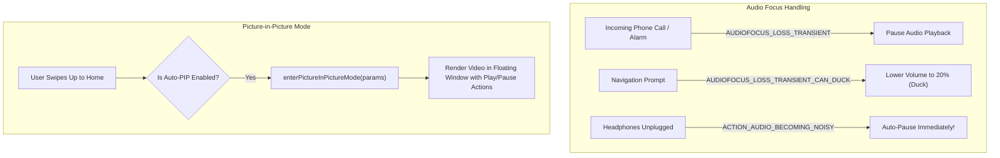

# 🪟 Background Playback, Audio Focus & PIP


In this lesson, you will learn how to keep audio playing when the phone is locked, handle phone calls and headphone disconnections gracefully, and shrink video into a floating **Picture-in-Picture (PIP)** window.

---

## 👶 1. The Beginner Analogy: The Floating TV & Courtesy Mute

1. **Picture-in-Picture (The Floating TV):** You are watching a match while replying to a message. The video shrinks into a tiny movable card floating in the corner of your screen.
2. **Audio Focus (The Polite Speaker):** When you are listening to music and a GPS voice says *"Turn Left in 200 meters"*, your music volume temporarily lowers (**Audio Ducking**) so you can hear the directions.
3. **Becoming Noisy (The Public Courtesy Rule):** When you unplug your headphones in a crowded library, the app must immediately pause the movie rather than blasting sound through the phone speakers!

---

## 📊 2. Visual Architecture: Audio Focus & The PIP Pipeline



---

## 🔍 3. Core Android System Integration

### 🪟 A. Picture-in-Picture (PIP) API
To enter PIP, configure `PictureInPictureParams` with the video's exact aspect ratio:

```kotlin
fun enterPip(activity: Activity, videoWidth: Int, videoHeight: Int) {
    if (Build.VERSION.SDK_INT >= Build.VERSION_CODES.O) {
        // Match the floating window aspect ratio to the video frame:
        val aspectRatio = Rational(videoWidth.coerceAtLeast(1), videoHeight.coerceAtLeast(1))
        
        val params = PictureInPictureParams.Builder()
            .setAspectRatio(aspectRatio)
            .build()

        activity.enterPictureInPictureMode(params)
    }
}
```

---

### 🎮 B. Interactive Controls in PIP (`RemoteAction`)
While in PIP mode, your normal Compose UI buttons cannot be touched. Instead, you register system **`RemoteAction`** icons (Play, Pause, Seek):

```kotlin
val playIntent = PendingIntent.getBroadcast(
    context, 0,
    Intent("PIP_ACTION").putExtra("action_code", 1),
    PendingIntent.FLAG_IMMUTABLE
)

val playAction = RemoteAction(
    Icon.createWithResource(context, R.drawable.ic_play),
    "Play",
    "Play Video",
    playIntent
)
```

---

### 🎧 C. Headphone Unplug Detection (`ACTION_AUDIO_BECOMING_NOISY`)
```kotlin
val noisyReceiver = object : BroadcastReceiver() {
    override fun onReceive(context: Context?, intent: Intent?) {
        if (intent?.action == AudioManager.ACTION_AUDIO_BECOMING_NOISY) {
            // Unplugged! Pause immediately to prevent embarrassment:
            playerViewModel.pause()
        }
    }
}

// Registered in onStart, unregistered in onStop:
context.registerReceiver(noisyReceiver, IntentFilter(AudioManager.ACTION_AUDIO_BECOMING_NOISY))
```

---

## ⚡ 4. Real-World Connection: How mpvRex Implements PIP

Look at `xyz.mpv.rex.ui.player.MPVPipHelper.kt`:

`mpvRex` manages full PIP support:
1. When entering PIP mode, `MPVPipHelper` registers a custom `BroadcastReceiver`.
2. It pushes system action buttons: **Rewind (-10s)**, **Play/Pause**, and **Fast-Forward (+10s)** into the PIP task bar.
3. When the user taps a button on the floating PIP frame, the broadcast receiver intercepts it and sends commands directly to `MPVLib`:
   ```kotlin
   when (actionCode) {
       PIP_PLAY -> MPVLib.setPropertyBoolean("pause", false)
       PIP_PAUSE -> MPVLib.setPropertyBoolean("pause", true)
       PIP_FORWARD -> MPVLib.command("seek", "10", "relative")
   }
   ```

---

## 🎯 5. Key Takeaways

- [x] **Picture-in-Picture (PIP)** shrinks the video Activity into a floating window using `PictureInPictureParams`.
- [x] Configure PIP aspect ratios with `Rational(width, height)` to prevent letterboxing.
- [x] PIP actions use **`RemoteAction`** and **`PendingIntent`** broadcasts because standard UI buttons are hidden.
- [x] Always listen for **`ACTION_AUDIO_BECOMING_NOISY`** to pause playback when headphones are disconnected.
- [x] Respect **Audio Focus** events so phone calls and navigation instructions seamlessly pause or duck media.
