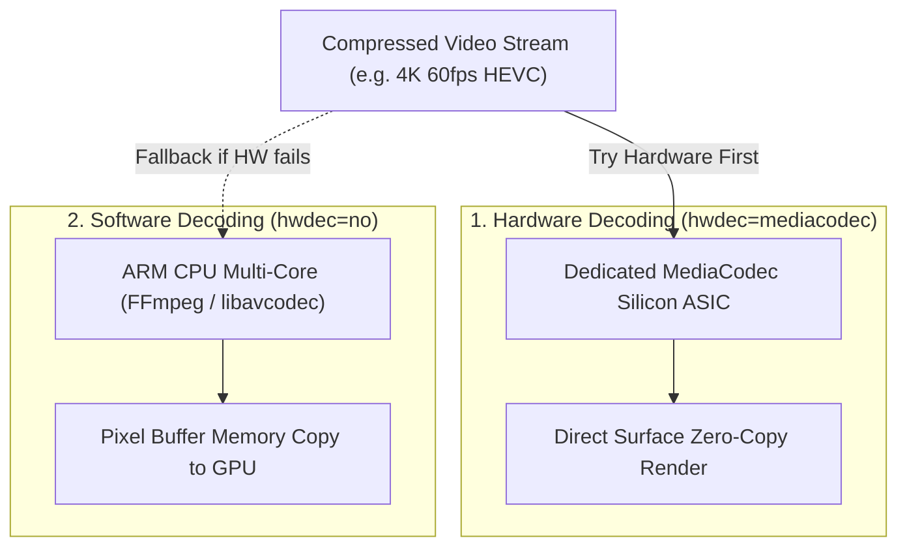

# ⚡ Hardware vs Software Decoding


In this lesson, you will learn the differences between **Hardware Decoding (MediaCodec)** and **Software Decoding (CPU)**, and explore GPU rendering options like **Vulkan**, **Debanding**, and **Anime4K shaders**.

---

## 👶 1. The Beginner Analogy: The Automated Stamping Machine vs The Master Craftsman

1. **Hardware Decoding (The Specialized Factory Stamping Machine):** Your phone's processor has tiny physical silicon chips built exclusively to unpack H.264 and HEVC video frames. It uses almost zero battery and the phone stays ice cold. But it can only stamp standardized shapes.
2. **Software Decoding (The Master Craftsman with a Chisel):** The general-purpose CPU does all the math by hand. It can carve any exotic shape or rare codec in existence, but it sweats and burns more battery power to do it!

---

## 📊 2. Visual Architecture: Decoding Engines Compared



---

## 🔍 3. Decoding Comparison Matrix

| Property | Hardware (`mediacodec`) | Software (`no`) |
| :--- | :--- | :--- |
| **Battery Life** | 🔋 Maximum (Up to 10+ hours of video) | 🪫 Higher battery consumption |
| **Device Temperature** | ❄️ Cold | 🔥 Warmer on high bitrates |
| **Compatibility** | 🟡 Standard formats (H.264, H.265, AV1) | 🟢 Universal (Plays any format) |
| **10-bit & Exotic Profiles** | ⚠️ Can fail on older phone chips | 🟢 Perfectly reliable |

---

## 🎨 4. Advanced GPU Rendering in mpvRex

Beyond decoding, `mpvRex` gives users direct control over how pixels are rendered on the screen:

### 🚀 A. Modern Render Engines: `gpu-next` & Vulkan
In `DecoderPreferences.kt`:
- **`gpu-next`:** The next-generation video rendering pipeline in mpv with superior color accuracy and HDR tone-mapping.
- **Vulkan:** Low-overhead graphics API replacing legacy OpenGL ES, reducing frame jitter on modern Android devices.

---

### 🌈 B. Debanding (`deband`)
In dark movie scenes or gradients, video compression often creates ugly stepped stripes (**color banding**). 

The `deband` filter applies an intelligent dither algorithm in real time to smooth out color transitions:

```kotlin
// In DecoderPreferences.kt:
val debandIterations = preferenceStore.getInt("deband_iterations", 1)
val debandThreshold = preferenceStore.getInt("deband_threshold", 48)
```

---

### ✨ C. Anime4K Upscaling Shaders
`mpvRex` includes built-in **Anime4K** GLSL shaders. When watching a 1080p animated video on a 1440p or 4K phone display, Anime4K reconstructs sharp line art and color fills in real time directly on your phone's GPU!

---

## ⚡ 5. Real-World Connection: How mpvRex Configures Decoders

Look at `xyz.mpv.rex.preferences.DecoderPreferences.kt`:

```kotlin
class DecoderPreferences(preferenceStore: PreferenceStore) {
    // 1. Try Hardware first, fallback to software if needed:
    val tryHWDecoding = preferenceStore.getBoolean("try_hw_dec", true)
    
    // 2. High-performance rendering pipeline:
    val gpuNext = preferenceStore.getBoolean("gpu_next", false)
    val useVulkan = preferenceStore.getBoolean("use_vulkan", false)
    
    // 3. Image enhancements:
    val debanding = preferenceStore.getEnum("debanding", Debanding.None)
    val enableAnime4K = preferenceStore.getBoolean("enable_anime4k", false)
}
```

When video playback initializes in `MPVView.kt`, these preferences are passed directly to `MPVLib`:
```kotlin
val hwdecMode = if (decoderPreferences.tryHWDecoding.get()) "mediacodec" else "no"
MPVLib.setOptionString("hwdec", hwdecMode)
```

---

## 🎯 6. Key Takeaways

- [x] **Hardware decoding** uses dedicated phone chips for low battery and zero heat.
- [x] **Software decoding** uses the CPU; it can decode anything, but consumes more energy.
- [x] Always default to hardware decoding (`mediacodec`) with graceful software fallbacks.
- [x] **`gpu-next`** and **Vulkan** offer cutting-edge color precision and lower frame latency.
- [x] **Debanding** eliminates banding artifacts in dark gradients; **Anime4K** sharpens animated content in real time.
