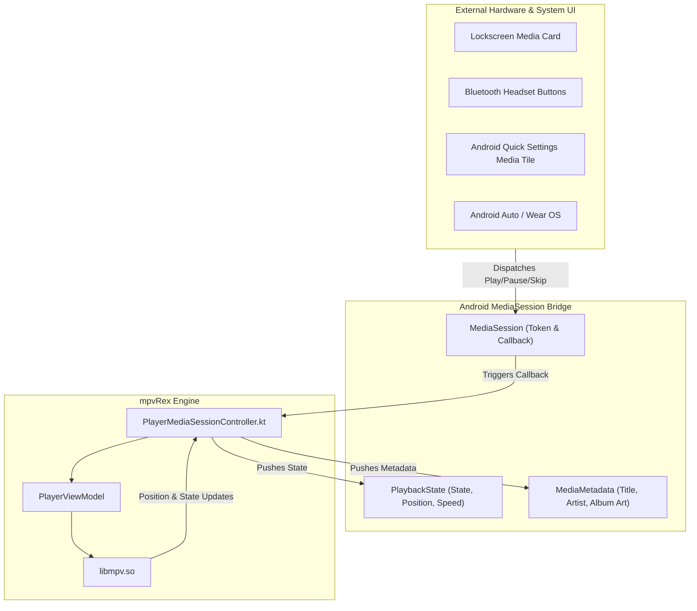

# 🎵 MediaSession & Lock Screen Controls


In this lesson, you will learn how Android integrates media playback with the operating system using **`MediaSession`**—powering lock screen controls, Quick Settings notification media tiles, Bluetooth headphone buttons, and Android Auto.

---

## 👶 1. The Beginner Analogy: Steering Wheel Controls & Smartwatch Display

Imagine driving a modern car while your phone plays music or a podcast:
- You don't pick up your phone to tap the screen.
- You press the **Skip** button on the steering wheel (**Bluetooth / Hardware Media Button**).
- The dashboard screen shows the album art, track title, and progress bar (**System MediaSession Metadata**).

**`MediaSession`** is the standardized protocol Android uses so external hardware (smartwatches, car dashboards, headphones, and the lock screen) can control playback seamlessly without opening the app!

---

## 📊 2. Visual Architecture: The MediaSession Pipeline



---

## 🔍 3. Core Mechanics of `MediaSession`

### 🎧 A. Initializing `MediaSession` & Transport Callbacks
```kotlin
val mediaSession = MediaSession(context, "PlayerMediaSession").apply {
    setCallback(object : MediaSession.Callback() {
        override fun onPlay() {
            viewModel.unpause()
            updatePlaybackState(isPlaying = true)
        }

        override fun onPause() {
            viewModel.pause()
            updatePlaybackState(isPlaying = false)
        }

        override fun onSkipToNext() {
            viewModel.playNextInPlaylist()
        }

        override fun onSeekTo(pos: Long) {
            viewModel.seekTo(pos)
        }
    })
    isActive = true
}
```

---

### ⏱️ B. Pushing PlaybackState (Progress on Lock Screen)
To show the scrubbing seekbar on the notification shade, you must continuously push the current position and state:

```kotlin
fun updatePlaybackState(isPlaying: Boolean, positionMs: Long, speed: Float) {
    val state = if (isPlaying) PlaybackState.STATE_PLAYING else PlaybackState.STATE_PAUSED
    
    val playbackState = PlaybackState.Builder()
        .setActions(
            PlaybackState.ACTION_PLAY or
            PlaybackState.ACTION_PAUSE or
            PlaybackState.ACTION_SKIP_TO_NEXT or
            PlaybackState.ACTION_SEEK_TO
        )
        .setState(state, positionMs, speed) // Speed is required for real-time timer sync!
        .build()

    mediaSession.setPlaybackState(playbackState)
}
```

---

### 🖼️ C. Pushing Metadata & Album Art
```kotlin
val metadata = MediaMetadata.Builder()
    .putString(MediaMetadata.METADATA_KEY_TITLE, "Interstellar")
    .putString(MediaMetadata.METADATA_KEY_ARTIST, "Christopher Nolan")
    .putLong(MediaMetadata.METADATA_KEY_DURATION, totalDurationMs)
    .putBitmap(MediaMetadata.METADATA_KEY_ALBUM_ART, videoThumbnailBitmap)
    .build()

mediaSession.setMetadata(metadata)
```

---

## ⚡ 4. Real-World Connection: How mpvRex Uses MediaSession

Look directly at `xyz.mpv.rex.ui.player.delegates.PlayerMediaSessionController.kt`:

`mpvRex` isolates MediaSession management into a dedicated delegate:
1. When playback begins, `PlayerMediaSessionController` activates `MediaSession`.
2. It checks user preferences (`playerPreferences.disableMediaButtons.get()`) to allow or suppress hardware headset clicks.
3. When the user scrubs from the lock screen notification slider, `onSeekTo(pos)` forwards the request to `PlaybackManager.seekTo(pos)`, synchronizing video audio smoothly without waking the screen!

---

## 🎯 5. Key Takeaways

- [x] **`MediaSession`** connects your app to Android lock screen cards, notifications, Bluetooth headsets, and Android Auto.
- [x] Implement **`MediaSession.Callback`** to handle play, pause, skip, and seek gestures from external hardware.
- [x] Push **`PlaybackState`** to synchronize the lock screen progress bar with video timestamps.
- [x] Push **`MediaMetadata`** to display title, duration, and thumbnail artwork on system tiles.
