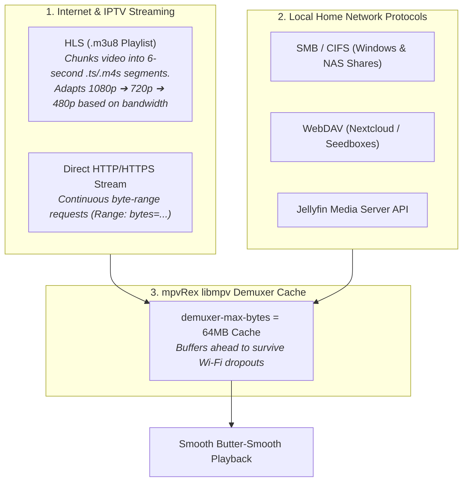

# 🌐 Network Streaming & Remote Protocols


In this lesson, you will learn how modern media players stream video over the internet and local Wi-Fi networks using **HTTP**, **HLS (`.m3u8`)**, **DASH**, and local network protocols like **SMB**, **WebDAV**, and **Jellyfin**.

---

## 👶 1. The Beginner Analogy: Sipping with a Straw vs Carrying the Whole Tank

1. **Local File Playback:** You carry a 20-liter water jug in your backpack (the entire 5GB video file is on your phone's SD card).
2. **Network Streaming:** You drink from a continuous water pipe through a straw (**Adaptive Streaming**). You only sip the exact 10 seconds of water you need right now. If the water pressure drops (slow Wi-Fi), the pipe automatically delivers lower-resolution water so your sip never stops!

---

## 📊 2. Visual Architecture: Streaming Protocols Compared



---

## 🔍 3. Core Streaming Protocols Decoded

### 📺 A. HLS (HTTP Live Streaming) & M3U8 Playlists
HLS is the global standard for video streaming on mobile:
- Instead of one massive file, the server hosts an **`.m3u8` master playlist**.
- The playlist lists multiple streams at different bitrates (e.g. 1080p at 5Mbps, 720p at 2.5Mbps, 480p at 1Mbps).
- When a user's network speed drops, `libmpv` seamlessly switches to a lower bitrate variant without buffering pauses!

```kotlin
// Loading an IPTV stream or remote HLS URL in mpvRex:
MPVLib.command("loadfile", "https://example.com/live/stream.m3u8")
```

---

### 🏠 B. Local Network Storage (SMB & WebDAV)
Many users keep movie collections on a home NAS (Network Attached Storage) or PC.

In `mpvRex`:
- **SMB (Server Message Block):** Connects to Windows shared folders and TrueNAS/Synology boxes.
- **WebDAV:** Connects to remote cloud seedboxes and self-hosted Nextcloud servers.
- `mpvRex` authenticates with the server, streams the file packets over local Wi-Fi, and streams them into `libmpv` without downloading the file to internal phone memory!

---

### 🛡️ C. Stream Caching & Buffer Optimization
When streaming over wireless connections, packets can arrive irregularly. To prevent micro-stutters:

```kotlin
// Configure mpv stream cache in AdvancedPreferences.kt:
MPVLib.setOptionString("cache", "yes")
MPVLib.setOptionString("demuxer-max-bytes", "64MiB") // Buffer up to 64MB ahead
MPVLib.setOptionString("demuxer-readahead-secs", "30") // Read 30 seconds into the future
```

---

## ⚡ 4. Real-World Connection: How mpvRex Organizes Network Media

Look at `xyz.mpv.rex.domain.network` and `xyz.mpv.rex.jellyfin`:

`mpvRex` features full network explorer integration:
1. **Network Explorer Cards (`NetworkConnectionCard.kt`):** Save your SMB credentials, IP address, and port.
2. **Jellyfin Sync (`JellyfinPreferences.kt`):** Connects to your private Jellyfin media server, fetches poster artwork, and syncs watch progress back to the server when you finish an episode!

---

## 🎯 5. Key Takeaways

- [x] **HLS (`.m3u8`)** breaks video into small segments, dynamically adapting resolution to network speed.
- [x] **`Range: bytes=...`** headers allow seeking in remote HTTP files without downloading preceding data.
- [x] **SMB and WebDAV** allow phones to stream high-bitrate 4K movies directly from home NAS servers over Wi-Fi.
- [x] Configure **`demuxer-max-bytes`** to buffer seconds of video ahead, preventing buffering drops.
- [x] **mpvRex** natively integrates SMB, WebDAV, IPTV playlists, and Jellyfin servers.
