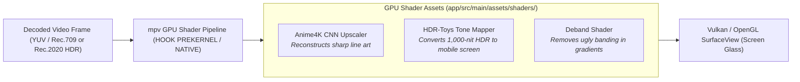

# 🎨 Custom Video Shaders & Post-Processing (GLSL)


In this lesson, you will learn how high-end media players apply real-time graphical enhancement shaders (**GLSL**) directly on the phone's GPU—including **HDR-Toys tone-mapping** and **Anime4K AI upscaling**.

---

## 👶 1. The Beginner Analogy: The Instant Movie Filter Studio

Imagine watching a movie through custom high-tech lenses:
1. **Raw Video:** A 1080p anime video looks soft when stretched onto an ultra-sharp 1440p phone screen.
2. **GLSL Fragment Shader:** A tiny computer program running on thousands of microscopic GPU cores simultaneously. It inspects every single pixel and its neighbors 60 times a second, sharpening lines, removing noise, and enhancing vibrancy in real time without dropping a frame!

---

## 📊 2. Visual Architecture: The GLSL Shader Pipeline in mpvRex



---

## 🔍 3. Core Mechanics of Video Shaders in mpv

### 📜 A. What is a `.glsl` Shader Hook?
Unlike traditional game shaders, `mpv` uses custom user shader hooks written in GLSL:

```glsl
//!HOOK MAIN
//!DESC My Custom Sharpen Filter
//!BIND HOOKED

vec4 hook() {
    vec4 color = HOOKED_tex(HOOKED_pos);
    // Simple edge detection & sharpening math:
    vec4 left = HOOKED_tex(HOOKED_pos - vec2(1.0/HOOKED_size.x, 0.0));
    return color + (color - left) * 0.5;
}
```

- **`//!HOOK MAIN`**: Tells mpv when to execute this shader during the rendering pass.
- **`//!BIND HOOKED`**: Binds the input video texture so the shader can sample neighboring pixels.

---

### 🚀 B. Loading Shaders at Runtime
In Kotlin, you attach or clear shaders dynamically using `MPVLib`:

```kotlin
// Attach Anime4K CNN upscaler shader:
fun applyAnime4K(shaderPath: String) {
    MPVLib.command("change-list", "glsl-shaders", "append", shaderPath)
}

// Clear all active shaders:
fun clearShaders() {
    MPVLib.command("change-list", "glsl-shaders", "clr", "")
}
```

---

### ☀️ C. HDR-Toys: Solving Washed-Out HDR Videos
When you play a 4K HDR10 movie on a mid-range phone screen that only supports standard SDR:
- Without tone mapping, the colors look gray, foggy, and washed out.
- **HDR-Toys** runs advanced color gamut transformations (e.g. `ASTRA` tone-mapping and `BOTTOSSON` gamut-mapping) to compress 1,000-nit brightness into the phone's physical display gamut while preserving deep shadows and vibrant highlights!

---

## ⚡ 4. Real-World Connection: How mpvRex Manages Shaders

Look at `app/src/main/assets/shaders/` and `xyz.mpv.rex.domain.anime4k.Anime4KManager.kt`:

`mpvRex` ships with a complete library of optimized GLSL shaders:
- `Anime4K_Restore_CNN_M.glsl` (Medium CNN line reconstruction)
- `Anime4K_Upscale_CNN_x2_L.glsl` (Large super-resolution 2x upscaler)
- `assets/shaders/hdr-toys/` (Tone-mapping curves)

When you toggle **Anime4K** on in the video settings menu, `Anime4KManager` extracts the shader asset to local storage and appends it to `libmpv`'s active shader list with a single command!

---

## 🎯 5. Key Takeaways

- [x] **GLSL Shaders** run directly on the phone's GPU to process video frames in real time.
- [x] `libmpv` supports runtime shader injection via the **`glsl-shaders`** property.
- [x] **Anime4K** sharpens animated lines and performs super-resolution upscaling on mobile GPUs.
- [x] **HDR-Toys** tone-mapping prevents washed-out gray colors when viewing HDR media on SDR screens.
- [x] All shader assets live under **`app/src/main/assets/shaders/`** in `mpvRex`.
