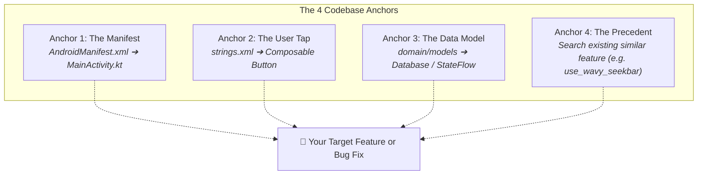

# 🔍 The Mental Model of Reading Large Codebases


In this lesson, you will learn the exact reverse-engineering framework used by senior engineers to navigate 100,000-line codebases without feeling overwhelmed.

---

## 👶 1. The Beginner Analogy: The Subway Map of a Metropolis

Imagine arriving in Tokyo or New York for the first time:
- **The Rookie Mistake:** Trying to walk down every single street and memorize all 50,000 buildings in order. You will burn out within an hour.
- **The Senior Approach:** You open a Subway Map! You locate where you are right now, find your destination station, and ride the express transit line straight there, ignoring the 99% of the city that is irrelevant to your current journey.

A codebase is just a digital metropolis. You only need to know how to ride the subway!

---

## 📊 2. Visual Architecture: The 4 Universal Navigation Anchors



---

## 🔍 3. The 3-Step Reverse-Engineering Playbook

### 🏷️ Step 1: Work Backwards from Screen Text
You see a button on your screen that says: **"Enable Debanding"**.
How do you find the file that controls it?

1. Search `strings.xml` for the text:
   ```xml
   <string name="pref_deband_title">Enable Debanding</string>
   ```
2. Grep for the key name `pref_deband_title` in your Kotlin files.
3. In 2 seconds, you are inside `VideoSettingsDebandCard.kt`!

---

### 🌊 Step 2: Trace the Call Chain (UI ➔ ViewModel ➔ Engine)
Once you find the UI button, follow where its click event goes:
```kotlin
// In UI Composable:
Switch(
    checked = isDebandEnabled,
    onCheckedChange = { viewModel.toggleDebanding(it) } // ➔ Goes to ViewModel!
)
```
Open `PlayerViewModel.kt`, search for `toggleDebanding`:
```kotlin
// In ViewModel:
fun toggleDebanding(enabled: Boolean) {
    decoderPreferences.debanding.set(enabled) // ➔ Saves to Disk!
    MPVLib.setOptionString("deband", if (enabled) "yes" else "no") // ➔ Tells C Engine!
}
```
You have mapped the entire feature from glass to disk in under 60 seconds!

---

### 👯 Step 3: The "Precedent Search" (Never Guess Syntax!)
Want to add a new toggle (like a **"White Progress Bar"**)? 
**Do not invent code from scratch.** Look for an existing toggle that already works:

1. Grep for `use_wavy_seekbar` across the codebase.
2. You will see:
   - Defined in `PlayerPreferences.kt`
   - Read in `Seekbar.kt`
   - Toggled in `PlayerPreferencesScreen.kt`
3. Copy that exact 3-file pattern for your new feature!

---

## ⚡ 4. Real-World Connection: How the White Seekbar was Added to mpvRex

Here is the exact real-world trace from `mpvRex`:

1. **Step 1 (Precedent):** We searched for `use_wavy_seekbar` in `PlayerPreferences.kt`:
   ```kotlin
   val useWavySeekbar = preferenceStore.getBoolean("use_wavy_seekbar", true)
   ```
2. **Step 2 (Add Preference):** Added one line right next to it:
   ```kotlin
   val whiteSeekBar = preferenceStore.getBoolean("white_seekbar", false)
   ```
3. **Step 3 (Inject & Paint):** Opened `Seekbar.kt` and changed one line:
   ```kotlin
   val playerPreferences = koinInject<PlayerPreferences>()
   val whiteSeekBar by playerPreferences.whiteSeekBar.collectAsState()
   val primaryColor = if (whiteSeekBar) Color.White else MaterialTheme.colorScheme.primary
   ```
4. **Step 4 (Expose in Settings):** Added the toggle switch in `PlayerPreferencesScreen.kt`.

Four small surgical edits in under 5 minutes without needing to read the other 450 files in the app!

---

## 🎯 5. Key Takeaways

- [x] Never try to read a large codebase file-by-file from top to bottom.
- [x] Work backwards: Screen text ➔ `strings.xml` ➔ Composable ➔ ViewModel ➔ Engine.
- [x] Always search for **precedents**—features that behave similarly to what you want to build.
- [x] Trace call stacks step-by-step to understand the complete journey of a user tap.
