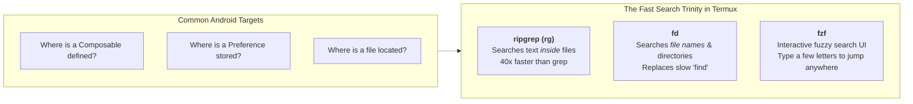

# ⚡ High-Speed CLI Code Search (ripgrep, fd, fzf)


In this lesson, you will master the command-line search tools (**`ripgrep`**, **`fd`**, and **`fzf`**) that allow you to locate any button, function, or bug in a massive codebase within milliseconds directly inside **Termux**.

---

## 👶 1. The Beginner Analogy: The Laser Scanner vs Flipping Pages

- **Legacy Search:** Flipping through 5,000 physical pages one by one with your thumb.
- **`ripgrep` (`rg`):** A high-powered laser scanner that sweeps across the entire library in 40 milliseconds, highlights every page containing the word you want, and hands you the exact line number!

On a mobile phone inside Termux, desktop IDE search is slow and eats memory. Mastering CLI tools gives you senior-level speed on any mobile device.

---

## 📊 2. Visual Architecture: The CLI Search Toolkit



---

## 🔍 3. Essential Command Recipes for Android

### 🚀 A. `ripgrep` (`rg`): Instant Text Search

#### 1. Basic Content Search:
```bash
# Search for 'use_wavy_seekbar' in all files:
rg "use_wavy_seekbar"
```

#### 2. Search Only Inside Kotlin Files:
```bash
# -g '*.kt' restricts search to Kotlin source files:
rg "MPVLib.command" -g "*.kt"
```

#### 3. Case-Insensitive Search:
```bash
# -i ignores uppercase/lowercase:
rg -i "anime4k"
```

#### 4. Find Exactly Where a Function is Defined:
```bash
# Finds where 'fun PlayerControls' is declared:
rg "fun PlayerControls\(" -g "*.kt"
```

---

### 📂 B. `fd`: Blazing-Fast File Name Search

`fd` is a modern, fast alternative to Linux `find`.

#### 1. Find Any File by Name:
```bash
# Locate all files containing 'Seekbar':
fd "Seekbar"
```

#### 2. Find Only Kotlin Files:
```bash
# -e filters by file extension:
fd -e kt "Manager"
```

#### 3. Find Layout XML or Drawables:
```bash
fd -e xml "ic_play"
```

---

### 🔍 C. `fzf`: Interactive Fuzzy Finding
Instead of typing the full path, type fragments:

```bash
# Open interactive file picker:
fd -e kt | fzf
```

---

## ⚡ 4. Real-World Connection: The 3 Killer Search Recipes in mpvRex

When working on `mpvRex`, these three terminal commands will solve 95% of your questions:

### Recipe 1: "Where is this preference stored?"
```bash
rg "preferenceStore\.get" app/src/main/kotlin/xyz/mpv/rex/preferences/
```
*Instantly outputs all 50+ user preferences with their default values and types!*

### Recipe 2: "Where are native C commands sent?"
```bash
rg "MPVLib\.command\(" -g "*.kt"
```
*Lists every single playback action (play, seek, sub-add, aspect-ratio change) in the entire app!*

### Recipe 3: "Where is this UI dialog rendered?"
```bash
rg "class .*Sheet" app/src/main/kotlin/ -g "*.kt"
```
*Finds all modal sheets (DecodersSheet, SubtitleTracksSheet, AspectRatioSheet).*

---

## 🎯 5. Key Takeaways

- [x] Use **`ripgrep` (`rg`)** to search text content across thousands of files in milliseconds.
- [x] Use **`-g "*.kt"`** to filter searches strictly to Kotlin files.
- [x] Use **`fd`** to locate files and directories by name without slow filesystem traversals.
- [x] Combine CLI search tools to find preference keys, JNI calls, and Composable declarations in seconds inside Termux.
